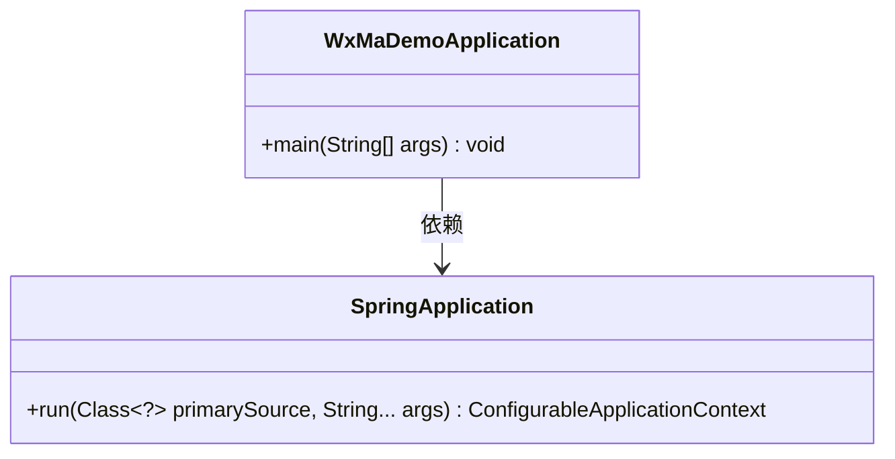
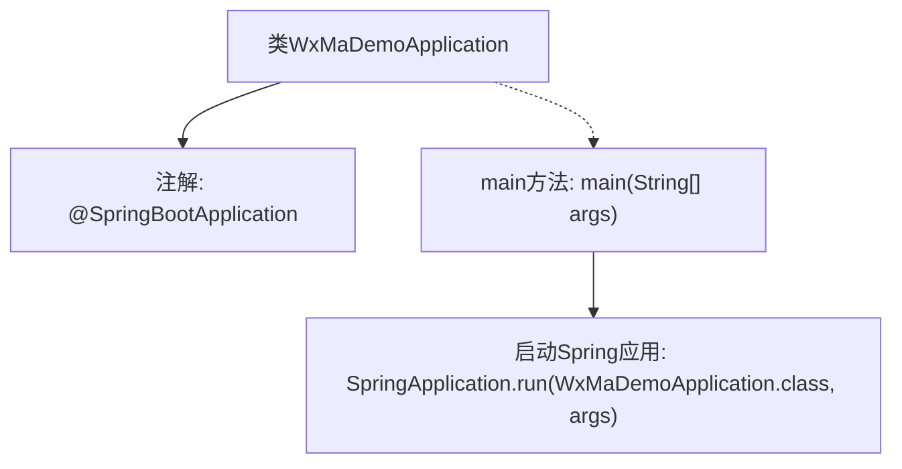

# 基础信息

|      |      |
|------|------|
| 名称 | WxMaDemoApplication |
| 编码语言 | .java |
| 代码路径 | weixin-java-miniapp-demo\src\main\java\com\github\binarywang\demo\wx\miniapp\WxMaDemoApplication.java |
| 包名 | com.github.binarywang.demo.wx.miniapp |
| 依赖项 | ['org.springframework.boot.SpringApplication', 'org.springframework.boot.autoconfigure.SpringBootApplication'] |
| 概述说明 | 这是一个Spring Boot应用的主类，使用@SpringBootApplication注解标记，通过main方法启动应用。 |

# 说明

这是一个基于Spring Boot框架的微信小程序Demo应用入口类。类上标注了@SpringBootApplication注解，表明这是一个Spring Boot应用的主配置类。main方法作为程序启动入口，通过SpringApplication.run方法启动整个应用，传入当前类对象和命令行参数。该结构是标准Spring Boot应用的典型启动方式。

# 类列表 Class Summary

| 名称   | 类型  | 说明 |
|-------|------|-------------|
| WxMaDemoApplication | class | 这是一个Spring Boot应用的主类，使用@SpringBootApplication注解标记，通过main方法启动应用。 |

## 类 WxMaDemoApplication

|      |      |
|------|------|
| 访问范围 | @SpringBootApplication;public |
| 类型 | class |
| 名称 | WxMaDemoApplication |
| 说明 | 这是一个Spring Boot应用的主类，使用@SpringBootApplication注解标记，通过main方法启动应用。 |

### UML类图

这段代码展示了一个简单的Spring Boot应用启动类`WxMaDemoApplication`，它通过`main`方法调用`SpringApplication.run()`来启动应用。类图中包含两个主要类：`WxMaDemoApplication`作为入口类，依赖`SpringApplication`的核心启动功能。`SpringApplication`的`run`方法使用泛型参数`Class<?>`来接收任意主配置类，体现了Spring Boot的约定优于配置原则。

### 内部方法调用关系图

这段流程图展示了WxMaDemoApplication类的核心结构。该类被@SpringBootApplication注解标记，表明这是一个Spring Boot应用的主配置类。程序入口是main方法，该方法通过调用SpringApplication.run()来启动整个Spring Boot应用，传入当前类对象和命令行参数作为参数。这个简洁的流程体现了Spring Boot应用的标准启动方式，其中注解负责自动配置，而run方法初始化应用上下文并启动内嵌服务器。

### 字段列表 Field List

| 名称  | 类型  | 说明 |
|-------|-------|------|

### 方法列表

| 名称  | 类型  | 说明 |
|-------|-------|------|
| main | void | Java主方法启动Spring Boot应用，运行WxMaDemoApplication类。 |

