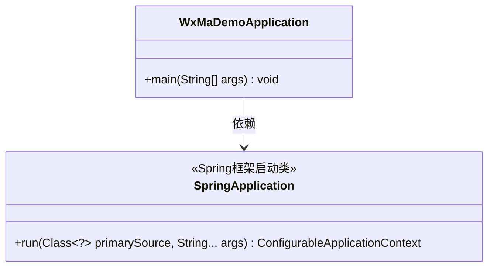
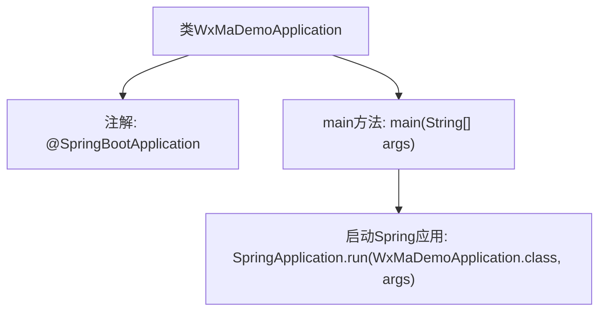

# 基础信息

|      |      |
|------|------|
| 名称 | WxMaDemoApplication |
| 编码语言 | .java |
| 代码路径 | weixin-java-miniapp-demo/src/main/java/com/github/binarywang/demo/wx/miniapp/WxMaDemoApplication.java |
| 包名 | com.github.binarywang.demo.wx.miniapp |
| 依赖项 | ['org.springframework.boot.SpringApplication', 'org.springframework.boot.autoconfigure.SpringBootApplication'] |
| 概述说明 | 这是一个Spring Boot应用的主类，使用@SpringBootApplication注解标记，通过main方法启动应用。 |

# 说明

这段内容描述了一个基于Spring Boot框架的Java应用程序入口类。类名为WxMaDemoApplication，使用了@SpringBootApplication注解标记，表明这是一个Spring Boot应用的主配置类。该注解整合了@Configuration、@EnableAutoConfiguration和@ComponentScan三个核心注解的功能。类中包含一个标准的Java main方法作为程序启动入口，通过调用SpringApplication.run方法来启动整个Spring Boot应用，并传入当前类对象和命令行参数args。这个类是典型的Spring Boot应用启动类结构，用于初始化应用上下文和自动配置。

# 类列表 Class Summary

| 名称   | 类型  | 说明 |
|-------|------|-------------|
| WxMaDemoApplication | class | 这是一个Spring Boot应用的主类，使用@SpringBootApplication注解标记，通过main方法启动应用。 |

## 类 WxMaDemoApplication

|      |      |
|------|------|
| 访问范围 | @SpringBootApplication;public |
| 类型 | class |
| 名称 | WxMaDemoApplication |
| 说明 | 这是一个Spring Boot应用的主类，使用@SpringBootApplication注解标记，通过main方法启动应用。 |

### UML类图

这段代码展示了一个典型的Spring Boot应用启动类结构。WxMaDemoApplication类通过@SpringBootApplication注解标记为Spring Boot应用入口，其main()方法委托SpringApplication.run()启动整个应用。类图中清晰呈现了启动类与Spring框架核心类SpringApplication的依赖关系，其中SpringApplication提供了运行Spring应用的静态方法，返回可配置的应用上下文。这种设计体现了Spring Boot约定优于配置的理念，简化了应用的启动流程。

### 内部方法调用关系图

这段流程图描述了基于Spring Boot的微信小程序应用启动类的核心结构。类WxMaDemoApplication通过@SpringBootApplication注解标记为Spring Boot应用入口，main方法作为程序起点调用SpringApplication.run()方法，该方法会初始化Spring容器、加载自动配置并启动内嵌服务器。整个流程简洁明了，展现了Spring Boot应用的标准启动模式，其中注解驱动和自动配置是框架的核心特性。

### 字段列表 Field List

| 名称  | 类型  | 说明 |
|-------|-------|------|

### 方法列表

| 名称  | 类型  | 说明 |
|-------|-------|------|
| main | void | Java主方法启动Spring Boot应用，运行WxMaDemoApplication类。 |

