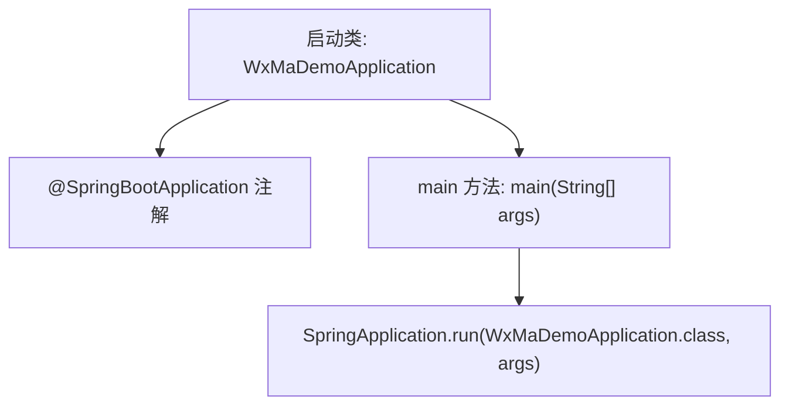

# 基础信息

|      |      |
|------|------|
| 名称 | WxMaDemoApplication |
| 编码语言 | .java |
| 代码路径 | weixin-java-miniapp-demo/src/main/java/com/github/binarywang/demo/wx/miniapp/WxMaDemoApplication.java |
| 包名 | com.github.binarywang.demo.wx.miniapp |
| 依赖项 | ['org.springframework.boot.SpringApplication', 'org.springframework.boot.autoconfigure.SpringBootApplication'] |
| 概述说明 | 这是一个Spring Boot应用程序的启动类，使用@SpringBootApplication注解标记，通过main方法启动Spring应用上下文。 |

# 说明

这是一个基于Spring Boot框架的微信小程序后端应用启动类。该类通过@SpringBootApplication注解标识为Spring Boot应用程序入口点，内部包含main方法用于启动Spring应用上下文。当程序执行时会初始化Spring容器并加载相关配置，为微信小程序提供后端服务支持。此类作为整个应用的启动引导程序，负责初始化框架环境和启动Web服务器。

# 类列表 Class Summary

| 名称   | 类型  | 说明 |
|-------|------|-------------|
| WxMaDemoApplication | class | 这是一个Spring Boot应用程序的启动类，使用@SpringBootApplication注解标记，通过main方法启动Spring应用上下文。 |

## 类 WxMaDemoApplication

|      |      |
|------|------|
| 访问范围 | @SpringBootApplication;public |
| 类型 | class |
| 名称 | WxMaDemoApplication |
| 说明 | 这是一个Spring Boot应用程序的启动类，使用@SpringBootApplication注解标记，通过main方法启动Spring应用上下文。 |

### UML类图

该类图展示了一个基于Spring Boot框架的微信小程序应用启动类。`WxMaDemoApplication` 是应用程序的入口点，包含 `main` 方法用于启动Spring Boot应用。通过注解 `@SpringBootApplication` 标识为一个标准的Spring Boot应用配置类，表明它具备自动配置、组件扫描等核心功能。此设计遵循了典型的Spring Boot项目结构，简化了微信小程序后端服务的初始化过程。

### 内部方法调用关系图

该流程图展示了基于 Spring Boot 的启动类 `WxMaDemoApplication` 的结构与执行流程。首先通过 `@SpringBootApplication` 注解标识为 Spring Boot 应用，随后在 `main` 方法中调用 `SpringApplication.run()` 启动应用上下文，完成项目的初始化和运行。整个过程体现了标准的 Spring Boot 启动机制。

### 字段列表 Field List

| 名称  | 类型  | 说明 |
|-------|-------|------|

### 方法列表

| 名称  | 类型  | 说明 |
|-------|-------|------|
| main | void | 这是一个Spring Boot应用程序的主启动类，通过SpringApplication.run()方法启动WxMaDemoApplication应用。 |

