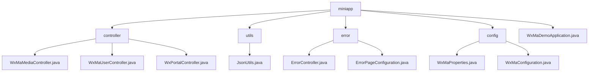

# 基础信息

|      |      |
|------|------|
| 名称 | miniapp |
| 编码语言 | .java |
| 代码路径 | weixin-java-miniapp-demo/src/main/java/com/github/binarywang/demo/wx/miniapp |
| 包名 | docs.src.main.java.com.github.binarywang.demo.wx.miniapp |
| 概述说明 | 该模块为微信小程序提供后端支持，涵盖媒体上传下载、用户登录、消息处理等功能。基于Spring Boot与WXJava SDK实现多小程序管理、接口路由及安全通信，支持JSON/XML解析、异常统一处理和配置动态加载，适用于企业级微信生态对接场景。 |

# 说明

## 概述

该模块为微信小程序提供后端核心支撑，涵盖用户登录、媒体资源管理、消息接收与多实例路由等功能。通过集成WXJava SDK和Spring Boot框架，实现RESTful API风格接口及多租户配置管理。例如：使用WxMaService处理凭证校验，WxMaConfig支持多小程序切换。

模块统一暴露HTTP接口，支持GET/POST请求，采用JSON/XML格式交互，并内置加解密与异常处理机制。关键数据结构包括MediaId、JSCode、Echostr、HttpStatus、ModelAndView等，配合ThreadLocal清理机制保障服务稳定性。

外部依赖项主要有WXJava Miniapp SDK、Spring Boot Web模块、Jackson库及相关日志组件。例如：JsonUtils利用ObjectMapper实现对象到JSON的格式化转换。

## 主要业务场景

模块覆盖三类核心业务流程：一是媒体上传下载（如图片获取MediaId），二是用户身份验证（如JSCode换取OpenId），三是消息订阅与事件分发（如文本消息自动回复）。系统通过Appid路由实现多小程序接入，支持明文/AES传输及多种消息类型解析。

错误处理机制统一接管404/500等异常状态，结合ErrorController与ErrorPageRegistrar实现页面跳转或响应输出。例如访问非法路径时跳转至/error/404视图。

典型应用场景包括第三方平台托管多个小程序、企业门户对接微信生态、以及需安全传递用户敏感信息的合规场景。API类型涵盖Controller层HTTP接口、SDK调用及配置注入，支持与Nginx、HTTPS网关等基础设施集成。整体架构类似事件总线模式，具备良好的扩展性和动态路由能力。

### 包内部结构视图

该流程图展示了微信小程序Java Demo项目的模块结构，包括控制器、工具类、错误处理和配置等主要组件的层级关系。

# 文件列表

| 名称   | 类型  | 说明 |
|-------|------|-------------|
| [WxMaDemoApplication.java](WxMaDemoApplication.md) | file | 这是一个Spring Boot应用程序的启动类，使用@SpringBootApplication注解标记，通过main方法启动Spring应用上下文。 |
| [config](config/_module.md) | package | 该类是微信小程序配置管理类，存储appid、secret、token等核心参数，支持多小程序配置。用于初始化小程序服务和消息路由处理机制，定义了日志记录、文本回复、图片响应等处理器，并支持发送客服消息与订阅通知功能。 |
| [error](error/_module.md) | package | 这是一个Spring Boot错误处理系统，包含错误控制器和配置类。控制器通过@RequestMapping("/error")统一处理404和500错误，返回error视图页面。配置类实现ErrorPageRegistrar接口，将404和500状态码分别映射到/error/404和/error/500路径，实现统一错误页面管理和跳转功能。 |
| [utils](utils/_module.md) | package | JsonUtils工具类提供JSON序列化功能，使用ObjectMapper实现对象转JSON字符串，配置了非空字段序列化和格式化输出，异常时打印堆栈并返回null。 |
| [controller](controller/_module.md) | package | 该控制器实现微信小程序媒体文件上传下载功能，支持多文件处理和异常捕获。另一控制器提供用户登录、信息获取及手机号绑定接口，处理JSCode校验和敏感信息解密。第三控制器负责小程序接入认证和消息接收，支持明文与AES加密消息解析，自动切换JSON或XML格式并分发处理。所有接口均校验appid合法性并清理线程上下文。 |

