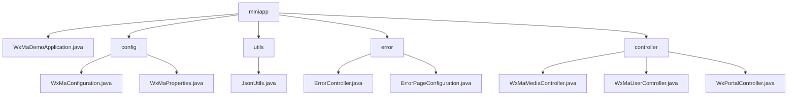

# 基础信息

|      |      |
|------|------|
| 名称 | miniapp |
| 编码语言 | .java |
| 代码路径 | weixin-java-miniapp-demo\src\main\java\com\github\binarywang\demo\wx\miniapp |
| 包名 | docs.src.main.java.com.github.binarywang.demo.wx.miniapp |
| 概述说明 | 微信小程序后端系统，含多账号管理、消息路由、错误处理、媒体文件管理及用户会话功能，基于Spring Boot和微信SDK实现。 |

# 说明

## 概述  
该模块是微信小程序后端综合系统，核心职责包括多账号服务配置、消息路由分发和HTTP错误处理，类似网关路由与错误处理中枢。通过WxMaProperties实现多账号管理，关键数据结构含Config类（Appid/Secret）、消息路由Map及ErrorPage注册表。依赖微信SDK、Spring Web和Lombok。例如@ConfigurationProperties注入配置，MsgRouter预置五种处理器，ErrorController统一渲染错误页。

## 主要业务场景  
模块覆盖小程序全生命周期：初始化校验配置→构建多账号服务→处理消息/错误。交互模式采用事件驱动，如文本消息触发客服回复，404错误重定向预设页。完整支持微信协议（如订阅消息分发）和HTTP状态处理，典型流程包含媒体文件上传（返回media_id）、用户登录（AES解密信息）和门户交互（GET/POST双模式）。API集成案例包括二维码生成和会话维护，均基于AppID隔离实现多租户架构。

### 包内部结构视图

该流程图展示了微信小程序Demo项目的目录结构。根节点miniapp包含5个子模块：主应用类、配置目录、工具类目录、错误处理目录和控制器目录。每个子模块下分别包含对应的实现文件，如配置模块包含微信配置类和属性类，控制器模块包含媒体、用户和入口三个控制器类。

# 文件列表

| 名称   | 类型  | 说明 |
|-------|------|-------------|
| [WxMaDemoApplication.java](WxMaDemoApplication.md) | file | 这是一个Spring Boot应用的主类，使用@SpringBootApplication注解标记，通过main方法启动应用。 |
| [config](config/_module.md) | package | 微信小程序后端配置类，初始化服务和消息路由，支持多账号，定义五种消息处理规则。配置属性类绑定小程序配置项，包含ID、密钥等字段。 |
| [controller](controller/_module.md) | package | 微信小程序三个控制器类：媒体管理类处理文件上传下载；用户管理类处理登录、用户信息和手机号；门户类处理微信认证和消息路由。均验证appid并清理ThreadLocal。 |
| [utils](utils/_module.md) | package | JsonUtils类提供静态方法toJson，使用ObjectMapper将对象转为JSON字符串，自动忽略null值并格式化输出。异常时返回null。 |
| [error](error/_module.md) | package | Spring MVC控制器处理404/500错误，返回统一视图。配置类注册错误页面映射404到/error/404，500到/error/500。 |

