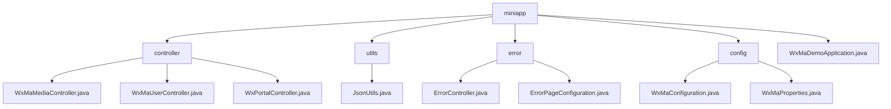

# 基础信息

|      |      |
|------|------|
| 名称 | miniapp |
| 编码语言 | .java |
| 代码路径 | weixin-java-miniapp-demo/src/main/java/com/github/binarywang/demo/wx/miniapp |
| 包名 | docs.src.main.java.com.github.binarywang.demo.wx.miniapp |
| 概述说明 | 该模块为微信小程序提供后端支持，涵盖用户认证、媒体管理、消息处理等功能，支持多应用配置切换与安全访问控制，采用RESTful API和JSON响应格式，依赖weixin-java-miniapp SDK，具备良好的扩展性和稳定性。 |

# 说明

## 概述  
该模块为微信小程序提供后端核心支撑，涵盖用户认证、媒体管理、消息路由及多应用配置切换功能。统一通过RESTful API提供服务，采用JSON交互格式并在请求结束时清理ThreadLocal变量以防止内存泄漏。例如：WxMaUserController处理登录与信息解密，WxPortalController负责消息分发。

模块接口规范统一基于Spring MVC风格设计，支持GET/POST方法调用，并兼容明文与AES加密传输方式。关键数据结构包括WxMaJscode2SessionResult（登录凭证结果）、WxMaUserInfo（用户敏感信息）和WxMpXmlMessage（微信推送消息）。外部依赖主要包括weixin-java-miniapp SDK、Spring Boot Web组件及相关HTTP客户端库。

## 主要业务场景  
模块支撑三大典型流程：用户身份验证与会话管理、临时素材上传下载、微信平台消息订阅与事件响应。交互模式类似MVC架构，前端请求经Controller解析后调用Service层处理，最终返回统一格式响应。例如：扫码登录由UserController处理，头像上传交由MediaController执行。

功能上实现了从配置加载、消息监听到客服消息推送的全链路闭环，具备良好的扩展性与集成能力。典型应用场景如企业级多租户小程序平台，可通过本模块快速搭建标准化通信入口。API类型覆盖配置注入接口与消息回调接口，支持灵活拓展新消息类型。例如：收到图片消息时自动上传并回传处理结果。

### 包内部结构视图

该流程图展示了微信小程序 Demo 项目的模块结构，包括控制器、工具类、错误处理和配置等主要组成部分及其层级关系。

# 文件列表

| 名称   | 类型  | 说明 |
|-------|------|-------------|
| [WxMaDemoApplication.java](WxMaDemoApplication.md) | file | 这是一个Spring Boot应用程序的启动类，名为WxMaDemoApplication。该类使用@SpringBootApplication注解标记，包含main方法用于启动Spring应用上下文。 |
| [config](config/_module.md) | package | 该配置类用于初始化微信小程序服务，通过读取配置属性完成多小程序账号注册与管理，构建消息路由器并定义文本、图片、二维码等消息处理逻辑，支持客服消息和订阅消息通知发送。 |
| [error](error/_module.md) | package | 这是一个Spring Boot错误处理系统，包含错误控制器和配置类。控制器处理404和500错误请求，统一返回error视图；配置类注册自定义错误页面，实现优雅的错误提示机制。 |
| [utils](utils/_module.md) | package | JsonUtils工具类提供JSON序列化功能，使用ObjectMapper实现对象到JSON字符串的转换，配置了非空字段序列化和格式化输出，异常时返回null并打印堆栈信息。 |
| [controller](controller/_module.md) | package | 该控制器实现微信小程序媒体文件上传下载功能，支持多文件处理和异常捕获。提供用户登录、信息获取及手机号绑定接口，处理JSCode校验与会话管理。同时负责小程序接入验证和消息接收处理，支持明文与AES加密传输，自动切换JSON或XML格式解析数据并路由至指定处理器，确保服务稳定运行。 |

