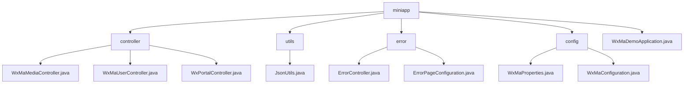

# 基础信息

|      |      |
|------|------|
| 名称 | miniapp |
| 编码语言 | .java |
| 代码路径 | weixin-java-miniapp-demo/src/main/java/com/github/binarywang/demo/wx/miniapp |
| 包名 | docs.src.main.java.com.github.binarywang.demo.wx.miniapp |
| 概述说明 | 该模块为微信小程序提供后端服务，支持多实例配置、用户认证、媒体管理及消息推送。采用RESTful接口设计，集成WxJava SDK与Spring Boot框架，实现文件上传、JSON解析、AES加密通信等功能，并通过统一错误处理机制提升系统稳定性。 |

# 说明

## 概述

该模块为微信小程序提供后端核心服务，支持多实例配置、用户认证、消息处理与媒体资源管理。通过AppId路由和线程本地变量实现请求隔离，结合WxJava SDK完成微信协议对接。例如上传图片返回MediaId、根据Code获取用户Session等。

接口遵循RESTful风格，支持Multipart文件传输、JSON/XML解析及AES加密通信。主要依赖包括wx-java-miniapp-spring-boot-starter、commons-fileupload及Spring Web相关组件。关键数据结构有WxMaConfig、WxMaUserInfo、WxMaJscode2SessionResult和WxMpXmlMessage等。

此外还包含统一错误处理机制，通过ErrorController和ErrorPageConfiguration实现404/500状态的视图渲染，类似事件总线集中分发错误请求至/error路径并展示Thymeleaf模板页。

模块使用JsonUtils工具类进行JSON序列化操作，基于Jackson ObjectMapper配置空值忽略与格式化输出功能。整体采用Spring Boot标准结构，由WxMaDemoApplication启动类引导初始化流程。

## 主要业务场景

模块整合了微信小程序三大交互流程：用户登录、消息推送与素材管理，交互模式类似事件总线架构，由Portal Controller统一分发请求。例如GET校验URL有效性，POST接收用户行为数据，并通过Service组件执行具体逻辑。

支持从配置加载到服务运行的完整生命周期，通过WxMaProperties绑定多实例参数，利用消息路由器分发不同类型事件至日志、文本回复或图片响应处理器。典型应用如扫码返回二维码、订阅通知触发消息推送等。

API类型涵盖Controller层HTTP接口、Service层业务逻辑及自定义消息处理器注册机制，适用于Spring Boot微服务部署环境。同时集成统一错误页面机制，提升前端体验一致性，开发者可快速复用构建自定义错误提示界面。

### 包内部结构视图

该流程图展示了微信小程序Java后台demo项目的模块结构，包括控制器、工具类、错误处理和配置等主要组件及其层级关系。

# 文件列表

| 名称   | 类型  | 说明 |
|-------|------|-------------|
| [WxMaDemoApplication.java](WxMaDemoApplication.md) | file | 这是一个Spring Boot应用程序的启动类，使用@SpringBootApplication注解标记，通过main方法启动Spring应用上下文。 |
| [config](config/_module.md) | package | 该类是微信小程序配置类，通过@ConfigurationProperties注解读取wx.miniapp前缀的配置属性，支持多套小程序配置。内部包含Config静态内部类定义appid、secret、token、aesKey和msgDataFormat等核心参数，采用List集合管理多组配置信息，用于初始化小程序服务并注册消息路由器处理各类消息场景。 |
| [error](error/_module.md) | package | 这是一个Spring Boot错误处理系统，包含错误控制器和配置类。控制器处理404和500错误并返回统一错误页面，配置类将HTTP状态码映射到对应错误路径实现统一管理。 |
| [utils](utils/_module.md) | package | JsonUtils工具类提供JSON序列化功能，使用ObjectMapper实现对象到JSON字符串的转换，配置了非空字段序列化和格式化输出，异常时返回null并打印堆栈信息。 |
| [controller](controller/_module.md) | package | 该控制器实现微信小程序媒体文件上传下载功能，支持临时图片素材上传返回media_id列表，提供根据mediaId下载素材能力，使用multipart格式接收文件并通过CommonsMultipartResolver处理请求，每次操作后清理线程本地变量，未找到对应appid配置时抛出异常提示。 |

