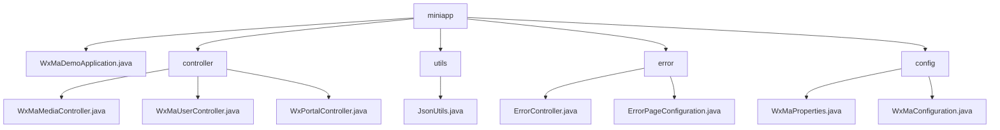

# 基础信息

|      |      |
|------|------|
| 名称 | miniapp |
| 编码语言 | .java |
| 代码路径 | weixin-java-miniapp-demo/src/main/java/com/github/binarywang/demo/wx/miniapp |
| 包名 | docs.src.main.java.com.github.binarywang.demo.wx.miniapp |
| 概述说明 | 微信小程序后端核心模块，含媒体管理、用户会话和消息路由功能，支持多账号配置，采用Spring Boot框架，包含错误处理和JSON工具类。 |

# 说明

## 概述  
该模块是微信小程序后端服务集合，核心职责包括媒体文件管理、用户会话服务和微信消息路由，同时集成错误页面处理和配置管理功能。采用基于appid的多租户架构，接口规范遵循Spring MVC标准，关键数据结构涵盖media_id列表、用户会话JSON、微信消息对象及WxMaProperties配置类。外部依赖微信SDK加密服务、HTTP请求处理和Spring框架。例如上传接口返回media_id，登录接口返回sessionKey，错误处理自动路由404页面。

## 主要业务场景  
模块支持三类核心流程：1)媒体文件管理类似CDN操作；2)用户认证遵循OAuth2.0模式；3)消息路由采用事件总线机制。典型交互为请求→验证→执行→清理→响应闭环，完整覆盖小程序后台开发需求。多租户配置管理支持并行处理多个小程序实例，错误处理通过状态码映射实现自动跳转。例如通过code换取会话，或根据消息类型路由到对应处理器链。

### 包内部结构视图

该流程图展示了微信小程序Demo项目的核心结构，包含主应用类、控制器、工具类、错误处理模块和配置模块。控制器下有三个具体实现类，错误处理和配置模块各有两个组件，工具类包含一个JSON处理工具。整体结构清晰，模块划分明确。

# 文件列表

| 名称   | 类型  | 说明 |
|-------|------|-------------|
| [WxMaDemoApplication.java](WxMaDemoApplication.md) | file | 这是一个Spring Boot应用的主类，使用@SpringBootApplication注解标记，通过main方法启动应用。 |
| [controller](controller/_module.md) | package | 微信小程序三个控制器类：媒体控制器处理文件上传下载；用户控制器提供登录、获取用户信息和手机号功能；门户控制器处理微信服务器认证和消息路由。均基于appid配置并清理ThreadLocal。 |
| [config](config/_module.md) | package | WxMaProperties是微信小程序配置类，支持多账号管理，包含appid、密钥等字段。WxMaConfiguration初始化服务并处理消息路由，含多种消息处理器和异常处理。 |
| [error](error/_module.md) | package | Spring MVC错误处理控制器，映射/error路径，包含404和500错误处理方法。配置类实现ErrorPageRegistrar接口，注册404和500错误页面路径。 |
| [utils](utils/_module.md) | package | JsonUtils类提供静态JSON序列化方法，使用ObjectMapper配置非空字段输出和格式化，异常时返回null。 |

