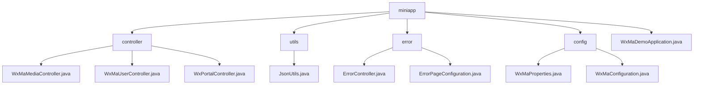

# 基础信息

|      |      |
|------|------|
| 名称 | miniapp |
| 编码语言 | .java |
| 代码路径 | weixin-java-miniapp-demo/src/main/java/com/github/binarywang/demo/wx/miniapp |
| 包名 | docs.src.main.java.com.github.binarywang.demo.wx.miniapp |
| 概述说明 | 该模块为微信小程序提供后端核心功能，包括媒体上传下载、用户认证与消息路由。基于Spring Boot开发，支持多租户配置切换，接口遵循RESTful风格并采用JSON通信。关键组件有WxMaConfig、WxMaMessage等，依赖weixin-java-miniapp SDK。模块涵盖错误处理、配置管理及应用启动引导，具备高内聚低耦合特性，适用于微服务架构中独立部署使用。 |

# 说明

## 概述

该模块为微信小程序提供完整的后端服务能力，涵盖用户认证、消息处理、媒体资源管理及多账户配置支持。接口遵循RESTful规范，以JSON格式通信并确保线程安全，所有控制器操作结束后清理ThreadLocal资源，类似ServletContext生命周期管理机制。关键数据结构包括WxMaConfig、WxMaJscode2SessionResult和WxMaMessage等。外部依赖主要为weixin-java-miniapp SDK、Spring Boot及其Web模块，未引入其他第三方库。例如：通过/media/upload上传图片获取media_id；使用/wxa/business/getuserphonenumber解密手机号；通过wx.miniapp.configs配置多个小程序实例。

## 主要业务场景

模块支撑微信小程序的接入验证、身份管理、消息路由与多媒体交互四大核心流程。支持GET校验签名与POST接收明文/AES加密消息，并通过路由器分发处理，形成类似事件总线模式的交互架构。用户相关接口实现登录态维护与敏感信息解密，如通过code换取openid。媒体控制器适用于头像上传、语音下载等典型场景。同时支持统一错误页面跳转，提升异常情况下的用户体验一致性。API类型覆盖HTTP GET/POST请求，集成案例包含从微信回调到业务响应的闭环处理。例如：访问未定义接口返回“页面未找到”提示；通过WxMaMessageRouter添加文本处理器实现自动应答功能。

### 包内部结构视图

该流程图展示了微信小程序 Demo 项目的模块结构，包括控制器、工具类、错误处理和配置等主要组成部分及其层级关系。

# 文件列表

| 名称   | 类型  | 说明 |
|-------|------|-------------|
| [WxMaDemoApplication.java](WxMaDemoApplication.md) | file | 这是一个Spring Boot应用程序的启动类，使用@SpringBootApplication注解标记，通过main方法启动Spring应用上下文。 |
| [config](config/_module.md) | package | 该类是微信小程序配置类，通过@ConfigurationProperties注解读取wx.miniapp前缀的配置信息，支持多套小程序配置管理。内部包含Config静态内部类，定义appid、secret、token、aesKey和msgDataFormat等核心配置项。采用List集合管理多组配置信息，用于初始化微信小程序服务和消息路由处理机制，实现多小程序账号的注册管理和自动化消息交互功能。 |
| [error](error/_module.md) | package | 这是一个Spring Boot错误处理系统，包含错误控制器和配置类。控制器处理404和500错误请求，统一返回error视图。配置类实现ErrorPageRegistrar接口，将HTTP 404和500状态码映射到对应错误路径，实现统一错误页面管理。 |
| [utils](utils/_module.md) | package | JsonUtils工具类提供JSON序列化功能，使用ObjectMapper实现对象到JSON字符串的转换，配置了非空字段序列化和格式化输出，异常时返回null。 |
| [controller](controller/_module.md) | package | 该控制器实现微信小程序媒体文件上传下载功能，支持通过appid切换配置，上传临时图片素材返回唯一media_id，下载时根据media_id获取文件，接口处理完自动清理线程本地变量。 |

