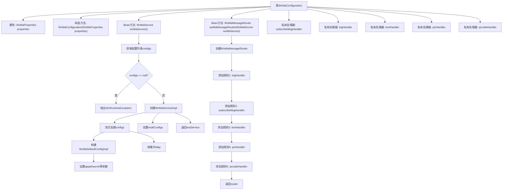

# 基础信息

|      |      |
|------|------|
| 名称 | WxMaConfiguration |
| 编码语言 | .java |
| 代码路径 | weixin-java-miniapp-demo\src\main\java\com\github\binarywang\demo\wx\miniapp\config\WxMaConfiguration.java |
| 包名 | com.github.binarywang.demo.wx.miniapp.config |
| 依赖项 | ['cn.binarywang.wx.miniapp.api.WxMaService', 'cn.binarywang.wx.miniapp.api.impl.WxMaServiceImpl', 'cn.binarywang.wx.miniapp.bean.WxMaKefuMessage', 'cn.binarywang.wx.miniapp.bean.WxMaSubscribeMessage', 'cn.binarywang.wx.miniapp.config.impl.WxMaDefaultConfigImpl', 'cn.binarywang.wx.miniapp.config.impl.WxMaRedisConfigImpl', 'cn.binarywang.wx.miniapp.message.WxMaMessageHandler', 'cn.binarywang.wx.miniapp.message.WxMaMessageRouter', 'com.google.common.collect.Lists', 'lombok.extern.slf4j.Slf4j', 'me.chanjar.weixin.common.bean.result.WxMediaUploadResult', 'me.chanjar.weixin.common.error.WxErrorException', 'me.chanjar.weixin.common.error.WxRuntimeException', 'org.springframework.beans.factory.annotation.Autowired', 'org.springframework.boot.context.properties.EnableConfigurationProperties', 'org.springframework.context.annotation.Bean', 'org.springframework.context.annotation.Configuration', 'redis.clients.jedis.JedisPool', 'java.io.File', 'java.util.List', 'java.util.stream.Collectors'] |
| 概述说明 | 这是一个微信小程序配置类，包含服务初始化和消息路由设置。创建WxMaService处理多配置，检查配置有效性。定义消息路由规则，处理订阅、文本、图片和二维码消息，提供日志记录和客服消息回复功能。 |

# 说明

这是一个微信小程序后端配置类，主要功能包括初始化微信小程序服务和配置消息路由。类通过构造函数注入配置属性，创建WxMaService实例时会检查配置是否存在，若无则抛出异常。服务配置支持多账号，将配置信息映射为以Appid为键的Map。同时配置了消息路由器，定义了五种消息处理规则：日志记录、订阅消息、文本消息、图片消息和二维码消息，每种消息都有对应的处理器。处理器功能包括发送客服消息、上传媒体文件、生成二维码等，部分操作涉及异常处理。

# 类列表 Class Summary

| 名称   | 类型  | 说明 |
|-------|------|-------------|
| WxMaConfiguration | class | WxMaConfiguration配置类，初始化微信小程序服务WxMaService和消息路由WxMaMessageRouter，处理订阅、文本、图片、二维码等消息类型。 |


## 类 WxMaConfiguration

|      |      |
|------|------|
| 访问范围 | @Slf4j;@Configuration;@EnableConfigurationProperties(WxMaProperties.class);public |
| 类型 | class |
| 名称 | WxMaConfiguration |
| 说明 | WxMaConfiguration配置类，初始化微信小程序服务WxMaService和消息路由WxMaMessageRouter，处理订阅、文本、图片、二维码等消息类型。 |


### UML类图

```mermaid
classDiagram
    class WxMaConfiguration {
        -WxMaProperties properties
        -WxMaMessageHandler subscribeMsgHandler
        -WxMaMessageHandler logHandler
        -WxMaMessageHandler textHandler
        -WxMaMessageHandler picHandler
        -WxMaMessageHandler qrcodeHandler
        +WxMaConfiguration(WxMaProperties properties)
        +WxMaService wxMaService()
        +WxMaMessageRouter wxMaMessageRouter(WxMaService wxMaService)
    }

    class WxMaProperties {
        +List~Config~ getConfigs()
    }

    class WxMaProperties.Config {
        +String getAppid()
        +String getSecret()
        +String getToken()
        +String getAesKey()
        +String getMsgDataFormat()
    }

    class WxMaService {
        <<Interface>>
        +void setMultiConfigs(Map~String, WxMaConfig~ configs)
        +MsgService getMsgService()
        +MediaService getMediaService()
        +QrcodeService getQrcodeService()
    }

    class WxMaServiceImpl {
        +void setMultiConfigs(Map~String, WxMaConfig~ configs)
        +MsgService getMsgService()
        +MediaService getMediaService()
        +QrcodeService getQrcodeService()
    }

    class WxMaDefaultConfigImpl {
        +String getAppid()
        +void setAppid(String appid)
        +void setSecret(String secret)
        +void setToken(String token)
        +void setAesKey(String aesKey)
        +void setMsgDataFormat(String msgDataFormat)
    }

    class WxMaMessageRouter {
        +WxMaMessageRouter(WxMaService wxMaService)
        +rule() RuleBuilder
    }

    interface WxMaMessageHandler {
        <<Interface>>
        +Object handle(WxMaMessage wxMessage, Map~String, Object~ context, WxMaService service, WxSessionManager sessionManager)
    }

    WxMaConfiguration --> WxMaProperties : 依赖
    WxMaConfiguration --> WxMaService : 创建
    WxMaConfiguration --> WxMaMessageRouter : 创建
    WxMaConfiguration ..|> WxMaMessageHandler : 实现
    WxMaServiceImpl ..|> WxMaService : 实现
    WxMaDefaultConfigImpl ..|> WxMaConfig : 实现
    WxMaProperties *-- WxMaProperties.Config : 包含
```

这段代码是一个微信小程序后端服务的配置类，主要功能是初始化微信小程序服务(WxMaService)和消息路由器(WxMaMessageRouter)。WxMaConfiguration通过@Configuration注解表明这是一个Spring配置类，它依赖WxMaProperties获取配置信息，创建并配置WxMaService实例，同时构建消息处理路由规则。类图中展示了核心类及其关系，包括配置类、服务接口及实现、配置项、消息处理器等组件，体现了Spring依赖注入和微信小程序SDK的集成方式。


### 内部方法调用关系图



这段代码是微信小程序服务端的Spring Boot配置类，主要完成两个核心功能：1) 初始化多账号的小程序服务实例WxMaService，通过读取配置文件构建多个小程序配置；2) 创建消息路由器WxMaMessageRouter，定义不同消息类型(订阅/文本/图片/二维码)的处理规则链。流程图清晰展示了配置初始化的校验过程、多账号配置的流式处理，以及消息路由规则的链式构建逻辑。

### 字段列表 Field List

| 名称  | 类型  | 说明 |
|-------|-------|------|
| properties | WxMaProperties | 私有不可变的微信小程序配置属性对象。 |
| logHandler = (wxMessage, context, service, sessionManager) -> {        log.info("收到消息：" + wxMessage.toString());        service.getMsgService().sendKefuMsg(WxMaKefuMessage.newTextBuilder().content("收到信息为：" + wxMessage.toJson())            .toUser(wxMessage.getFromUser()).build());        return null;    } | WxMaMessageHandler | 定义微信小程序消息处理逻辑：记录接收消息内容并自动回复用户，包含原始消息JSON。 |
| subscribeMsgHandler = (wxMessage, context, service, sessionManager) -> {        service.getMsgService().sendSubscribeMsg(WxMaSubscribeMessage.builder()            .templateId("此处更换为自己的模板id")            .data(Lists.newArrayList(                new WxMaSubscribeMessage.MsgData("keyword1", "339208499")))            .toUser(wxMessage.getFromUser())            .build());        return null;    } | WxMaMessageHandler | 定义微信小程序订阅消息处理器，使用指定模板ID和关键词数据向用户发送订阅消息。 |
| textHandler = (wxMessage, context, service, sessionManager) -> {        service.getMsgService().sendKefuMsg(WxMaKefuMessage.newTextBuilder().content("回复文本消息")            .toUser(wxMessage.getFromUser()).build());        return null;    } | WxMaMessageHandler | 微信小程序消息处理：收到用户文本消息后自动回复固定文本内容。 |
| picHandler = (wxMessage, context, service, sessionManager) -> {        try {            WxMediaUploadResult uploadResult = service.getMediaService()                .uploadMedia("image", "png",                    ClassLoader.getSystemResourceAsStream("tmp.png"));            service.getMsgService().sendKefuMsg(                WxMaKefuMessage                    .newImageBuilder()                    .mediaId(uploadResult.getMediaId())                    .toUser(wxMessage.getFromUser())                    .build());        } catch (WxErrorException e) {            e.printStackTrace();        }        return null;    } | WxMaMessageHandler | 定义了一个微信小程序消息处理器picHandler，用于接收图片消息后上传临时图片并返回客服消息。处理异常时打印错误信息。 |
| qrcodeHandler = (wxMessage, context, service, sessionManager) -> {        try {            final File file = service.getQrcodeService().createQrcode("123", 430);            WxMediaUploadResult uploadResult = service.getMediaService().uploadMedia("image", file);            service.getMsgService().sendKefuMsg(                WxMaKefuMessage                    .newImageBuilder()                    .mediaId(uploadResult.getMediaId())                    .toUser(wxMessage.getFromUser())                    .build());        } catch (WxErrorException e) {            e.printStackTrace();        }        return null;    } | WxMaMessageHandler | 处理微信消息，生成二维码并上传发送给用户，异常时打印错误。 |

### 方法列表

| 名称  | 类型  | 说明 |
|-------|-------|------|
| wxMaService | WxMaService | 创建微信小程序服务实例，检查配置后初始化多账号配置，包括appid、密钥等参数，未配置则抛出异常提示。 |
| wxMaMessageRouter | WxMaMessageRouter | 创建微信小程序消息路由，配置处理订阅、文本、图片和二维码消息的同步处理器。 |


