# 基础信息

|      |      |
|------|------|
| 名称 | WxMaConfiguration |
| 编码语言 | .java |
| 代码路径 | weixin-java-miniapp-demo/src/main/java/com/github/binarywang/demo/wx/miniapp/config/WxMaConfiguration.java |
| 包名 | com.github.binarywang.demo.wx.miniapp.config |
| 依赖项 | ['cn.binarywang.wx.miniapp.api.WxMaService', 'cn.binarywang.wx.miniapp.api.impl.WxMaServiceImpl', 'cn.binarywang.wx.miniapp.bean.WxMaKefuMessage', 'cn.binarywang.wx.miniapp.bean.WxMaSubscribeMessage', 'cn.binarywang.wx.miniapp.config.impl.WxMaDefaultConfigImpl', 'cn.binarywang.wx.miniapp.config.impl.WxMaRedisConfigImpl', 'cn.binarywang.wx.miniapp.message.WxMaMessageHandler', 'cn.binarywang.wx.miniapp.message.WxMaMessageRouter', 'com.google.common.collect.Lists', 'lombok.extern.slf4j.Slf4j', 'me.chanjar.weixin.common.bean.result.WxMediaUploadResult', 'me.chanjar.weixin.common.error.WxErrorException', 'me.chanjar.weixin.common.error.WxRuntimeException', 'org.springframework.beans.factory.annotation.Autowired', 'org.springframework.boot.context.properties.EnableConfigurationProperties', 'org.springframework.context.annotation.Bean', 'org.springframework.context.annotation.Configuration', 'redis.clients.jedis.JedisPool', 'java.io.File', 'java.util.List', 'java.util.stream.Collectors'] |
| 概述说明 | 该配置类用于初始化微信小程序服务及消息路由器，支持多小程序配置，并定义了多种消息处理逻辑，包括日志记录、文本回复、图片发送和二维码生成等功能。 |

# 说明

该配置类用于初始化微信小程序服务，通过读取配置属性创建多个小程序实例，并注册消息路由器。路由器根据消息内容分发至不同处理器，分别处理日志记录、订阅消息发送、文本回复、图片及二维码消息响应等场景，同时支持多媒体资源上传与客服消息下发功能。

# 类列表 Class Summary

| 名称   | 类型  | 说明 |
|-------|------|-------------|
| WxMaConfiguration | class | 该配置类用于初始化微信小程序服务及消息路由器，支持多小程序配置，并定义了多种消息处理逻辑，包括日志记录、文本回复、图片发送和二维码生成等功能。 |


## 类 WxMaConfiguration

|      |      |
|------|------|
| 访问范围 | @Slf4j;@Configuration;@EnableConfigurationProperties(WxMaProperties.class);public |
| 类型 | class |
| 名称 | WxMaConfiguration |
| 说明 | 该配置类用于初始化微信小程序服务及消息路由器，支持多小程序配置，并定义了多种消息处理逻辑，包括日志记录、文本回复、图片发送和二维码生成等功能。 |


### UML类图

```mermaid
classDiagram
    class WxMaConfiguration {
        -WxMaProperties properties
        -WxMaMessageHandler subscribeMsgHandler
        -WxMaMessageHandler logHandler
        -WxMaMessageHandler textHandler
        -WxMaMessageHandler picHandler
        -WxMaMessageHandler qrcodeHandler
        +WxMaConfiguration(WxMaProperties properties)
        +WxMaService wxMaService()
        +WxMaMessageRouter wxMaMessageRouter(WxMaService wxMaService)
    }

    class WxMaProperties {
        <<Interface>>
        +List~Config~ getConfigs()
    }

    class WxMaService {
        <<Interface>>
        +void setMultiConfigs(Map~String, WxMaDefaultConfigImpl~ configs)
        +WxMaMsgService getMsgService()
        +WxMaMediaService getMediaService()
        +WxMaQrcodeService getQrcodeService()
    }

    class WxMaServiceImpl {
        +void setMultiConfigs(Map~String, WxMaDefaultConfigImpl~ configs)
        +WxMaMsgService getMsgService()
        +WxMaMediaService getMediaService()
        +WxMaQrcodeService getQrcodeService()
    }

    class WxMaDefaultConfigImpl {
        +void setAppid(String appid)
        +void setSecret(String secret)
        +void setToken(String token)
        +void setAesKey(String aesKey)
        +void setMsgDataFormat(String msgDataFormat)
        +String getAppid()
    }

    class WxMaMessageRouter {
        +WxMaMessageRouter(WxMaService wxMaService)
        +WxMaMessageRouter rule()
        +WxMaMessageRouter handler(WxMaMessageHandler handler)
        +WxMaMessageRouter next()
        +WxMaMessageRouter async(boolean async)
        +WxMaMessageRouter content(String content)
        +WxMaMessageRouter end()
    }

    class WxMaMessageHandler {
        <<Interface>>
        +Object handle(WxMaMessage wxMessage, Map~String, Object~ context, WxMaService service, WxSessionManager sessionManager)
    }

    class WxMaMessage {
        +String getFromUser()
        +String toJson()
        +String toString()
    }

    class WxSessionManager {
    }

    class WxMaSubscribeMessage {
        -String templateId
        -List~MsgData~ data
        -String toUser
        +WxMaSubscribeMessage builder()
        +WxMaSubscribeMessage templateId(String templateId)
        +WxMaSubscribeMessage data(List~MsgData~ data)
        +WxMaSubscribeMessage toUser(String toUser)
        +WxMaSubscribeMessage build()
    }

    class WxMaKefuMessage {
        +WxMaKefuMessage newTextBuilder()
        +WxMaKefuMessage newImageBuilder()
        +WxMaKefuMessage content(String content)
        +WxMaKefuMessage mediaId(String mediaId)
        +WxMaKefuMessage toUser(String toUser)
        +WxMaKefuMessage build()
    }

    class WxMediaUploadResult {
        +String getMediaId()
    }

    class WxMaMsgService {
        +void sendSubscribeMsg(WxMaSubscribeMessage message)
        +void sendKefuMsg(WxMaKefuMessage message)
    }

    class WxMaMediaService {
        +WxMediaUploadResult uploadMedia(String mediaType, String fileType, InputStream inputStream)
        +WxMediaUploadResult uploadMedia(String mediaType, File file)
    }

    class WxMaQrcodeService {
        +File createQrcode(String sceneStr, int width)
    }

    class WxErrorException {
        +printStackTrace()
    }


    WxMaConfiguration --> WxMaProperties : 依赖
    WxMaConfiguration --> WxMaService : 创建并配置
    WxMaConfiguration --> WxMaMessageRouter : 创建并配置路由规则
    WxMaConfiguration --> WxMaMessageHandler : 持有多个处理器实例
    WxMaServiceImpl ..|> WxMaService : 实现
    WxMaDefaultConfigImpl --> WxMaProperties.Config : 配置映射
    WxMaMessageRouter --> WxMaService : 路由处理需服务支持
    WxMaMessageRouter --> WxMaMessageHandler : 注册处理逻辑
    WxMaMessageHandler --> WxMaMessage : 处理微信消息对象
    WxMaMessageHandler --> WxSessionManager : 管理会话状态
    WxMaMessageHandler --> WxMaSubscribeMessage : 构建订阅消息
    WxMaMessageHandler --> WxMaKefuMessage : 构建客服消息
    WxMaMessageHandler --> WxMediaUploadResult : 获取媒体上传结果
    WxMaMessageHandler --> WxErrorException : 异常捕获
    WxMaService --> WxMaMsgService : 提供消息服务接口
    WxMaService --> WxMaMediaService : 提供媒体服务接口
    WxMaService --> WxMaQrcodeService : 提供二维码服务接口
```



该类图展示了微信小程序配置类 `WxMaConfiguration` 如何通过属性绑定和 Bean 注入方式构建核心服务组件，包括多配置管理、消息路由及多种消息处理器。各组件职责清晰，结构完整，体现了 Spring Boot 自动配置与微信 SDK 的集成设计思路。


### 内部方法调用关系图

```mermaid
graph TD
    A["类WxMaConfiguration"]
    B["属性: WxMaProperties properties"]
    C["构造方法: WxMaConfiguration(WxMaProperties properties)"]
    D["Bean方法: wxMaService()"]
    E["Bean方法: wxMaMessageRouter(WxMaService wxMaService)"]
    F["消息处理器: subscribeMsgHandler"]
    G["消息处理器: logHandler"]
    H["消息处理器: textHandler"]
    I["消息处理器: picHandler"]
    J["消息处理器: qrcodeHandler"]

    A --> B
    A --> C
    A --> D
    A --> E
    D --> "创建WxMaServiceImpl实例"
    D --> "读取configs并校验非空"
    D --> "构建config映射并设置到maService"
    E --> "创建WxMaMessageRouter实例"
    E --> "注册logHandler规则"
    E --> "注册subscribeMsgHandler规则"
    E --> "注册textHandler规则"
    E --> "注册picHandler规则"
    E --> "注册qrcodeHandler规则"
    F --> "发送订阅消息"
    G --> "记录日志并回复客服消息"
    H --> "回复文本消息"
    I --> "上传图片并发送"
    J --> "生成二维码并发送"
```

该流程图展示了微信小程序配置类 `WxMaConfiguration` 的结构与核心逻辑。主要包括服务 Bean 的初始化、多配置项加载以及消息路由规则的绑定，涵盖了从配置注入到各类型消息处理的完整链路。

### 字段列表 Field List

| 名称  | 类型  | 说明 |
|-------|-------|------|
| properties | WxMaProperties | 这是一个微信小程序配置属性类的私有常量实例，用于存储和管理微信小程序的相关配置信息。 |
| textHandler = (wxMessage, context, service, sessionManager) -> {        service.getMsgService().sendKefuMsg(WxMaKefuMessage.newTextBuilder().content("回复文本消息")            .toUser(wxMessage.getFromUser()).build());        return null;    } | WxMaMessageHandler | 这是一个微信小程序消息处理器，用于处理文本消息并自动回复用户。 |
| logHandler = (wxMessage, context, service, sessionManager) -> {        log.info("收到消息：" + wxMessage.toString());        service.getMsgService().sendKefuMsg(WxMaKefuMessage.newTextBuilder().content("收到信息为：" + wxMessage.toJson())            .toUser(wxMessage.getFromUser()).build());        return null;    } | WxMaMessageHandler | 这是一个微信小程序消息处理器，用于记录收到的消息并自动回复用户。 |
| picHandler = (wxMessage, context, service, sessionManager) -> {        try {            WxMediaUploadResult uploadResult = service.getMediaService()                .uploadMedia("image", "png",                    ClassLoader.getSystemResourceAsStream("tmp.png"));            service.getMsgService().sendKefuMsg(                WxMaKefuMessage                    .newImageBuilder()                    .mediaId(uploadResult.getMediaId())                    .toUser(wxMessage.getFromUser())                    .build());        } catch (WxErrorException e) {            e.printStackTrace();        }        return null;    } | WxMaMessageHandler | 这是一个微信小程序图片消息处理器，用于上传本地图片资源并发送给用户。处理器通过服务上传PNG格式的临时图片文件，然后构建客服消息将上传后的媒体ID发送给来源用户，实现图片回复功能。异常情况会打印错误堆栈信息。 |
| subscribeMsgHandler = (wxMessage, context, service, sessionManager) -> {        service.getMsgService().sendSubscribeMsg(WxMaSubscribeMessage.builder()            .templateId("此处更换为自己的模板id")            .data(Lists.newArrayList(                new WxMaSubscribeMessage.MsgData("keyword1", "339208499")))            .toUser(wxMessage.getFromUser())            .build());        return null;    } | WxMaMessageHandler | 这是一个微信小程序消息处理器，用于处理用户订阅消息。当用户触发订阅事件时，系统会自动发送一条订阅消息，包含指定模板ID和关键词数据给用户。 |
| qrcodeHandler = (wxMessage, context, service, sessionManager) -> {        try {            final File file = service.getQrcodeService().createQrcode("123", 430);            WxMediaUploadResult uploadResult = service.getMediaService().uploadMedia("image", file);            service.getMsgService().sendKefuMsg(                WxMaKefuMessage                    .newImageBuilder()                    .mediaId(uploadResult.getMediaId())                    .toUser(wxMessage.getFromUser())                    .build());        } catch (WxErrorException e) {            e.printStackTrace();        }        return null;    } | WxMaMessageHandler | 该代码定义了一个微信小程序消息处理器，用于生成带参数二维码并发送给用户。处理器接收到消息后，首先创建一个参数为"123"、尺寸为430的二维码图片文件，然后将该图片上传至微信服务器获得媒体ID，最后通过客服消息接口将二维码图片发送给消息发送方用户。整个过程包含异常处理机制。 |

### 方法列表

| 名称  | 类型  | 说明 |
|-------|-------|------|
| wxMaService | WxMaService | 该代码配置微信小程序服务，读取配置列表并初始化多个小程序配置，包括appid、secret、token等参数，支持多小程序管理。 |
| wxMaMessageRouter | WxMaMessageRouter | 该代码配置了一个微信小程序消息路由器，定义了多种消息类型的处理规则，包括订阅消息、文本、图片和二维码处理，并支持异步处理和日志记录功能。 |


