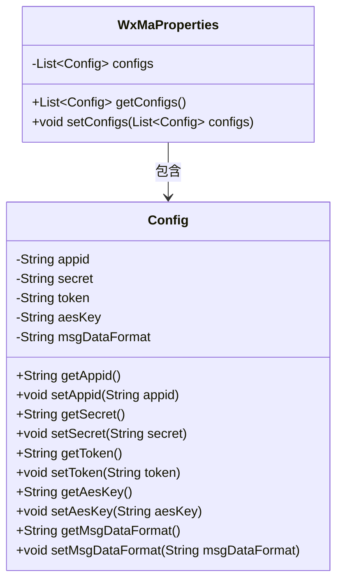
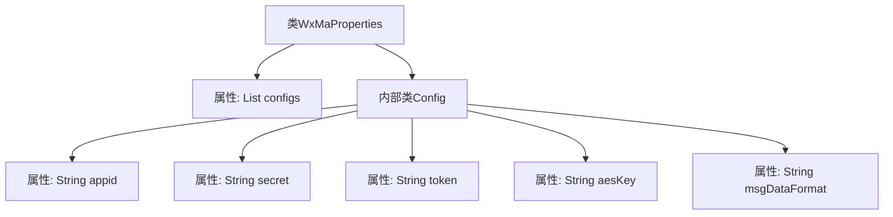

# 基础信息

|      |      |
|------|------|
| 名称 | WxMaProperties |
| 编码语言 | .java |
| 代码路径 | weixin-java-miniapp-demo\src\main\java\com\github\binarywang\demo\wx\miniapp\config\WxMaProperties.java |
| 包名 | com.github.binarywang.demo.wx.miniapp.config |
| 依赖项 | ['java.util.List', 'org.springframework.boot.context.properties.ConfigurationProperties', 'lombok.Data'] |
| 概述说明 | WxMaProperties类用于配置微信小程序属性，包含多个Config配置项，每个配置项包括appid、secret、token、aesKey和msgDataFormat字段。 |

# 说明

这是一个微信小程序配置属性的Java类定义。主类WxMaProperties使用@ConfigurationProperties注解绑定以"wx.miniapp"为前缀的配置项，包含一个Config类型的列表configs。Config静态内部类定义了小程序相关配置字段：appid（小程序ID）、secret（小程序密钥）、token（消息服务器令牌）、aesKey（消息加密密钥）和msgDataFormat（消息格式XML/JSON）。所有字段均通过Lombok的@Data注解自动生成getter/setter方法。

# 类列表 Class Summary

| 名称   | 类型  | 说明 |
|-------|------|-------------|
| WxMaProperties | class | WxMaProperties类用于配置微信小程序属性，包含多个Config配置项，每个配置项有appid、secret、token、aesKey和msgDataFormat字段。 |

## 类 WxMaProperties

|      |      |
|------|------|
| 访问范围 | @Data;@ConfigurationProperties(prefix = "wx.miniapp");public |
| 类型 | class |
| 名称 | WxMaProperties |
| 说明 | WxMaProperties类用于配置微信小程序属性，包含多个Config配置项，每个配置项有appid、secret、token、aesKey和msgDataFormat字段。 |

### UML类图

这段代码定义了一个微信小程序配置类WxMaProperties，使用@ConfigurationProperties注解绑定"wx.miniapp"前缀的配置。内部静态类Config封装了小程序的核心配置项：appid、secret、token、aesKey和msgDataFormat。通过@Data注解自动生成getter/setter方法，WxMaProperties包含多个Config配置项组成的列表，适用于多小程序配置场景。类图清晰展示了主配置类与嵌套配置类的包含关系，以及所有可配置属性的访问接口。

### 内部方法调用关系图

这段代码定义了一个Spring Boot配置类WxMaProperties，用于管理微信小程序的多账号配置。主类包含Config内部类的列表，每个Config实例存储小程序的appid、secret、token、aesKey和消息格式等配置项。通过@ConfigurationProperties注解绑定"wx.miniapp"前缀的配置，@Data注解自动生成getter/setter方法。该设计支持多小程序账号的集中管理，便于通过配置文件动态加载参数。

### 字段列表 Field List

| 名称  | 类型  | 说明 |
|-------|-------|------|
| configs | List<Config> | 私有配置列表变量configs。 |

### 方法列表

| 名称  | 类型  | 说明 |
|-------|-------|------|

