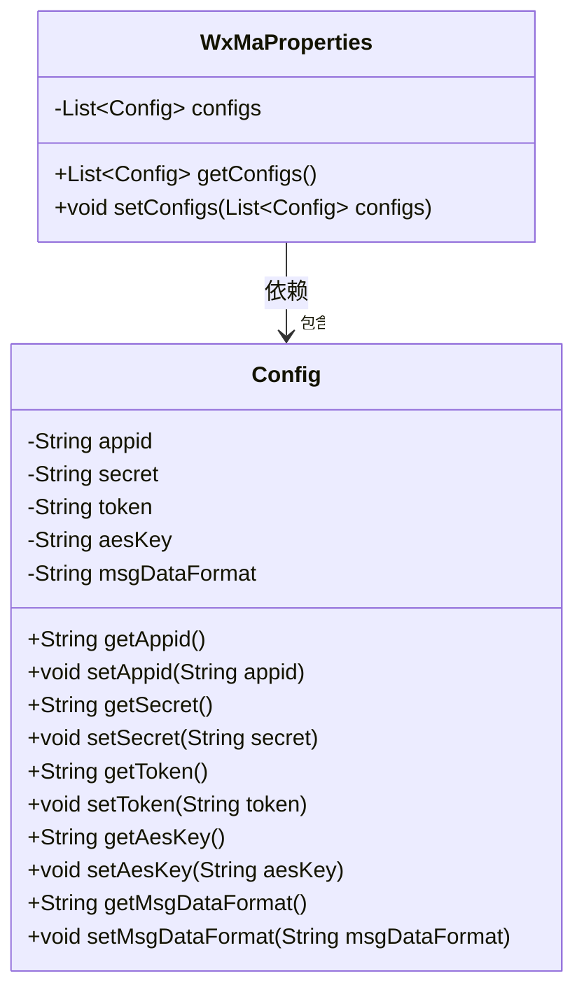
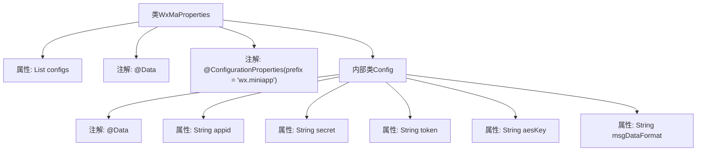

# 基础信息

|      |      |
|------|------|
| 名称 | WxMaProperties |
| 编码语言 | .java |
| 代码路径 | weixin-java-miniapp-demo/src/main/java/com/github/binarywang/demo/wx/miniapp/config/WxMaProperties.java |
| 包名 | com.github.binarywang.demo.wx.miniapp.config |
| 依赖项 | ['java.util.List', 'org.springframework.boot.context.properties.ConfigurationProperties', 'lombok.Data'] |
| 概述说明 | 该类用于配置微信小程序相关参数，包含应用ID、密钥、令牌、加密密钥及消息格式等核心配置项。 |

# 说明

该类是一个用于配置微信小程序相关参数的属性配置类。通过@ConfigurationProperties注解指定配置前缀为"wx.miniapp"，支持多套配置。内部定义了嵌套的Config静态内部类，包含微信小程序的核心配置项：appid应用标识、secret应用密钥、token消息服务器令牌、aesKey消息加密密钥以及msgDataFormat消息数据格式类型。整个配置结构采用List集合方式管理多组小程序配置信息。

# 类列表 Class Summary

| 名称   | 类型  | 说明 |
|-------|------|-------------|
| WxMaProperties | class | 该类用于配置微信小程序相关参数，包含应用ID、密钥、令牌和消息格式等核心配置项。 |

## 类 WxMaProperties

|      |      |
|------|------|
| 访问范围 | @Data;@ConfigurationProperties(prefix = "wx.miniapp");public |
| 类型 | class |
| 名称 | WxMaProperties |
| 说明 | 该类用于配置微信小程序相关参数，包含应用ID、密钥、令牌和消息格式等核心配置项。 |

### UML类图

该类图描述了微信小程序配置属性的结构。`WxMaProperties` 类用于封装多个微信小程序的配置信息，每个配置项由内部静态类 `Config` 表示，包含了如 appid、secret 等关键参数，支持通过 `@ConfigurationProperties` 进行自动绑定。

### 内部方法调用关系图

该流程图展示了`WxMaProperties`配置类的结构，包括其内部静态类`Config`及其各属性字段。外部类用于绑定微信小程序相关配置，通过`@ConfigurationProperties`指定前缀为`wx.miniapp`，内部类封装了每个小程序实例的具体参数如`appid`、`secret`等，整体结构清晰地体现了配置分层与数据映射关系。

### 字段列表 Field List

| 名称  | 类型  | 说明 |
|-------|-------|------|
| configs | List<Config> | 这是一个私有配置列表变量，用于存储Config类型的配置对象集合。 |

### 方法列表

| 名称  | 类型  | 说明 |
|-------|-------|------|

