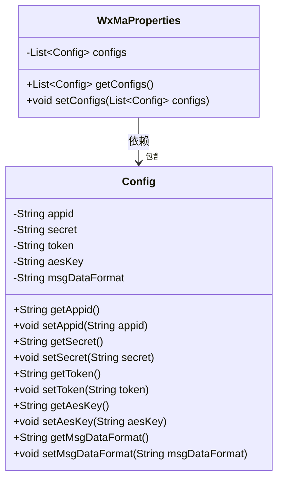
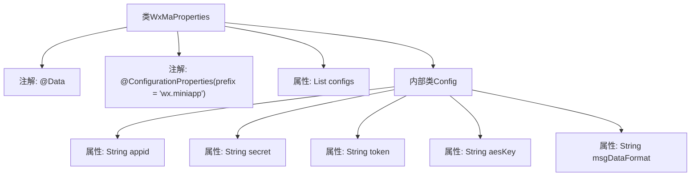

# 基础信息

|      |      |
|------|------|
| 名称 | WxMaProperties |
| 编码语言 | .java |
| 代码路径 | weixin-java-miniapp-demo/src/main/java/com/github/binarywang/demo/wx/miniapp/config/WxMaProperties.java |
| 包名 | com.github.binarywang.demo.wx.miniapp.config |
| 依赖项 | ['java.util.List', 'org.springframework.boot.context.properties.ConfigurationProperties', 'lombok.Data'] |
| 概述说明 | 这是一个微信小程序配置属性类，包含多个小程序的配置信息，每个配置项有appid、secret、token、aesKey和消息格式等参数。 |

# 说明

该类是一个用于配置微信小程序相关参数的属性配置类。通过@ConfigurationProperties注解指定配置前缀为"wx.miniapp"，支持多套配置。内部定义了Config静态内部类，包含appid、secret、token、aesKey和msgDataFormat五个核心配置项，分别对应微信小程序的应用标识、密钥、消息服务器令牌、加密密钥以及消息数据格式等关键信息。

# 类列表 Class Summary

| 名称   | 类型  | 说明 |
|-------|------|-------------|
| WxMaProperties | class | 该类用于配置微信小程序相关参数，包含应用ID、密钥、消息服务器令牌和加密密钥等信息。 |

## 类 WxMaProperties

|      |      |
|------|------|
| 访问范围 | @Data;@ConfigurationProperties(prefix = "wx.miniapp");public |
| 类型 | class |
| 名称 | WxMaProperties |
| 说明 | 该类用于配置微信小程序相关参数，包含应用ID、密钥、消息服务器令牌和加密密钥等信息。 |

### UML类图

该类图描述了微信小程序配置属性的结构。`WxMaProperties` 类用于封装多个 `Config` 配置项，每个 `Config` 对应一个小程序的认证和消息处理参数，如 appid、secret 等。两者之间是聚合关系，表示 `WxMaProperties` 包含多个 `Config` 实例。

### 内部方法调用关系图

该流程图展示了`WxMaProperties`配置类的结构，包括其绑定前缀为"wx.miniapp"的注解配置、包含的`List<Config>`属性以及内部静态类`Config`的各个字段定义。整体用于微信小程序相关配置的自动装配映射。

### 字段列表 Field List

| 名称  | 类型  | 说明 |
|-------|-------|------|
| configs | List<Config> | 这是一个私有配置列表成员变量，用于存储Config类型的配置对象集合。 |

### 方法列表

| 名称  | 类型  | 说明 |
|-------|-------|------|

