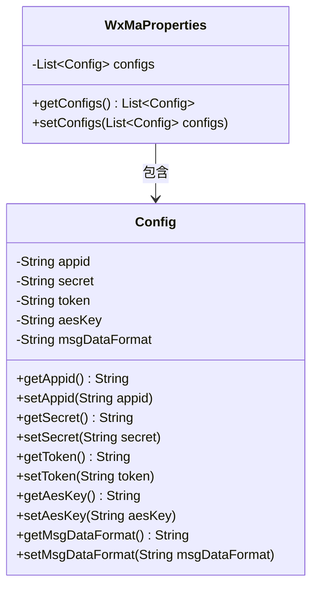
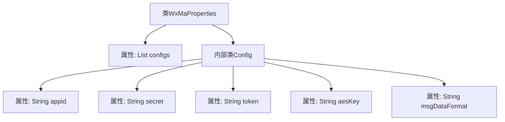

# 基础信息

|      |      |
|------|------|
| 名称 | WxMaProperties |
| 编码语言 | .java |
| 代码路径 | weixin-java-miniapp-demo/src/main/java/com/github/binarywang/demo/wx/miniapp/config/WxMaProperties.java |
| 包名 | com.github.binarywang.demo.wx.miniapp.config |
| 依赖项 | ['java.util.List', 'org.springframework.boot.context.properties.ConfigurationProperties', 'lombok.Data'] |
| 概述说明 | WxMaProperties类用于配置微信小程序属性，包含多个Config配置项，每个配置项有appid、secret、token、aesKey和msgDataFormat字段。 |

# 说明

该内容定义了一个名为WxMaProperties的Java配置类，用于管理微信小程序的相关配置参数。类使用@ConfigurationProperties注解，前缀为wx.miniapp。包含一个Config内部类列表，每个Config对象存储单个小程序的配置信息。Config类包含五个字段：appid（小程序ID）、secret（小程序密钥）、token（消息服务器令牌）、aesKey（消息加密密钥）、msgDataFormat（消息格式，支持XML或JSON）。所有字段均通过Lombok的@Data注解自动生成getter/setter方法。该结构支持多小程序配置，适用于需要管理多个微信小程序的Spring Boot应用场景。

# 类列表 Class Summary

| 名称   | 类型  | 说明 |
|-------|------|-------------|
| WxMaProperties | class | WxMaProperties类用于配置微信小程序属性，包含多个Config配置项，每个配置项有appid、secret、token、aesKey和msgDataFormat字段。 |

## 类 WxMaProperties

|      |      |
|------|------|
| 访问范围 | @Data;@ConfigurationProperties(prefix = "wx.miniapp");public |
| 类型 | class |
| 名称 | WxMaProperties |
| 说明 | WxMaProperties类用于配置微信小程序属性，包含多个Config配置项，每个配置项有appid、secret、token、aesKey和msgDataFormat字段。 |

### UML类图

这段类图展示了微信小程序配置属性的结构关系。WxMaProperties作为主配置类，通过@ConfigurationProperties注解绑定"wx.miniapp"前缀的配置项，内部聚合了多个Config对象组成的列表。每个Config对象存储着小程序的核心参数：appid用于身份标识，secret用于安全认证，token和aesKey用于消息加密，msgDataFormat定义消息格式。通过@Data注解自动生成所有字段的getter/setter方法，形成标准的JavaBean结构。这种设计支持多小程序配置管理，通过层级结构清晰分离整体配置与单个小程序配置。

### 内部方法调用关系图

这段代码定义了一个Spring Boot配置类WxMaProperties，用于管理微信小程序的多账号配置。核心是包含Config内部类，存储单个小程序的appid、secret等敏感信息。通过@ConfigurationProperties注解绑定"wx.miniapp"前缀的配置，@Data注解自动生成getter/setter。流程图展示了主类与嵌套配置类的层级关系，以及Config类中5个关键字段的组成结构。

### 字段列表 Field List

| 名称  | 类型  | 说明 |
|-------|-------|------|
| configs | List<Config> | 私有配置列表变量configs。 |

### 方法列表

| 名称  | 类型  | 说明 |
|-------|-------|------|

