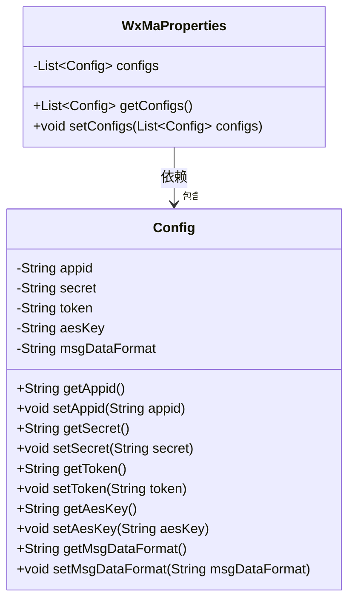
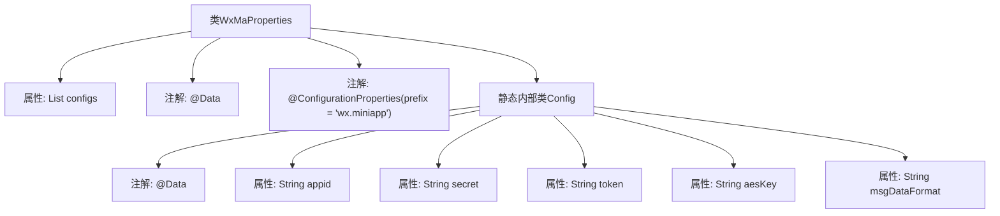

# 基础信息

|      |      |
|------|------|
| 名称 | WxMaProperties |
| 编码语言 | .java |
| 代码路径 | weixin-java-miniapp-demo/src/main/java/com/github/binarywang/demo/wx/miniapp/config/WxMaProperties.java |
| 包名 | com.github.binarywang.demo.wx.miniapp.config |
| 依赖项 | ['java.util.List', 'org.springframework.boot.context.properties.ConfigurationProperties', 'lombok.Data'] |
| 概述说明 | 该类用于配置微信小程序相关参数，包含应用ID、密钥、消息服务器令牌和加密密钥等信息。 |

# 说明

该类是一个用于配置微信小程序相关参数的属性配置类。通过@ConfigurationProperties注解指定配置前缀为"wx.miniapp"，支持多套配置。内部定义了Config静态内部类，包含微信小程序的核心配置项：appid应用标识、secret应用密钥、token消息服务器令牌、aesKey消息加密密钥以及msgDataFormat消息数据格式类型。整个配置结构采用List集合方式管理多组配置信息，便于支持多个小程序应用的统一配置管理。

# 类列表 Class Summary

| 名称   | 类型  | 说明 |
|-------|------|-------------|
| WxMaProperties | class | 该类用于配置微信小程序相关参数，包含应用ID、密钥、消息服务器令牌和加密密钥等信息。 |

## 类 WxMaProperties

|      |      |
|------|------|
| 访问范围 | @Data;@ConfigurationProperties(prefix = "wx.miniapp");public |
| 类型 | class |
| 名称 | WxMaProperties |
| 说明 | 该类用于配置微信小程序相关参数，包含应用ID、密钥、消息服务器令牌和加密密钥等信息。 |

### UML类图

该类图描述了微信小程序配置属性的结构。`WxMaProperties` 类用于封装多个 `Config` 配置项，每个 `Config` 对应一个小程序的基本信息（如 appid、secret 等）。通过 `@ConfigurationProperties` 注解，Spring Boot 可以自动将配置文件中以 `wx.miniapp` 为前缀的属性绑定到该类中，实现配置的集中管理与读取。

### 内部方法调用关系图

该流程图展示了`WxMaProperties`配置类及其静态内部类`Config`的结构关系。`WxMaProperties`通过`@ConfigurationProperties`注解绑定前缀为`wx.miniapp`的配置项，并包含一个`Config`对象列表，每个`Config`对象使用`@Data`注解自动生成Getter/Setter方法，用于存储微信小程序的相关配置信息。

### 字段列表 Field List

| 名称  | 类型  | 说明 |
|-------|-------|------|
| configs | List<Config> | 这是一个私有配置列表变量，用于存储Config类型的配置对象集合。 |

### 方法列表

| 名称  | 类型  | 说明 |
|-------|-------|------|

