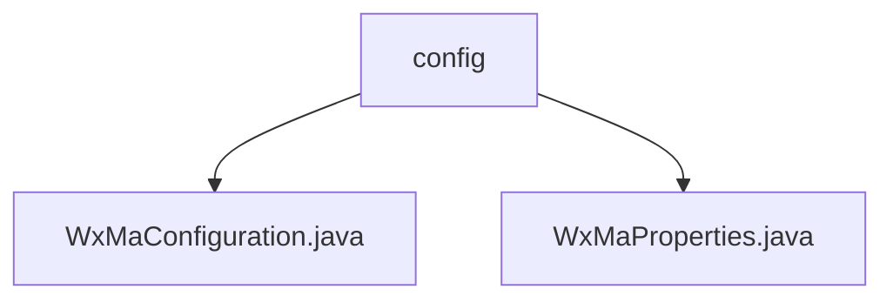

# 基础信息

|      |      |
|------|------|
| 名称 | config |
| 编码语言 | .java |
| 代码路径 | weixin-java-miniapp-demo/src/main/java/com/github/binarywang/demo/wx/miniapp/config |
| 包名 | docs.src.main.java.com.github.binarywang.demo.wx.miniapp.config |
| 概述说明 | 该配置类用于初始化微信小程序服务，通过读取配置属性完成多小程序账号注册与管理，构建消息路由器并定义文本、图片、二维码等消息处理逻辑，支持客服消息和订阅消息通知发送。 |

# 说明

## 概述

该模块负责微信小程序服务的初始化与消息路由处理，支持多账号配置管理及多种消息类型的处理逻辑。通过属性配置类加载AppID、Secret等核心参数，并结合消息路由器实现文本、图片、二维码等消息的分发与处理。

接口规范包括配置读取、消息处理器注册与路由转发机制，采用流式配置与组件注入提升扩展性。关键数据结构包括Config配置项、WxMaProperties属性映射类及消息路由器实例。外部依赖主要为微信小程序Java SDK及相关Spring Boot注解支持。

例如，系统可接收用户发送的文本消息后记录日志，或在扫码事件触发时生成带参二维码返回给客户端。

## 主要业务场景

模块整合了从小程序接入配置到消息处理的完整链路，适用于需要对接多个微信小程序并统一管理消息响应的场景。其交互模式类似事件总线，将不同类型的消息分派至对应的处理器执行特定业务动作。

功能覆盖从基础配置加载、消息监听到客服消息推送和订阅通知下发，具备良好的集成能力。典型应用如企业级多租户小程序平台，可通过此模块快速构建标准通信入口。

API类型涵盖配置注入型接口和消息路由回调接口，支持灵活扩展新的消息类型与业务处理器。例如，在接收到图片消息时自动上传素材至云端存储，并返回处理结果通知。

### 包内部结构视图

该流程图展示了微信小程序Demo项目配置模块的结构，其中`config`包下包含两个配置类文件，用于实现微信小程序相关功能的参数设置与初始化配置。

# 文件列表

| 名称   | 类型  | 说明 |
|-------|------|-------------|
| [WxMaConfiguration.java](WxMaConfiguration.md) | file | 该配置类用于初始化微信小程序服务及消息路由器，支持多小程序配置，并定义了多种消息处理逻辑，包括日志记录、文本回复、图片发送和二维码生成等功能。 |
| [WxMaProperties.java](WxMaProperties.md) | file | 这是一个微信小程序配置属性类，包含多个小程序的配置信息，每个配置项有appid、secret、token、aesKey和消息格式等参数。 |

