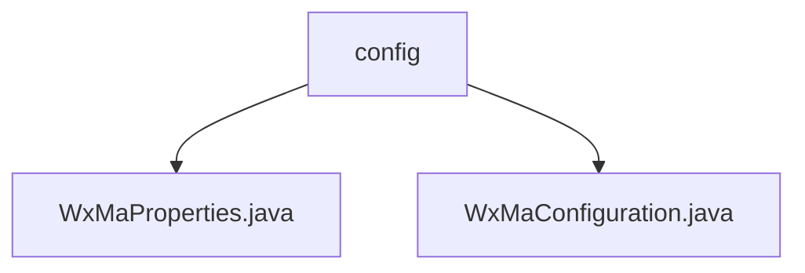

# 基础信息

|      |      |
|------|------|
| 名称 | config |
| 编码语言 | .java |
| 代码路径 | weixin-java-miniapp-demo/src/main/java/com/github/binarywang/demo/wx/miniapp/config |
| 包名 | docs.src.main.java.com.github.binarywang.demo.wx.miniapp.config |
| 概述说明 | 该类是微信小程序配置类，通过@ConfigurationProperties注解读取wx.miniapp前缀的配置信息，支持多套小程序配置管理。内部包含Config静态内部类，定义appid、secret、token、aesKey和msgDataFormat等核心配置项。采用List集合管理多组配置信息，用于初始化微信小程序服务和消息路由处理机制，实现多小程序账号的注册管理和自动化消息交互功能。 |

# 说明

## 概述

该模块用于管理微信小程序的多账户配置与服务初始化，支持通过属性配置类加载多套小程序参数，并注册对应的消息处理路由。  
接口规范包括属性绑定前缀`wx.miniapp`，以及基于Config类的配置项如Appid、Secret、Token等，结合List结构支持多实例管理。

核心数据结构为WxMaProperties中的Config静态内部类，封装了小程序认证与通信所需的基本字段；WxMaConfiguration则负责将配置映射为可操作的服务对象。

外部依赖主要包括Spring Boot的@ConfigurationProperties和微信Java SDK（如WxMaService、WxMaMessageRouter），未引入其他第三方库。

例如，可通过`wx.miniapp.configs[0].appid`配置第一个小程序的应用ID，系统会据此创建对应的消息路由器和服务实例。

## 主要业务场景

模块主要应用于需要同时对接多个微信小程序的后端服务中，通过统一配置中心完成账号加载和服务注册，类似事件总线模式实现消息分发。

交互模式涵盖从用户发送文本、图片到小程序后台后的自动响应流程，支持日志记录、关键字回复及二维码下发等多种处理逻辑。

功能完整性体现在能够动态加载多套小程序配置并分别构建独立的消息处理链路，确保不同账号间互不干扰。

典型应用场景包括企业级微信客服系统或平台型小程序管理后台，支持快速扩展新的小程序接入而无需修改代码结构。

API类型覆盖配置读取、服务注入及消息路由三大类别，集成案例如通过WxMaMessageRouter添加文本消息处理器实现自动应答功能。

### 包内部结构视图

该流程图展示了微信小程序配置模块的结构，`config` 包下包含两个配置类文件：`WxMaProperties.java` 和 `WxMaConfiguration.java`，用于管理微信小程序的相关配置属性与初始化设置。

# 文件列表

| 名称   | 类型  | 说明 |
|-------|------|-------------|
| [WxMaProperties.java](WxMaProperties.md) | file | 该类用于配置微信小程序相关参数，包含应用ID、密钥、消息服务器令牌和加密密钥等信息。 |
| [WxMaConfiguration.java](WxMaConfiguration.md) | file | 该配置类用于初始化微信小程序服务及消息路由器，支持多应用配置和多种消息处理逻辑。 |

