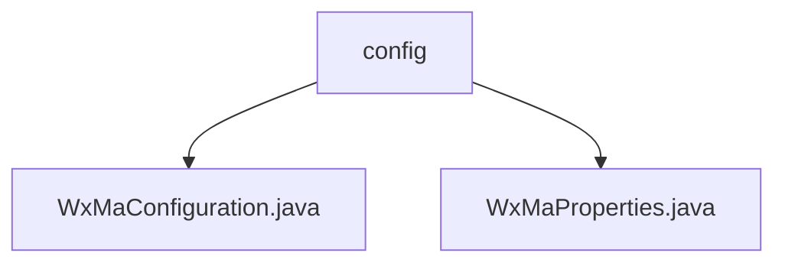

# 基础信息

|      |      |
|------|------|
| 名称 | config |
| 编码语言 | .java |
| 代码路径 | weixin-java-miniapp-demo\src\main\java\com\github\binarywang\demo\wx\miniapp\config |
| 包名 | docs.src.main.java.com.github.binarywang.demo.wx.miniapp.config |
| 概述说明 | 微信小程序后端配置类，初始化服务和消息路由，支持多账号，定义五种消息处理规则。配置属性类绑定小程序配置项，包含ID、密钥等字段。 |

# 说明

## 概述  
该模块是微信小程序后端配置系统，核心职责是初始化多账号小程序服务并配置消息路由，类似网关路由分发器。通过WxMaProperties类绑定配置属性，支持以Appid为键的多账号管理。关键数据结构包括Config内部类（含Appid/Secret等字段）和消息路由规则Map。依赖项包括微信SDK（WxMaService）和Lombok。例如通过@ConfigurationProperties实现配置注入，消息路由器预置五种处理器规则。

## 主要业务场景  
模块处理小程序消息全生命周期，典型流程为：初始化时校验配置→构建多账号服务实例→配置消息路由规则。交互模式采用事件驱动，例如文本消息触发客服回复，二维码消息调用生成接口。完整支持微信协议要求的五种消息类型，如订阅消息通过MsgRouter分发到对应处理器。API集成案例包括媒体文件上传和二维码生成，均封装为标准化处理链。

### 包内部结构视图

该流程图展示了微信小程序Demo项目中配置模块的层级结构。根节点为config文件夹，包含两个Java配置文件：WxMaConfiguration和WxMaProperties。这两个文件直接隶属于config目录下，没有更深层级的子目录结构，形成了简单的两层树形关系。

# 文件列表

| 名称   | 类型  | 说明 |
|-------|------|-------------|
| [WxMaConfiguration.java](WxMaConfiguration.md) | file | 这是一个微信小程序配置类，包含服务初始化和消息路由设置。创建WxMaService处理多配置，检查配置有效性。定义消息路由规则，处理订阅、文本、图片和二维码消息，提供日志记录和客服消息回复功能。 |
| [WxMaProperties.java](WxMaProperties.md) | file | WxMaProperties类用于配置微信小程序属性，包含多个Config配置项，每个配置项包括appid、secret、token、aesKey和msgDataFormat字段。 |

