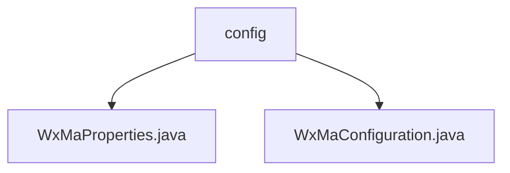

# 基础信息

|      |      |
|------|------|
| 名称 | config |
| 编码语言 | .java |
| 代码路径 | weixin-java-miniapp-demo/src/main/java/com/github/binarywang/demo/wx/miniapp/config |
| 包名 | docs.src.main.java.com.github.binarywang.demo.wx.miniapp.config |
| 概述说明 | 该类是微信小程序配置管理类，存储appid、secret、token等核心参数，支持多小程序配置。用于初始化小程序服务和消息路由处理机制，定义了日志记录、文本回复、图片响应等处理器，并支持发送客服消息与订阅通知功能。 |

# 说明

## 概述

该模块负责微信小程序的配置管理与服务初始化，支持多账号接入及消息路由处理。类似Spring Boot配置加载机制，通过WxMaProperties类存储AppId、Secret、Token等核心参数，并由WxMaConfiguration类完成服务实例化和消息处理器注册。

接口规范包括配置属性注入、消息类型路由绑定、客服消息发送和订阅通知推送。关键数据结构有小程序配置列表、消息处理器映射表以及消息数据格式定义。外部依赖项主要包括Weixin Java SDK及相关日志框架。

例如：WxMaProperties中维护多个小程序的appid与secret组合；WxMaConfiguration中注册文本消息回调处理逻辑。

## 主要业务场景

模块支持多小程序统一接入管理，实现消息接收、解析与响应的全流程处理。采用事件驱动模式分发不同类型消息至对应处理器，例如用户发送文本后触发自动回复，扫码事件触发二维码处理逻辑。

集成场景涵盖客服消息下发、模板消息通知、用户行为日志采集等。API类型覆盖配置读取、服务获取、消息路由三大类别。整体功能具备高扩展性，便于对接企业级微信生态应用平台。

### 包内部结构视图

该流程图展示了微信小程序配置模块的结构，`config` 包下包含两个配置类文件：`WxMaProperties.java` 用于属性配置，`WxMaConfiguration.java` 用于配置初始化。两者均属于 `config` 配置包的子节点，体现了典型的Java项目配置分离设计。

# 文件列表

| 名称   | 类型  | 说明 |
|-------|------|-------------|
| [WxMaProperties.java](WxMaProperties.md) | file | 该类用于配置微信小程序相关参数，包含应用ID、密钥、消息服务器令牌和加密密钥等信息。 |
| [WxMaConfiguration.java](WxMaConfiguration.md) | file | 该类为微信小程序配置类，初始化服务和消息路由器，处理订阅消息、文本、图片及二维码等类型的消息，并支持发送客服消息与上传媒体文件。 |

