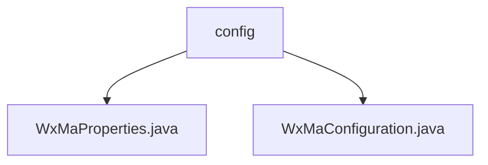

# 基础信息

|      |      |
|------|------|
| 名称 | config |
| 编码语言 | .java |
| 代码路径 | weixin-java-miniapp-demo/src/main/java/com/github/binarywang/demo/wx/miniapp/config |
| 包名 | docs.src.main.java.com.github.binarywang.demo.wx.miniapp.config |
| 概述说明 | WxMaProperties是微信小程序配置类，支持多账号管理，包含appid、密钥等字段。WxMaConfiguration初始化服务并处理消息路由，含多种消息处理器和异常处理。 |

# 说明

## 概述  
该模块核心职责是管理微信小程序的后端服务配置与消息路由，支持多账号并行处理。采用Spring Boot配置规范，通过`@ConfigurationProperties`定义参数结构，例如小程序ID、密钥等字段，并支持XML/JSON消息格式。关键数据结构包括`WxMaProperties.Config`内部类，存储单个小程序的认证和加密参数。外部依赖仅微信小程序SDK。实现案例包含配置校验异常抛出、多账号初始化等。

## 主要业务场景  
模块适用于需同时运营多个微信小程序的Spring Boot应用，类似多租户配置管理。业务流程包括：1)启动时加载并校验各小程序配置；2)根据消息类型（如文本/图片）路由到对应处理器；3)执行具体操作，例如生成二维码或上传媒体文件。交互模式采用事件驱动，类似消息总线机制。典型场景如用户订阅消息处理，通过预定义的处理器链实现自动化响应。

### 包内部结构视图

该流程图展示了微信小程序demo项目中配置模块的层级结构。根节点为config文件夹，包含两个Java配置文件：WxMaProperties.java用于存储小程序属性配置，WxMaConfiguration.java负责小程序服务的初始化配置。这种结构清晰划分了配置相关代码，符合Spring Boot应用的典型配置管理方式。

# 文件列表

| 名称   | 类型  | 说明 |
|-------|------|-------------|
| [WxMaProperties.java](WxMaProperties.md) | file | WxMaProperties类用于配置微信小程序属性，包含多个Config配置项，每个配置项有appid、secret、token、aesKey和msgDataFormat字段。 |
| [WxMaConfiguration.java](WxMaConfiguration.md) | file | 微信小程序配置类，初始化服务及消息路由，处理订阅、文本、图片和二维码消息。 |

