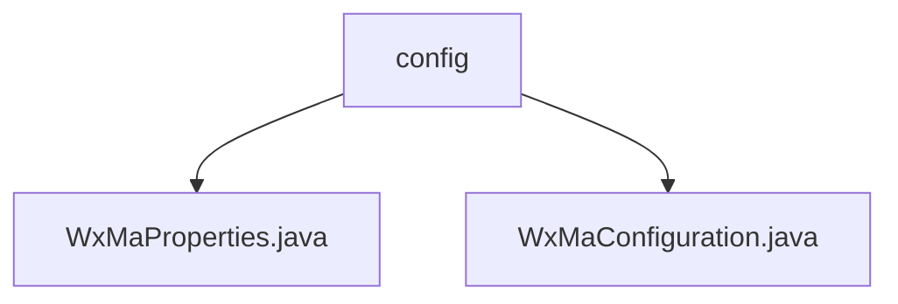

# 基础信息

|      |      |
|------|------|
| 名称 | config |
| 编码语言 | .java |
| 代码路径 | weixin-java-miniapp-demo/src/main/java/com/github/binarywang/demo/wx/miniapp/config |
| 包名 | docs.src.main.java.com.github.binarywang.demo.wx.miniapp.config |
| 概述说明 | 该类是微信小程序配置类，通过@ConfigurationProperties注解读取wx.miniapp前缀的配置属性，支持多套小程序配置。内部包含Config静态内部类定义appid、secret、token、aesKey和msgDataFormat等核心参数，采用List集合管理多组配置信息，用于初始化小程序服务并注册消息路由器处理各类消息场景。 |

# 说明

## 概述

该模块用于配置并初始化微信小程序服务，支持多套配置管理。通过属性绑定与消息路由机制，实现对不同消息类型的分发处理。

接口规范要求提供以"wx.miniapp"为前缀的配置项，并通过List结构支持多个小程序实例。每个实例需包含AppId、Secret等核心字段。

关键数据结构包括WxMaProperties及其嵌套的Config类，后者封装了appid、secret、token、aesKey和msgDataFormat等参数。

外部依赖主要来自weixin-java-miniapp库及相关Spring Boot注解组件。

例如：WxMaProperties中使用@ConfigurationProperties绑定配置；WxMaConfiguration中利用WxMaService构建消息路由器。

## 主要业务场景

模块支持从配置加载到服务启动的完整流程，类似工厂模式创建多个小程序实例。

交互模式基于消息路由器实现事件分发，分别对接日志、文本回复、图片响应等功能模块。

功能覆盖消息接收与回复、素材上传、客服消息推送等典型应用场景。

典型应用模式包括：用户订阅通知触发消息发送、扫码事件返回二维码图片等。

API类型涵盖配置读取接口和服务运行时的消息处理接口，集成案例包括自定义消息处理器注册与多媒体资源操作。

### 包内部结构视图

该流程图展示了微信小程序配置模块的结构，`config` 包下包含两个配置类文件：`WxMaProperties.java` 用于属性配置，`WxMaConfiguration.java` 用于配置初始化。两者均属于微信小程序 Demo 项目的配置层。

# 文件列表

| 名称   | 类型  | 说明 |
|-------|------|-------------|
| [WxMaProperties.java](WxMaProperties.md) | file | 该类用于配置微信小程序相关参数，包含应用ID、密钥、令牌、加密密钥及消息格式等核心配置项。 |
| [WxMaConfiguration.java](WxMaConfiguration.md) | file | 该配置类用于初始化微信小程序服务及消息路由器，支持多小程序配置，并定义了多种消息处理逻辑，包括日志记录、文本回复、图片发送和二维码生成等功能。 |

