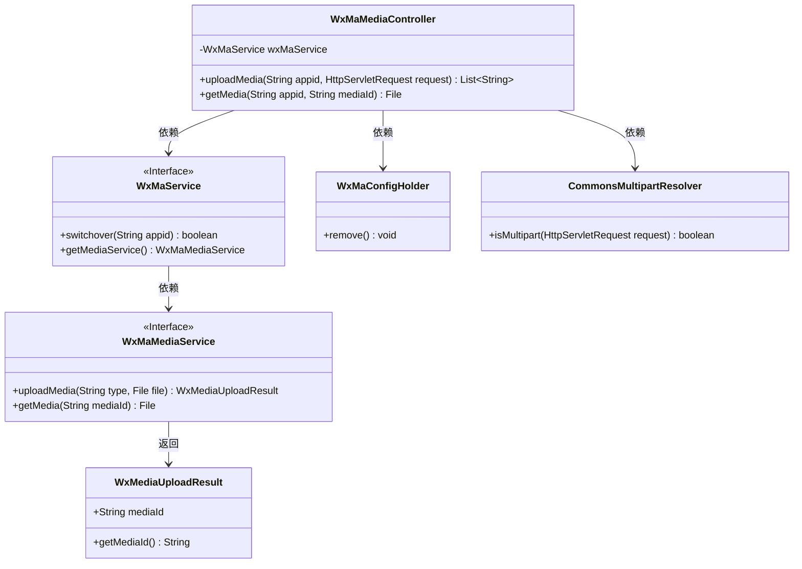
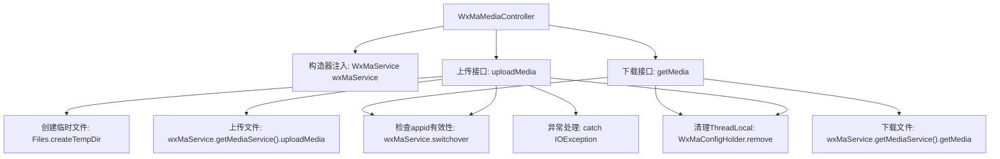
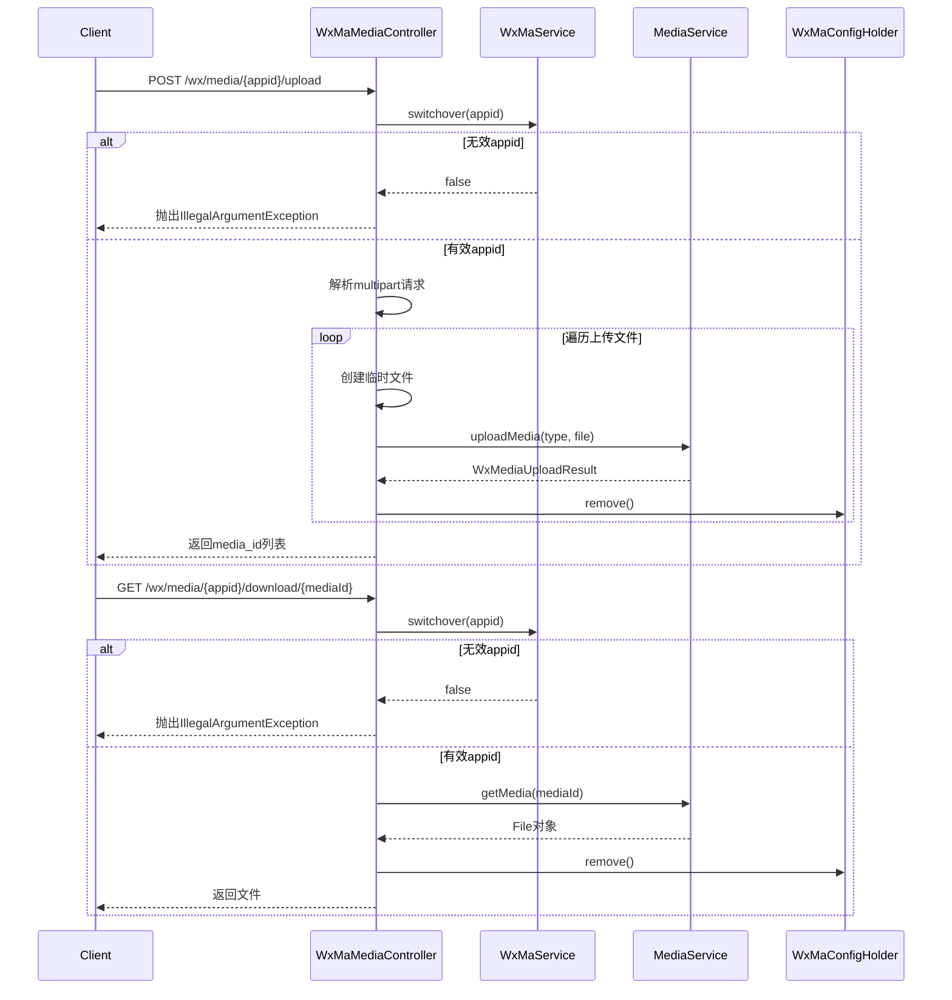

# 基础信息

|      |      |
|------|------|
| 名称 | WxMaMediaController |
| 编码语言 | .java |
| 代码路径 | weixin-java-miniapp-demo/src/main/java/com/github/binarywang/demo/wx/miniapp/controller/WxMaMediaController.java |
| 包名 | com.github.binarywang.demo.wx.miniapp.controller |
| 依赖项 | ['cn.binarywang.wx.miniapp.api.WxMaService', 'cn.binarywang.wx.miniapp.constant.WxMaConstants', 'cn.binarywang.wx.miniapp.util.WxMaConfigHolder', 'com.google.common.collect.Lists', 'com.google.common.io.Files', 'lombok.AllArgsConstructor', 'lombok.extern.slf4j.Slf4j', 'me.chanjar.weixin.common.bean.result.WxMediaUploadResult', 'me.chanjar.weixin.common.error.WxErrorException', 'org.springframework.web.bind.annotation', 'org.springframework.web.multipart.MultipartFile', 'org.springframework.web.multipart.MultipartHttpServletRequest', 'org.springframework.web.multipart.commons.CommonsMultipartResolver', 'javax.servlet.http.HttpServletRequest', 'java.io.File', 'java.io.IOException', 'java.util.Iterator', 'java.util.List'] |
| 概述说明 | 微信小程序媒体控制器，提供上传和下载临时素材功能。上传返回media_id列表，下载返回媒体文件。需校验appid有效性，操作后清理ThreadLocal。 |

# 说明

这是一个微信小程序媒体文件管理的控制器类，包含上传和下载临时素材功能。上传接口接收appid和HTTP请求，验证配置后处理多文件上传，返回media_id列表。下载接口根据appid和mediaId获取媒体文件。两个操作都包含ThreadLocal清理逻辑，上传过程会记录文件路径和media_id，异常时记录错误日志。

# 类列表 Class Summary

| 名称   | 类型  | 说明 |
|-------|------|-------------|
| WxMaMediaController | class | 微信小程序素材控制器，提供上传和下载临时素材功能，包括验证appid、处理文件上传及返回media_id或文件。 |

## 类 WxMaMediaController

|      |      |
|------|------|
| 访问范围 | @RestController;@AllArgsConstructor;@Slf4j;@RequestMapping("/wx/media/{appid}");public |
| 类型 | class |
| 名称 | WxMaMediaController |
| 说明 | 微信小程序素材控制器，提供上传和下载临时素材功能，包括验证appid、处理文件上传及返回media_id或文件。 |

### UML类图

该代码实现了一个微信小程序媒体文件上传下载的REST控制器。核心类WxMaMediaController通过WxMaService接口操作媒体服务，依赖CommonsMultipartResolver处理文件上传，使用WxMaConfigHolder管理线程局部变量。上传方法将临时文件转为微信媒体ID，下载方法根据媒体ID获取文件。类图展示了控制器与服务层之间的调用关系，以及关键的数据传输对象WxMediaUploadResult。

### 内部方法调用关系图

该流程图展示了微信素材管理控制器的核心逻辑，包含上传和下载两个主要接口。上传流程涉及appid验证、多文件处理、临时文件创建和媒体服务调用；下载流程则包含权限校验和媒体文件获取。两个流程最后都会清理ThreadLocal存储的配置信息，确保线程安全。时序图详细描述了客户端与各组件间的交互顺序和异常处理路径。

### 字段列表 Field List

| 名称  | 类型  | 说明 |
|-------|-------|------|
| wxMaService | WxMaService | 微信小程序服务实例的私有不可变成员变量。 |

### 方法列表

| 名称  | 类型  | 说明 |
|-------|-------|------|
| uploadMedia | List<String> | 上传媒体文件接口，校验appid后处理多文件上传，返回媒体ID列表。异常时清理配置并记录日志。 |
| getMedia | File | Java方法：通过appid和mediaId下载微信小程序媒体文件，验证配置后返回文件，最后清理ThreadLocal。 |

