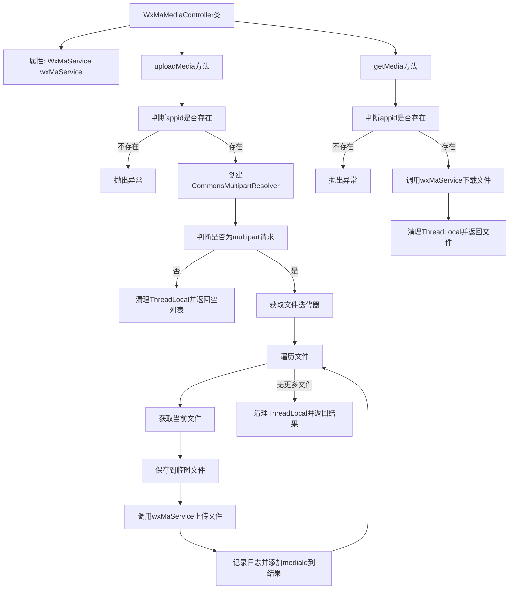

# 基础信息

|      |      |
|------|------|
| 名称 | WxMaMediaController |
| 编码语言 | .java |
| 代码路径 | weixin-java-miniapp-demo/src/main/java/com/github/binarywang/demo/wx/miniapp/controller/WxMaMediaController.java |
| 包名 | com.github.binarywang.demo.wx.miniapp.controller |
| 依赖项 | ['cn.binarywang.wx.miniapp.api.WxMaService', 'cn.binarywang.wx.miniapp.constant.WxMaConstants', 'cn.binarywang.wx.miniapp.util.WxMaConfigHolder', 'com.google.common.collect.Lists', 'com.google.common.io.Files', 'lombok.AllArgsConstructor', 'lombok.extern.slf4j.Slf4j', 'me.chanjar.weixin.common.bean.result.WxMediaUploadResult', 'me.chanjar.weixin.common.error.WxErrorException', 'org.springframework.web.bind.annotation', 'org.springframework.web.multipart.MultipartFile', 'org.springframework.web.multipart.MultipartHttpServletRequest', 'org.springframework.web.multipart.commons.CommonsMultipartResolver', 'javax.servlet.http.HttpServletRequest', 'java.io.File', 'java.io.IOException', 'java.util.Iterator', 'java.util.List'] |
| 概述说明 | 该控制器提供微信小程序临时素材的上传与下载功能，支持通过appid切换配置，上传接口返回media_id列表，下载接口根据media_id获取文件。 |

# 说明

该控制器提供微信小程序媒体文件的上传与下载功能。通过指定appid可切换至相应配置，支持上传临时图片素材并返回media_id，每次上传仅生成一个media_id。上传时需使用multipart/form-data格式。同时支持根据media_id下载对应的临时素材文件。接口在处理完毕后会自动清理线程本地变量以确保环境干净。

# 类列表 Class Summary

| 名称   | 类型  | 说明 |
|-------|------|-------------|
| WxMaMediaController | class | 该控制器提供微信小程序临时素材的上传与下载功能，支持通过appid切换配置，上传接口返回media_id列表，下载接口根据media_id获取文件。 |


## 类 WxMaMediaController

|      |      |
|------|------|
| 访问范围 | @RestController;@AllArgsConstructor;@Slf4j;@RequestMapping("/wx/media/{appid}");public |
| 类型 | class |
| 名称 | WxMaMediaController |
| 说明 | 该控制器提供微信小程序临时素材的上传与下载功能，支持通过appid切换配置，上传接口返回media_id列表，下载接口根据media_id获取文件。 |


### UML类图

```mermaid
classDiagram
    class WxMaMediaController {
        -WxMaService wxMaService
        +List~String~ uploadMedia(String appid, HttpServletRequest request) throws WxErrorException
        +File getMedia(String appid, String mediaId) throws WxErrorException
    }

    class WxMaService {
        <<Interface>>
        +boolean switchover(String appid)
        +WxMaConfigHolder getConfigHolder()
        +WxMaMediaService getMediaService()
    }

    class WxMaMediaService {
        <<Interface>>
        +WxMediaUploadResult uploadMedia(String mediaType, File file) throws WxErrorException
        +File getMedia(String mediaId) throws WxErrorException
    }

    class WxMediaUploadResult {
        +String getMediaId()
    }

    class WxMaConstants {
        <<Interface>>
    }

    class WxMaConfigHolder {
        <<Interface>>
        +void remove()
    }

    class CommonsMultipartResolver {
        +boolean isMultipart(HttpServletRequest request)
    }

    class MultipartHttpServletRequest {
        +Iterator~String~ getFileNames()
        +MultipartFile getFile(String name)
    }

    class MultipartFile {
        +String getOriginalFilename()
        +void transferTo(File dest) throws IOException
    }

    class File {
        +File(File parent, String child)
    }

    class Lists {
        <<Interface>>
        +ArrayList~E~ newArrayList()
    }

    class HttpServletRequest {
    }

    class IOException {
    }

    class WxErrorException {
    }

    // Dependencies
    WxMaMediaController --> WxMaService : 依赖
    WxMaMediaController --> CommonsMultipartResolver : 创建并使用
    WxMaMediaController --> MultipartHttpServletRequest : 强转并使用
    WxMaMediaController --> MultipartFile : 获取文件内容
    WxMaMediaController --> File : 创建临时文件
    WxMaMediaController --> Lists : 使用newArrayList()
    WxMaMediaController --> WxMaConfigHolder : 调用remove()
    WxMaMediaController --> WxMaConstants : 使用常量
    WxMaMediaController --> WxMediaUploadResult : 接收上传结果
    WxMaMediaController --> HttpServletRequest : 处理请求
    WxMaMediaController --> IOException : 捕获异常
    WxMaMediaController --> WxErrorException : 抛出异常

    WxMaService --> WxMaMediaService : 提供媒体服务接口
    WxMaService --> WxMaConfigHolder : 配置管理

    WxMaMediaService --> WxMediaUploadResult : 返回上传结果
    WxMaMediaService --> File : 文件操作
    WxMaMediaService --> WxErrorException : 抛出异常
```

该类图展示了微信小程序媒体控制器 `WxMaMediaController` 的结构与依赖关系。它通过 `WxMaService` 接口调用微信服务，实现临时素材的上传和下载功能。控制器依赖 Spring Web 类处理 multipart 请求，并使用多个工具类完成文件操作和日志记录。异常处理机制保障了程序健壮性，同时利用 ThreadLocal 清理机制确保上下文安全。


### 内部方法调用关系图



该流程图展示了微信小程序媒体控制器中两个主要接口的处理逻辑：上传临时素材与下载临时素材。流程涵盖了参数校验、多部件请求解析、文件操作及服务调用等关键步骤，并体现了异常处理和资源清理机制。

### 字段列表 Field List

| 名称  | 类型  | 说明 |
|-------|-------|------|
| wxMaService | WxMaService | 这是一个微信小程序服务接口的私有常量字段声明，用于在类中提供微信小程序相关功能调用能力。 |

### 方法列表

| 名称  | 类型  | 说明 |
|-------|-------|------|
| uploadMedia | List<String> | 该接口处理微信小程序媒体文件上传，支持多文件同时上传，返回media_id列表。 |
| getMedia | File | 该接口用于下载微信媒体文件。通过appid和mediaId获取对应媒体资源，支持多应用配置切换。成功获取文件后自动清理线程本地变量，确保数据隔离。若appid配置不存在则抛出异常提示。 |


