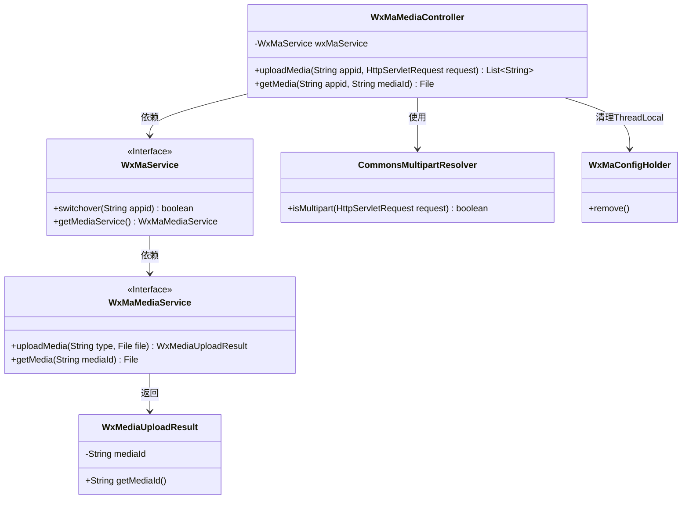
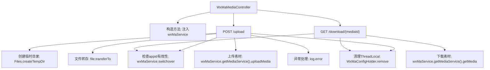
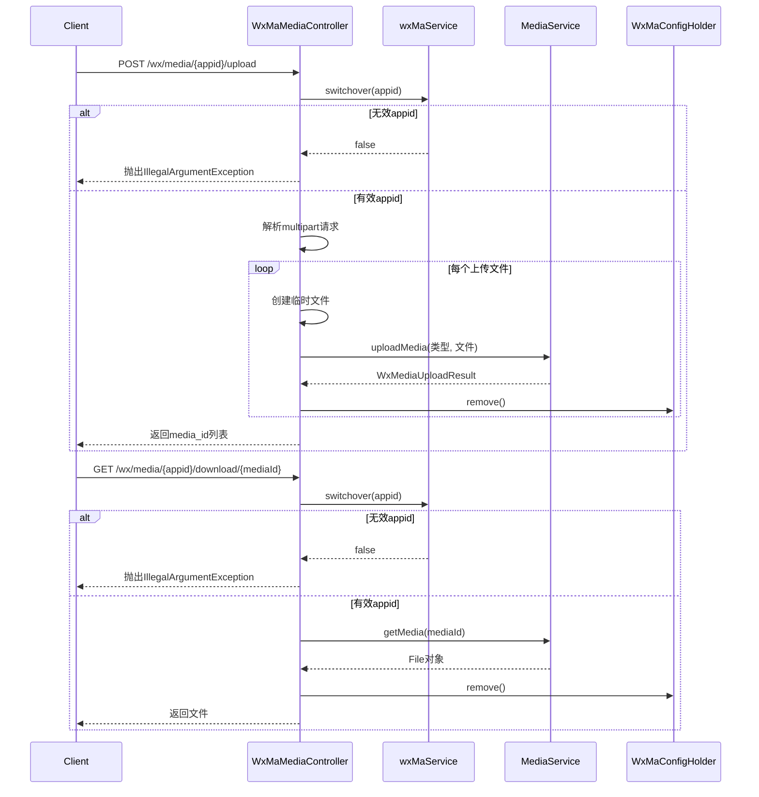

# 基础信息

|      |      |
|------|------|
| 名称 | WxMaMediaController |
| 编码语言 | .java |
| 代码路径 | weixin-java-miniapp-demo\src\main\java\com\github\binarywang\demo\wx\miniapp\controller\WxMaMediaController.java |
| 包名 | com.github.binarywang.demo.wx.miniapp.controller |
| 依赖项 | ['cn.binarywang.wx.miniapp.api.WxMaService', 'cn.binarywang.wx.miniapp.constant.WxMaConstants', 'cn.binarywang.wx.miniapp.util.WxMaConfigHolder', 'com.google.common.collect.Lists', 'com.google.common.io.Files', 'lombok.AllArgsConstructor', 'lombok.extern.slf4j.Slf4j', 'me.chanjar.weixin.common.bean.result.WxMediaUploadResult', 'me.chanjar.weixin.common.error.WxErrorException', 'org.springframework.web.bind.annotation', 'org.springframework.web.multipart.MultipartFile', 'org.springframework.web.multipart.MultipartHttpServletRequest', 'org.springframework.web.multipart.commons.CommonsMultipartResolver', 'javax.servlet.http.HttpServletRequest', 'java.io.File', 'java.io.IOException', 'java.util.Iterator', 'java.util.List'] |
| 概述说明 | 微信小程序媒体控制器，提供上传和下载临时素材功能。上传返回media_id列表，下载返回文件。检查appid有效性，清理ThreadLocal。 |

# 说明

这是一个微信小程序媒体文件管理控制器类，包含上传和下载临时素材功能。上传接口接收多文件上传，验证appid有效性后保存临时文件并返回media_id列表。下载接口根据mediaId获取媒体文件。两个操作都包含ThreadLocal清理逻辑，确保线程安全。上传过程记录文件路径和media_id，异常时记录错误日志。

# 类列表 Class Summary

| 名称   | 类型  | 说明 |
|-------|------|-------------|
| WxMaMediaController | class | 微信小程序媒体控制器，提供上传和下载临时素材功能。上传需验证appid，支持多文件处理，返回media_id。下载需验证appid和media_id，返回媒体文件。操作后清理ThreadLocal。 |

## 类 WxMaMediaController

|      |      |
|------|------|
| 访问范围 | @RestController;@AllArgsConstructor;@Slf4j;@RequestMapping("/wx/media/{appid}");public |
| 类型 | class |
| 名称 | WxMaMediaController |
| 说明 | 微信小程序媒体控制器，提供上传和下载临时素材功能。上传需验证appid，支持多文件处理，返回media_id。下载需验证appid和media_id，返回媒体文件。操作后清理ThreadLocal。 |

### UML类图

这段代码描述了一个微信小程序媒体文件控制器，主要提供上传和下载临时素材的功能。类图中包含控制器WxMaMediaController与微信服务接口WxMaService的交互，后者进一步依赖媒体服务接口WxMaMediaService来处理具体操作。控制器还使用了CommonsMultipartResolver解析多部分请求，并通过WxMaConfigHolder管理线程本地变量。上传功能返回包含mediaId的结果对象，整体设计遵循分层架构和依赖倒置原则。

### 内部方法调用关系图

该流程图展示了微信素材管理控制器的核心逻辑，包含文件上传和下载两个主要端点。上传流程涉及临时文件创建、多部分请求处理和媒体服务调用，下载流程则通过媒体ID获取文件。两个操作都包含appid有效性验证和ThreadLocal清理机制，异常处理通过日志记录实现。时序图详细描述了客户端与控制器、服务层之间的交互过程，特别强调了不同条件下的分支处理逻辑。

### 字段列表 Field List

| 名称  | 类型  | 说明 |
|-------|-------|------|
| wxMaService | WxMaService | 微信小程序服务实例的私有常量变量。 |

### 方法列表

| 名称  | 类型  | 说明 |
|-------|-------|------|
| uploadMedia | List<String> | Java方法处理微信小程序文件上传，验证appid后解析多文件请求，逐个上传并返回media_id列表，最后清理ThreadLocal。 |
| getMedia | File | Java方法：通过appid和mediaId下载媒体文件，检查appid配置后返回文件，最后清理ThreadLocal。异常时提示未找到配置。 |

