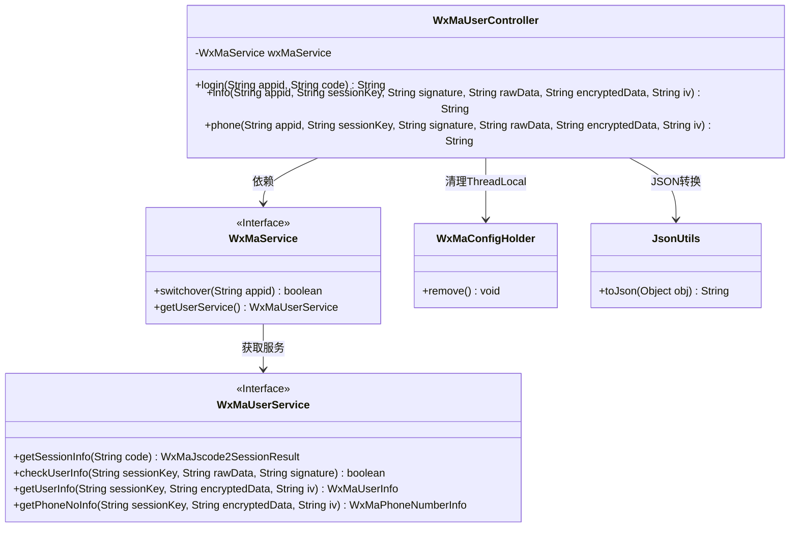
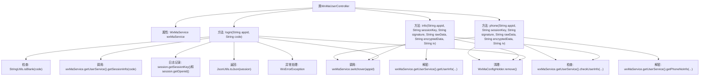

# 基础信息

|      |      |
|------|------|
| 名称 | WxMaUserController |
| 编码语言 | .java |
| 代码路径 | weixin-java-miniapp-demo/src/main/java/com/github/binarywang/demo/wx/miniapp/controller/WxMaUserController.java |
| 包名 | com.github.binarywang.demo.wx.miniapp.controller |
| 依赖项 | ['cn.binarywang.wx.miniapp.api.WxMaService', 'cn.binarywang.wx.miniapp.bean.WxMaJscode2SessionResult', 'cn.binarywang.wx.miniapp.bean.WxMaPhoneNumberInfo', 'cn.binarywang.wx.miniapp.bean.WxMaUserInfo', 'cn.binarywang.wx.miniapp.util.WxMaConfigHolder', 'com.github.binarywang.demo.wx.miniapp.utils.JsonUtils', 'lombok.AllArgsConstructor', 'lombok.extern.slf4j.Slf4j', 'me.chanjar.weixin.common.error.WxErrorException', 'org.apache.commons.lang3.StringUtils', 'org.springframework.web.bind.annotation.GetMapping', 'org.springframework.web.bind.annotation.PathVariable', 'org.springframework.web.bind.annotation.RequestMapping', 'org.springframework.web.bind.annotation.RestController'] |
| 概述说明 | 微信小程序用户控制器，提供登录、获取用户信息及手机号接口，需校验appid和用户数据，返回JSON格式结果，处理异常并清理ThreadLocal。 |

# 说明

这是一个微信小程序用户相关的控制器类，包含三个接口。登录接口通过code获取用户会话信息，验证appid有效性后返回包含sessionKey和openid的JSON数据。获取用户信息接口需要校验用户数据签名，验证通过后解密并返回用户信息JSON。获取用户手机号接口同样需要校验签名，验证通过后解密返回手机号信息JSON。每个接口都会在最后清理ThreadLocal中的配置信息。所有接口都基于路径中的appid参数进行微信服务配置切换。

# 类列表 Class Summary

| 名称   | 类型  | 说明 |
|-------|------|-------------|
| WxMaUserController | class | 微信小程序用户控制器，提供登录、用户信息和手机号获取接口，需校验appid和用户数据，返回JSON格式结果，使用后清理ThreadLocal。 |

## 类 WxMaUserController

|      |      |
|------|------|
| 访问范围 | @RestController;@AllArgsConstructor;@Slf4j;@RequestMapping("/wx/user/{appid}");public |
| 类型 | class |
| 名称 | WxMaUserController |
| 说明 | 微信小程序用户控制器，提供登录、用户信息和手机号获取接口，需校验appid和用户数据，返回JSON格式结果，使用后清理ThreadLocal。 |

### UML类图

该代码实现了一个微信小程序用户管理控制器，提供登录、获取用户信息和手机号三个核心功能。类图展示了控制器与微信服务接口的依赖关系，通过WxMaService调用底层用户服务，使用WxMaConfigHolder管理线程局部变量，并借助JsonUtils进行数据序列化。所有操作都包含appid校验和ThreadLocal清理机制，确保线程安全和配置隔离。

### 内部方法调用关系图

该流程图展示了WxMaUserController类的结构和主要方法调用关系。类包含三个核心方法：login、info和phone，均以appid作为路径参数。login方法处理微信小程序登录，验证code并获取会话信息；info方法验证用户信息并解密返回；phone方法验证并解密用户手机号信息。所有方法都会检查appid有效性，并在最后清理ThreadLocal。异常处理和日志记录贯穿整个流程，确保数据安全和可追溯性。

### 字段列表 Field List

| 名称  | 类型  | 说明 |
|-------|-------|------|
| wxMaService | WxMaService | 微信小程序服务实例的私有不可变成员变量。 |

### 方法列表

| 名称  | 类型  | 说明 |
|-------|-------|------|
| login | String | 这是一个微信小程序登录接口，通过code获取用户session信息。验证code非空后检查appid配置，成功则返回session数据（包含sessionKey和openid），失败返回错误。最后清理ThreadLocal。 |
| info | String | 微信小程序用户信息校验接口：检查appid配置，验证用户数据签名，解密返回用户信息。失败返回错误提示。 |
| phone | String | 这是一个微信小程序获取用户手机号的接口，首先验证appid和用户信息，然后解密获取手机号数据并返回。验证失败返回错误信息。 |

