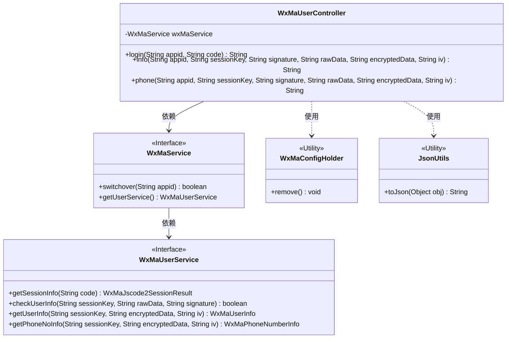
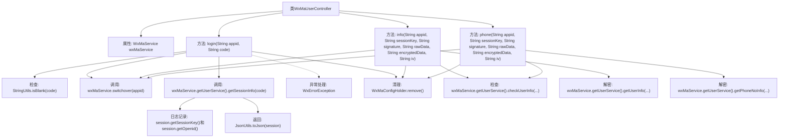

# 基础信息

|      |      |
|------|------|
| 名称 | WxMaUserController |
| 编码语言 | .java |
| 代码路径 | weixin-java-miniapp-demo\src\main\java\com\github\binarywang\demo\wx\miniapp\controller\WxMaUserController.java |
| 包名 | com.github.binarywang.demo.wx.miniapp.controller |
| 依赖项 | ['cn.binarywang.wx.miniapp.api.WxMaService', 'cn.binarywang.wx.miniapp.bean.WxMaJscode2SessionResult', 'cn.binarywang.wx.miniapp.bean.WxMaPhoneNumberInfo', 'cn.binarywang.wx.miniapp.bean.WxMaUserInfo', 'cn.binarywang.wx.miniapp.util.WxMaConfigHolder', 'com.github.binarywang.demo.wx.miniapp.utils.JsonUtils', 'lombok.AllArgsConstructor', 'lombok.extern.slf4j.Slf4j', 'me.chanjar.weixin.common.error.WxErrorException', 'org.apache.commons.lang3.StringUtils', 'org.springframework.web.bind.annotation.GetMapping', 'org.springframework.web.bind.annotation.PathVariable', 'org.springframework.web.bind.annotation.RequestMapping', 'org.springframework.web.bind.annotation.RestController'] |
| 概述说明 | 微信小程序用户控制器，提供登录、获取用户信息和手机号接口，需校验appid和用户数据，返回JSON格式结果，使用后清理ThreadLocal。 |

# 说明

这是一个微信小程序用户管理控制器类，包含三个接口：登录接口验证用户code并返回会话信息；用户信息接口校验并解密返回用户数据；手机号接口校验并解密返回用户手机号信息。所有接口都需验证appid有效性，并在处理完成后清理ThreadLocal存储的配置信息。

# 类列表 Class Summary

| 名称   | 类型  | 说明 |
|-------|------|-------------|
| WxMaUserController | class | 微信小程序用户控制器，提供登录、获取用户信息及手机号接口，需校验appid和sessionKey，返回JSON数据，处理异常并清理ThreadLocal。 |

## 类 WxMaUserController

|      |      |
|------|------|
| 访问范围 | @RestController;@AllArgsConstructor;@Slf4j;@RequestMapping("/wx/user/{appid}");public |
| 类型 | class |
| 名称 | WxMaUserController |
| 说明 | 微信小程序用户控制器，提供登录、获取用户信息及手机号接口，需校验appid和sessionKey，返回JSON数据，处理异常并清理ThreadLocal。 |

### UML类图

类图描述：该图展示了微信小程序用户控制器WxMaUserController的结构，它通过WxMaService接口与微信服务交互，包含登录、获取用户信息和手机号三个核心方法。控制器依赖WxMaService接口实现业务逻辑，后者进一步委托给WxMaUserService处理具体用户操作。工具类JsonUtils和WxMaConfigHolder分别用于JSON序列化和线程本地变量清理。整体采用分层设计，符合单一职责原则。

### 内部方法调用关系图

这段代码是一个微信小程序用户相关的Spring Boot控制器，包含三个主要接口：login用于用户登录获取会话信息，info用于获取用户基本信息，phone用于获取用户手机号信息。每个接口都会先验证appid配置，进行必要的参数校验和解密操作，最后返回JSON格式数据。所有操作完成后都会清理ThreadLocal存储的配置信息。流程图清晰展示了类结构、方法调用关系和关键处理步骤，包括正常流程和异常处理路径。

### 字段列表 Field List

| 名称  | 类型  | 说明 |
|-------|-------|------|
| wxMaService | WxMaService | 微信小程序服务实例（私有不可变） |

### 方法列表

| 名称  | 类型  | 说明 |
|-------|-------|------|
| login | String | 该代码是一个微信小程序登录接口，接收appid和code参数，验证code有效性并检查appid配置。获取用户会话信息后返回JSON数据，异常时记录日志并清理ThreadLocal。 |
| info | String | 该代码是一个微信小程序后端接口，用于验证用户信息并返回解密后的用户数据。首先检查appid配置，然后校验用户数据签名，最后解密数据并返回JSON格式的用户信息。 |
| phone | String | 获取微信用户手机号接口：校验appid和用户信息，解密手机号数据后返回。失败返回错误信息。 |

