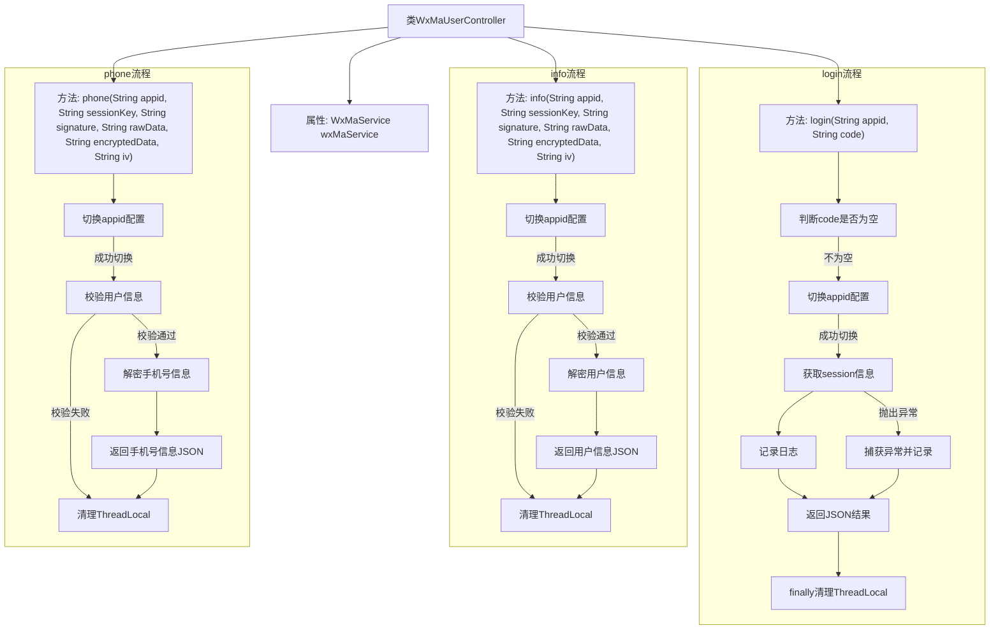

# 基础信息

|      |      |
|------|------|
| 名称 | WxMaUserController |
| 编码语言 | .java |
| 代码路径 | weixin-java-miniapp-demo/src/main/java/com/github/binarywang/demo/wx/miniapp/controller/WxMaUserController.java |
| 包名 | com.github.binarywang.demo.wx.miniapp.controller |
| 依赖项 | ['cn.binarywang.wx.miniapp.api.WxMaService', 'cn.binarywang.wx.miniapp.bean.WxMaJscode2SessionResult', 'cn.binarywang.wx.miniapp.bean.WxMaPhoneNumberInfo', 'cn.binarywang.wx.miniapp.bean.WxMaUserInfo', 'cn.binarywang.wx.miniapp.util.WxMaConfigHolder', 'com.github.binarywang.demo.wx.miniapp.utils.JsonUtils', 'lombok.AllArgsConstructor', 'lombok.extern.slf4j.Slf4j', 'me.chanjar.weixin.common.error.WxErrorException', 'org.apache.commons.lang3.StringUtils', 'org.springframework.web.bind.annotation.GetMapping', 'org.springframework.web.bind.annotation.PathVariable', 'org.springframework.web.bind.annotation.RequestMapping', 'org.springframework.web.bind.annotation.RestController'] |
| 概述说明 | 该控制器提供微信小程序用户登录、信息获取及手机号解密功能，通过appid切换配置并处理会话验证与数据解密。 |

# 说明

该控制器提供微信小程序用户相关接口，包括登录、获取用户信息及绑定手机号。通过appid切换配置，处理JSCode登录凭证校验，解密用户敏感信息并返回结果，同时包含线程局部变量清理与异常日志记录。

# 类列表 Class Summary

| 名称   | 类型  | 说明 |
|-------|------|-------------|
| WxMaUserController | class | 该控制器提供微信小程序用户登录、信息获取及手机号解密功能，通过appid切换配置并处理会话验证与数据解密。 |


## 类 WxMaUserController

|      |      |
|------|------|
| 访问范围 | @RestController;@AllArgsConstructor;@Slf4j;@RequestMapping("/wx/user/{appid}");public |
| 类型 | class |
| 名称 | WxMaUserController |
| 说明 | 该控制器提供微信小程序用户登录、信息获取及手机号解密功能，通过appid切换配置并处理会话验证与数据解密。 |


### UML类图

```mermaid
classDiagram

    class WxMaUserController {
        -WxMaService wxMaService
        +String login(String appid, String code)
        +String info(String appid, String sessionKey, String signature, String rawData, String encryptedData, String iv)
        +String phone(String appid, String sessionKey, String signature, String rawData, String encryptedData, String iv)
    }

    class <<Interface>> WxMaService {
        +boolean switchover(String appid)
        +WxMaUserService getUserService()
    }

    class WxMaUserService {
        +WxMaJscode2SessionResult getSessionInfo(String jsCode) throws WxErrorException
        +boolean checkUserInfo(String sessionKey, String rawData, String signature)
        +WxMaUserInfo getUserInfo(String sessionKey, String encryptedData, String iv)
        +WxMaPhoneNumberInfo getPhoneNoInfo(String sessionKey, String encryptedData, String iv)
    }

    class WxMaConfigHolder {
        +static void remove()
    }

    class JsonUtils {
        +static String toJson(Object object)
    }

    class WxMaJscode2SessionResult {
        +String getSessionKey()
        +String getOpenid()
    }

    class WxMaUserInfo {
    }

    class WxMaPhoneNumberInfo {
    }

    class WxErrorException {
    }

    // 类间关系
    WxMaUserController --> WxMaService : 依赖
    WxMaUserController --> WxMaConfigHolder : 清理上下文
    WxMaUserController --> JsonUtils : 序列化返回值
    WxMaUserController --> WxErrorException : 异常处理
    WxMaUserController --> WxMaJscode2SessionResult : 获取会话信息
    WxMaUserController --> WxMaUserInfo : 获取用户信息
    WxMaUserController --> WxMaPhoneNumberInfo : 获取手机号信息

    WxMaService --> WxMaUserService : 获取服务实例

```

该类图展示了微信小程序用户控制器 `WxMaUserController` 的结构及其与其他关键类和接口的关系。控制器通过 `WxMaService` 接口调用微信服务，完成登录、获取用户信息及手机号等操作，并依赖工具类进行序列化和上下文管理。异常处理与日志记录也包含在控制逻辑中。


### 内部方法调用关系图



该流程图展示了微信小程序用户控制器（WxMaUserController）中三个核心接口的执行流程：登录、获取用户信息和获取手机号。每个接口都包含参数校验、配置切换、信息处理与返回等关键步骤，并统一在最后清理线程本地变量，保证请求上下文隔离。

### 字段列表 Field List

| 名称  | 类型  | 说明 |
|-------|-------|------|
| wxMaService | WxMaService | 这是一个微信小程序服务接口的私有常量字段声明，用于在类中提供微信小程序相关功能调用。 |

### 方法列表

| 名称  | 类型  | 说明 |
|-------|-------|------|
| info | String | 该接口用于获取微信小程序用户信息，通过appid切换配置，校验用户签名并解密返回用户数据。 |
| login | String | 该接口处理微信小程序登录请求，通过appid和code获取用户会话信息。首先校验code是否为空，然后切换到对应的微信配置，调用服务获取sessionKey和openid，记录日志并返回JSON格式的会话信息。若发生异常则记录错误日志并返回异常信息，最后清理线程本地变量。 |
| phone | String | 该接口用于获取用户手机号，通过校验用户信息并解密加密数据来实现。首先切换到指定appid配置，校验用户信息合法性，然后解密手机号相关信息并返回结果，过程中会清理线程本地变量。 |


