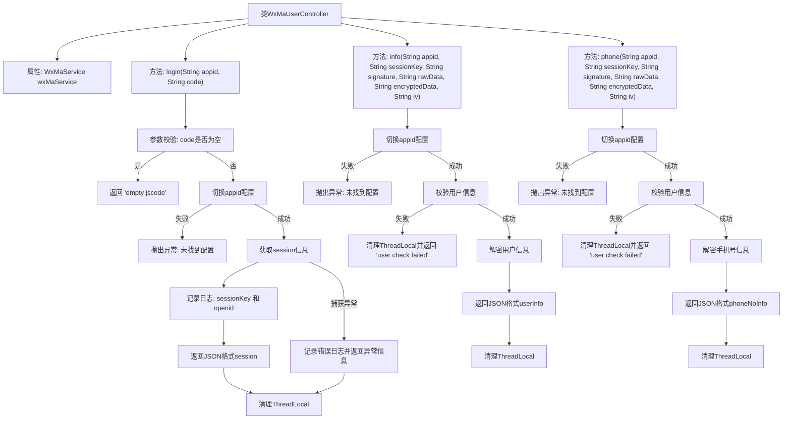

# 基础信息

|      |      |
|------|------|
| 名称 | WxMaUserController |
| 编码语言 | .java |
| 代码路径 | weixin-java-miniapp-demo/src/main/java/com/github/binarywang/demo/wx/miniapp/controller/WxMaUserController.java |
| 包名 | com.github.binarywang.demo.wx.miniapp.controller |
| 依赖项 | ['cn.binarywang.wx.miniapp.api.WxMaService', 'cn.binarywang.wx.miniapp.bean.WxMaJscode2SessionResult', 'cn.binarywang.wx.miniapp.bean.WxMaPhoneNumberInfo', 'cn.binarywang.wx.miniapp.bean.WxMaUserInfo', 'cn.binarywang.wx.miniapp.util.WxMaConfigHolder', 'com.github.binarywang.demo.wx.miniapp.utils.JsonUtils', 'lombok.AllArgsConstructor', 'lombok.extern.slf4j.Slf4j', 'me.chanjar.weixin.common.error.WxErrorException', 'org.apache.commons.lang3.StringUtils', 'org.springframework.web.bind.annotation.GetMapping', 'org.springframework.web.bind.annotation.PathVariable', 'org.springframework.web.bind.annotation.RequestMapping', 'org.springframework.web.bind.annotation.RestController'] |
| 概述说明 | 该类为微信小程序用户相关接口控制器，提供登录、获取用户信息及绑定手机号功能，通过appid切换配置并处理微信返回的数据。 |

# 说明

该控制器提供微信小程序用户相关接口，包括登录、获取用户信息及绑定手机号。通过appID切换配置，调用微信服务完成会话获取与数据解密，并记录日志。所有操作均在finally块中清理ThreadLocal资源，确保线程安全。接口返回JSON格式数据或错误信息。

# 类列表 Class Summary

| 名称   | 类型  | 说明 |
|-------|------|-------------|
| WxMaUserController | class | 该类为微信小程序用户相关接口控制器，提供登录、获取用户信息及绑定手机号功能，通过appid切换配置并处理微信返回的数据。 |


## 类 WxMaUserController

|      |      |
|------|------|
| 访问范围 | @RestController;@AllArgsConstructor;@Slf4j;@RequestMapping("/wx/user/{appid}");public |
| 类型 | class |
| 名称 | WxMaUserController |
| 说明 | 该类为微信小程序用户相关接口控制器，提供登录、获取用户信息及绑定手机号功能，通过appid切换配置并处理微信返回的数据。 |


### UML类图

```mermaid
classDiagram
    class WxMaUserController {
        -WxMaService wxMaService
        +String login(String appid, String code)
        +String info(String appid, String sessionKey, String signature, String rawData, String encryptedData, String iv)
        +String phone(String appid, String sessionKey, String signature, String rawData, String encryptedData, String iv)
    }

    class WxMaService {
        <<Interface>>
        +boolean switchover(String appid)
        +WxMaUserService getUserService()
    }

    class WxMaUserService {
        <<Interface>>
        +WxMaJscode2SessionResult getSessionInfo(String jsCode) throws WxErrorException
        +boolean checkUserInfo(String sessionKey, String rawData, String signature)
        +WxMaUserInfo getUserInfo(String sessionKey, String encryptedData, String iv)
        +WxMaPhoneNumberInfo getPhoneNoInfo(String sessionKey, String encryptedData, String iv)
    }

    class WxMaJscode2SessionResult {
        +String getSessionKey()
        +String getOpenid()
    }

    class WxMaUserInfo {
    }

    class WxMaPhoneNumberInfo {
    }

    class WxMaConfigHolder {
        +static void remove()
    }

    class JsonUtils {
        +static String toJson(Object object)
    }

    class StringUtils {
        +static boolean isBlank(String str)
    }

    class WxErrorException {
    }

    class log {
        +static void info(String msg)
        +static void error(String msg, Throwable t)
    }

    // Dependencies
    WxMaUserController --> WxMaService : 依赖
    WxMaUserController --> WxMaConfigHolder : 清理ThreadLocal
    WxMaUserController --> JsonUtils : 序列化返回结果
    WxMaUserController --> StringUtils : 参数校验
    WxMaUserController --> WxErrorException : 异常处理
    WxMaUserController --> log : 日志记录
    WxMaService --> WxMaUserService : 获取用户服务
    WxMaUserService --> WxMaJscode2SessionResult : 登录凭证解析
    WxMaUserService --> WxMaUserInfo : 用户信息解密
    WxMaUserService --> WxMaPhoneNumberInfo : 手机号信息解密
```

该类图展示了微信小程序用户相关接口的控制器 `WxMaUserController` 及其依赖的服务与工具类。控制器通过 `WxMaService` 切换配置并获取用户服务，实现登录、获取用户信息及手机号功能。各方法均涉及参数校验、安全性检查、异常处理及日志记录，并最终将结果序列化返回。


### 内部方法调用关系图



该流程图展示了微信小程序用户控制器（`WxMaUserController`）中三个核心接口的处理逻辑：登录、获取用户信息和获取手机号。每个接口均先校验参数与配置，再执行具体业务操作，并最终清理线程变量，结构清晰，层次分明。

### 字段列表 Field List

| 名称  | 类型  | 说明 |
|-------|-------|------|
| wxMaService | WxMaService | 这是一个微信小程序服务接口的私有常量字段声明，用于在类中提供微信小程序相关功能调用。 |

### 方法列表

| 名称  | 类型  | 说明 |
|-------|-------|------|
| info | String | 该接口用于获取微信小程序用户信息，首先校验appid配置，然后验证用户会话有效性，最后解密并返回用户信息，过程中包含错误处理和资源清理。 |
| login | String | 该接口处理微信小程序登录请求，通过appid和code获取用户会话信息。首先校验code是否为空，然后切换到对应的微信配置，调用服务获取session_key和openid，最后返回JSON格式的会话信息或错误信息。 |
| phone | String | 该接口用于获取用户手机号，通过校验用户信息并解密加密数据来实现。首先切换到指定appid配置，校验用户信息合法性，然后解密手机号码信息并返回JSON格式结果，过程中会清理线程本地变量。 |


