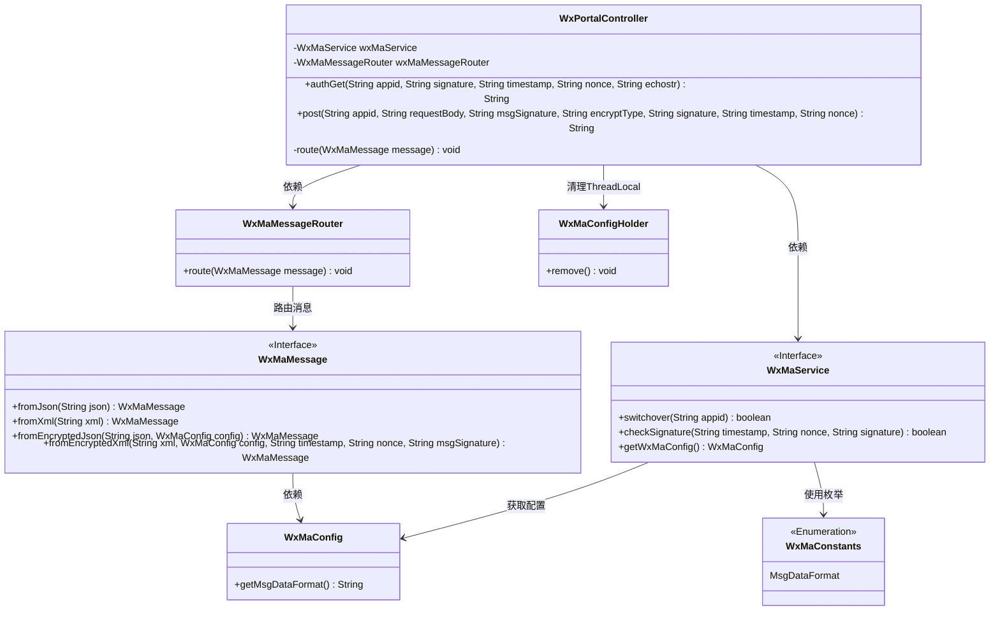
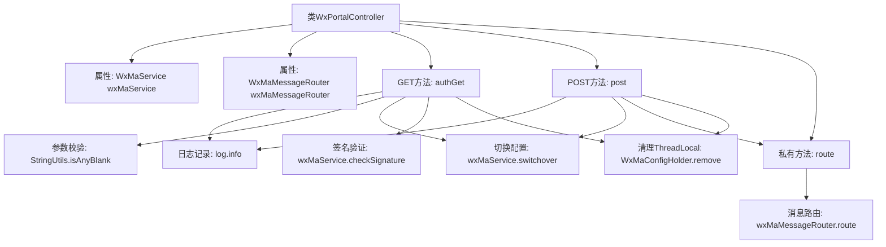
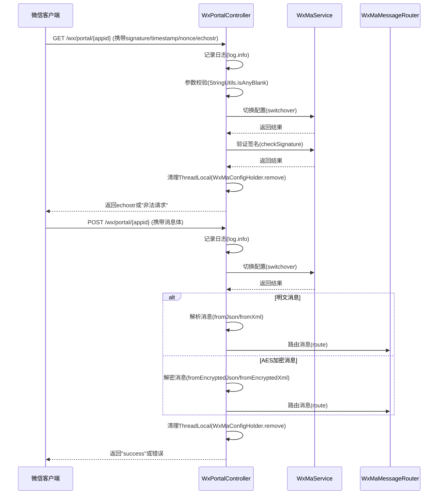

# 基础信息

|      |      |
|------|------|
| 名称 | WxPortalController |
| 编码语言 | .java |
| 代码路径 | weixin-java-miniapp-demo\src\main\java\com\github\binarywang\demo\wx\miniapp\controller\WxPortalController.java |
| 包名 | com.github.binarywang.demo.wx.miniapp.controller |
| 依赖项 | ['cn.binarywang.wx.miniapp.api.WxMaService', 'cn.binarywang.wx.miniapp.bean.WxMaMessage', 'cn.binarywang.wx.miniapp.constant.WxMaConstants', 'cn.binarywang.wx.miniapp.message.WxMaMessageRouter', 'cn.binarywang.wx.miniapp.util.WxMaConfigHolder', 'lombok.AllArgsConstructor', 'lombok.extern.slf4j.Slf4j', 'org.apache.commons.lang3.StringUtils', 'org.springframework.web.bind.annotation', 'java.util.Objects'] |
| 概述说明 | 微信小程序控制器，处理认证和消息请求，验证签名并路由消息，支持明文和AES加密，清理ThreadLocal。 |

# 说明

这是一个微信小程序门户控制器类，包含两个核心方法。GET方法处理微信服务器认证请求，验证签名参数后返回echostr字符串。POST方法处理微信消息，支持明文和AES加密两种格式，根据消息格式进行解析后路由处理，最后返回success响应。两个方法都会检查appid有效性，并在处理完成后清理ThreadLocal存储的配置信息。控制器通过日志记录所有请求参数，对非法请求会抛出异常。

# 类列表 Class Summary

| 名称   | 类型  | 说明 |
|-------|------|-------------|
| WxPortalController | class | 微信小程序控制器，处理认证和消息请求，验证签名并路由消息，支持明文和AES加密，返回成功或错误信息。 |

## 类 WxPortalController

|      |      |
|------|------|
| 访问范围 | @RestController;@AllArgsConstructor;@RequestMapping("/wx/portal/{appid}");@Slf4j;public |
| 类型 | class |
| 名称 | WxPortalController |
| 说明 | 微信小程序控制器，处理认证和消息请求，验证签名并路由消息，支持明文和AES加密，返回成功或错误信息。 |

### UML类图

类图描述：该图展示了一个微信小程序门户控制器(WxPortalController)的核心结构，它依赖于微信小程序服务接口(WxMaService)和消息路由器(WxMaMessageRouter)。控制器处理两种HTTP请求：GET用于认证，POST用于消息处理。系统通过WxMaConfigHolder管理线程本地配置，支持JSON和XML两种消息格式，并实现了明文和AES加密两种消息处理方式。各组件通过清晰的接口定义进行交互，体现了良好的分层设计。

### 内部方法调用关系图

这段代码实现了一个微信小程序消息处理控制器，主要包含GET和POST两个核心方法。GET方法用于微信服务器认证验证，通过校验签名参数确保请求合法性；POST方法处理微信推送的各种消息，支持明文和AES加密两种格式，通过路由机制将消息分发给相应处理器。整个流程严格遵循微信开发规范，包含完善的日志记录、参数校验、配置切换和资源清理机制，体现了高可靠性的消息处理架构。

### 字段列表 Field List

| 名称  | 类型  | 说明 |
|-------|-------|------|
| wxMaMessageRouter | WxMaMessageRouter | 微信小程序消息路由器的私有不可变实例。 |
| wxMaService | WxMaService | 微信小程序服务实例，私有不可变。 |

### 方法列表

| 名称  | 类型  | 说明 |
|-------|-------|------|
| post | String | 处理微信请求的POST接口，支持明文和AES加密消息，校验appid后根据格式（JSON/XML）解析并路由消息，最后清理ThreadLocal返回成功或错误。 |
| route | void | 方法route接收WxMaMessage消息，调用wxMaMessageRouter.route处理，异常时记录错误日志。 |
| authGet | String | 处理微信认证请求，验证签名参数，返回echostr或错误信息。检查appid和参数合法性，清理ThreadLocal。 |

