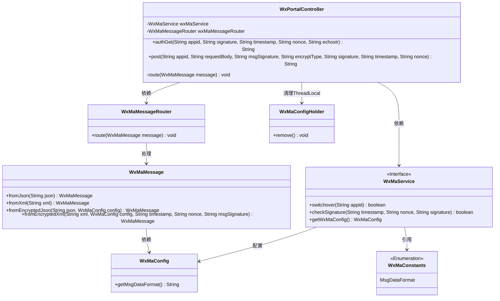
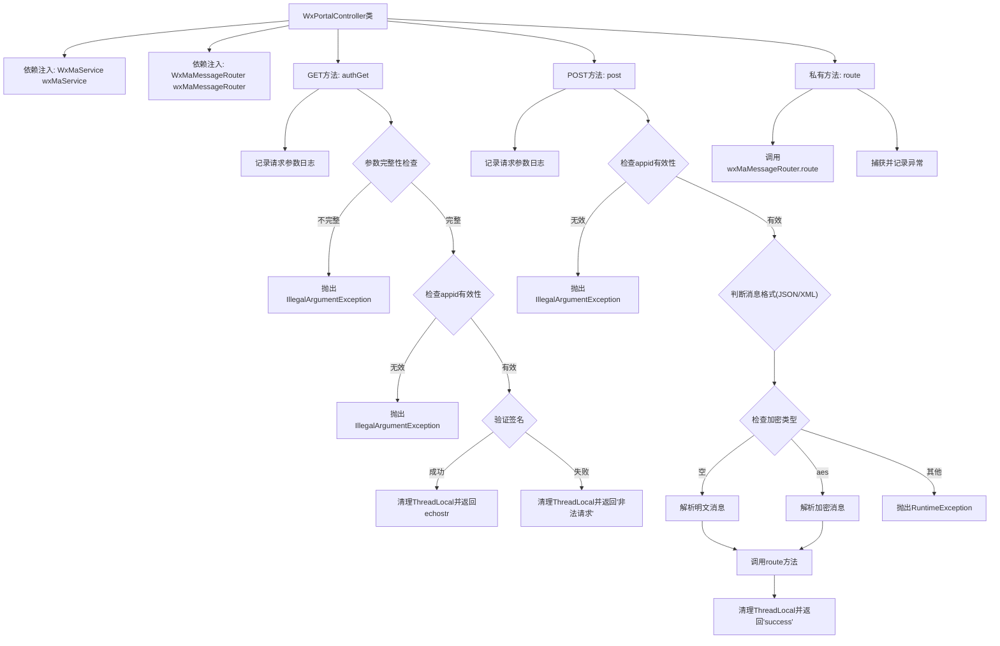

# 基础信息

|      |      |
|------|------|
| 名称 | WxPortalController |
| 编码语言 | .java |
| 代码路径 | weixin-java-miniapp-demo/src/main/java/com/github/binarywang/demo/wx/miniapp/controller/WxPortalController.java |
| 包名 | com.github.binarywang.demo.wx.miniapp.controller |
| 依赖项 | ['cn.binarywang.wx.miniapp.api.WxMaService', 'cn.binarywang.wx.miniapp.bean.WxMaMessage', 'cn.binarywang.wx.miniapp.constant.WxMaConstants', 'cn.binarywang.wx.miniapp.message.WxMaMessageRouter', 'cn.binarywang.wx.miniapp.util.WxMaConfigHolder', 'lombok.AllArgsConstructor', 'lombok.extern.slf4j.Slf4j', 'org.apache.commons.lang3.StringUtils', 'org.springframework.web.bind.annotation', 'java.util.Objects'] |
| 概述说明 | 微信小程序控制器，处理认证和消息请求，验证签名并路由消息，支持明文和AES加密格式。 |

# 说明

该代码定义了一个微信小程序后台控制器WxPortalController，包含GET和POST两个接口。GET接口用于微信服务器认证，验证签名参数后返回echostr字符串。POST接口处理微信消息，支持明文和AES加密两种格式，根据配置转换为消息对象后路由处理，最后返回success响应。两个接口都会清理ThreadLocal存储的配置信息，并校验appid有效性。

# 类列表 Class Summary

| 名称   | 类型  | 说明 |
|-------|------|-------------|
| WxPortalController | class | 微信小程序控制器类，处理认证和消息请求，验证签名并路由消息，支持明文和AES加密，返回成功或错误信息。 |

## 类 WxPortalController

|      |      |
|------|------|
| 访问范围 | @RestController;@AllArgsConstructor;@RequestMapping("/wx/portal/{appid}");@Slf4j;public |
| 类型 | class |
| 名称 | WxPortalController |
| 说明 | 微信小程序控制器类，处理认证和消息请求，验证签名并路由消息，支持明文和AES加密，返回成功或错误信息。 |

### UML类图

该图展示了微信小程序门户控制器的类结构及其依赖关系。WxPortalController作为核心控制器，通过WxMaService处理微信接口认证和消息路由，依赖WxMaMessageRouter进行消息分发。WxMaMessage类负责不同格式消息的解析，WxMaConfig提供配置信息，WxMaConfigHolder管理线程局部变量。整体结构清晰展现了微信消息处理的完整流程。

### 内部方法调用关系图

流程图描述：该流程图展示了微信门户控制器的完整处理流程，包含GET和POST两种请求处理路径。GET请求主要用于微信服务器认证，包含参数校验、签名验证等步骤；POST请求处理业务消息，支持明文和AES加密两种方式，通过消息路由进行分发处理。所有流程最终都会清理ThreadLocal资源，并针对不同情况返回响应结果或抛出异常。控制器内部通过wxMaService和wxMaMessageRouter两个依赖组件完成核心功能。

### 字段列表 Field List

| 名称  | 类型  | 说明 |
|-------|-------|------|
| wxMaMessageRouter | WxMaMessageRouter | 微信小程序消息路由器的私有常量实例。 |
| wxMaService | WxMaService | 微信小程序服务实例私有常量。 |

### 方法列表

| 名称  | 类型  | 说明 |
|-------|-------|------|
| route | void | 该方法用于路由微信小程序消息，捕获并记录异常。 |
| post | String | 处理微信请求的POST接口，支持明文和AES加密消息，根据appid校验配置，解析XML或JSON格式，路由处理后返回success，异常时清理ThreadLocal并报错。 |
| authGet | String | 这是一个微信认证接口，接收appid和签名参数，验证通过后返回echostr，否则报错。 |

