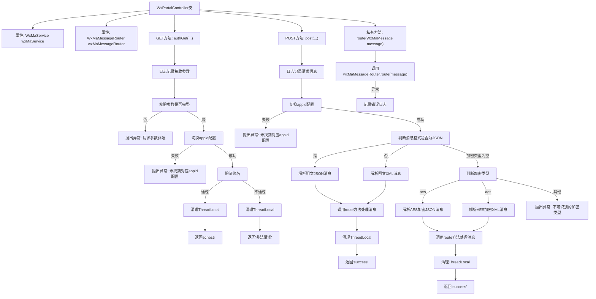

# 基础信息

|      |      |
|------|------|
| 名称 | WxPortalController |
| 编码语言 | .java |
| 代码路径 | weixin-java-miniapp-demo/src/main/java/com/github/binarywang/demo/wx/miniapp/controller/WxPortalController.java |
| 包名 | com.github.binarywang.demo.wx.miniapp.controller |
| 依赖项 | ['cn.binarywang.wx.miniapp.api.WxMaService', 'cn.binarywang.wx.miniapp.bean.WxMaMessage', 'cn.binarywang.wx.miniapp.constant.WxMaConstants', 'cn.binarywang.wx.miniapp.message.WxMaMessageRouter', 'cn.binarywang.wx.miniapp.util.WxMaConfigHolder', 'lombok.AllArgsConstructor', 'lombok.extern.slf4j.Slf4j', 'org.apache.commons.lang3.StringUtils', 'org.springframework.web.bind.annotation', 'java.util.Objects'] |
| 概述说明 | 该控制器用于处理微信小程序的GET和POST请求，实现服务器验证与消息解密路由功能。 |

# 说明

该控制器用于处理微信小程序接入验证及消息接收。通过GET请求完成服务器有效性校验，返回echostr确认请求合法；POST请求接收并解析微信推送的消息，支持明文与AES加密两种传输方式，根据配置自动切换JSON或XML格式解析数据，并将消息路由至指定处理器。所有操作均会记录日志并清理线程上下文资源。

# 类列表 Class Summary

| 名称   | 类型  | 说明 |
|-------|------|-------------|
| WxPortalController | class | 该控制器用于处理微信小程序的GET和POST请求，实现服务器验证与消息路由。GET方法用于接入验证，POST方法用于接收并解析用户发送的消息（支持明文和AES加密），根据配置自动切换对应appid并处理消息，最终返回success或错误信息。使用日志记录请求详情，并在处理完毕后清理线程本地变量。 |

## 类 WxPortalController

|      |      |
|------|------|
| 访问范围 | @RestController;@AllArgsConstructor;@RequestMapping("/wx/portal/{appid}");@Slf4j;public |
| 类型 | class |
| 名称 | WxPortalController |
| 说明 | 该控制器用于处理微信小程序的GET和POST请求，实现服务器验证与消息路由。GET方法用于接入验证，POST方法用于接收并解析用户发送的消息（支持明文和AES加密），根据配置自动切换对应appid并处理消息，最终返回success或错误信息。使用日志记录请求详情，并在处理完毕后清理线程本地变量。 |

### UML类图

```mermaid
classDiagram
    class WxPortalController {
        -WxMaService wxMaService
        -WxMaMessageRouter wxMaMessageRouter
        +authGet(String appid, String signature, String timestamp, String nonce, String echostr) String
        +post(String appid, String requestBody, String msgSignature, String encryptType, String signature, String timestamp, String nonce) String
        -route(WxMaMessage message) void
    }

    class WxMaService {
        <<Interface>>
        +switchover(String appid) boolean
        +checkSignature(String timestamp, String nonce, String signature) boolean
        +getWxMaConfig() WxMaConfig
    }

    class WxMaMessageRouter {
        <<Interface>>
        +route(WxMaMessage message) void
    }

    class WxMaMessage {
        <<Interface>>
        +fromJson(String json) WxMaMessage
        +fromXml(String xml) WxMaMessage
        +fromEncryptedJson(String json, WxMaConfig config) WxMaMessage
        +fromEncryptedXml(String xml, WxMaConfig config, String timestamp, String nonce, String msgSignature) WxMaMessage
    }

    class WxMaConfig {
        <<Interface>>
        +getMsgDataFormat() String
    }

    class WxMaConstants {
        <<Interface>>
        +MsgDataFormat JSON
    }

    class WxMaConfigHolder {
        <<Interface>>
        +remove() void
    }

    class StringUtils {
        <<Interface>>
        +isAnyBlank(String... strings) boolean
        +isBlank(String string) boolean
    }

    class Objects {
        <<Interface>>
        +equals(Object a, Object b) boolean
    }

    class RequestParam {
        <<Interface>>
    }

    class PathVariable {
        <<Interface>>
    }

    class RestController {
        <<Interface>>
    }

    class RequestMapping {
        <<Interface>>
    }

    class GetMapping {
        <<Interface>>
    }

    class PostMapping {
        <<Interface>>
    }

    class RequestBody {
        <<Interface>>
    }

    class Slf4j {
        <<Interface>>
    }

    class AllArgsConstructor {
        <<Interface>>
    }

    WxPortalController --> WxMaService : 依赖
    WxPortalController --> WxMaMessageRouter : 依赖
    WxPortalController --> WxMaMessage : 依赖
    WxPortalController --> WxMaConfigHolder : 依赖
    WxPortalController --> StringUtils : 依赖
    WxPortalController --> Objects : 依赖
    WxPortalController --> WxMaConstants : 依赖
    WxMaMessage --> WxMaConfig : 依赖
```

该类图展示了微信小程序门户控制器 `WxPortalController` 的结构及其与其他关键组件的交互关系。它通过依赖注入使用了服务接口 `WxMaService` 和消息路由接口 `WxMaMessageRouter`，并处理来自微信服务器的认证和消息推送请求。同时，涉及多个工具类和常量定义以支持签名验证、加解密及消息解析功能。

### 内部方法调用关系图

该流程图展示了微信公众号接入认证与消息接收处理的核心逻辑。控制器根据请求方式分为GET和POST两种处理路径，分别完成签名校验和消息解密解析，并通过路由分发至具体处理器，涵盖了明文和加密两种传输模式，同时注重了线程上下文的清理工作。

### 字段列表 Field List

| 名称  | 类型  | 说明 |
|-------|-------|------|
| wxMaMessageRouter | WxMaMessageRouter | 这是一个微信小程序消息路由器的私有常量实例，用于处理和路由微信小程序的消息请求。 |
| wxMaService | WxMaService | 这是一个微信小程序服务接口的私有常量字段声明，用于在类中提供微信小程序相关功能调用。 |

### 方法列表

| 名称  | 类型  | 说明 |
|-------|-------|------|
| route | void | 该方法用于路由微信小程序消息，通过wxMaMessageRouter处理传入的消息，若处理过程中发生异常则记录错误日志。 |
| post | String | 该接口处理微信小程序消息推送，支持明文和AES加密两种传输方式，根据消息格式（JSON或XML）解析并路由处理，确保线程安全。 |
| authGet | String | 该接口用于处理微信服务器的GET认证请求，验证签名合法性并返回echostr或错误信息。 |

