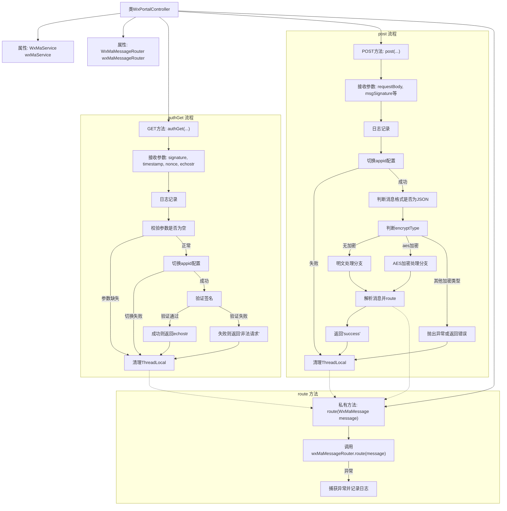

# 基础信息

|      |      |
|------|------|
| 名称 | WxPortalController |
| 编码语言 | .java |
| 代码路径 | weixin-java-miniapp-demo/src/main/java/com/github/binarywang/demo/wx/miniapp/controller/WxPortalController.java |
| 包名 | com.github.binarywang.demo.wx.miniapp.controller |
| 依赖项 | ['cn.binarywang.wx.miniapp.api.WxMaService', 'cn.binarywang.wx.miniapp.bean.WxMaMessage', 'cn.binarywang.wx.miniapp.constant.WxMaConstants', 'cn.binarywang.wx.miniapp.message.WxMaMessageRouter', 'cn.binarywang.wx.miniapp.util.WxMaConfigHolder', 'lombok.AllArgsConstructor', 'lombok.extern.slf4j.Slf4j', 'org.apache.commons.lang3.StringUtils', 'org.springframework.web.bind.annotation', 'java.util.Objects'] |
| 概述说明 | 该控制器用于处理微信小程序的GET和POST请求，实现服务器验证与消息接收功能。GET方法用于验证签名并返回echostr，POST方法用于接收并解析用户消息，支持明文和AES加密两种模式，最终通过路由分发消息。 |

# 说明

该控制器用于处理微信小程序接入认证及消息接收。通过GET请求完成服务器有效性验证，返回echostr确认接入；POST请求用于接收并解析微信推送的消息，支持明文与AES加密两种方式，根据配置自动切换JSON或XML格式解析，并通过路由分发至相应处理器，最终返回success表示接收成功。所有操作均校验appid合法性并在处理后清理线程上下文。

# 类列表 Class Summary

| 名称   | 类型  | 说明 |
|-------|------|-------------|
| WxPortalController | class | 该控制器用于处理微信小程序的GET和POST请求，支持消息签名验证、解密及路由处理，确保请求合法并清理线程变量。 |

## 类 WxPortalController

|      |      |
|------|------|
| 访问范围 | @RestController;@AllArgsConstructor;@RequestMapping("/wx/portal/{appid}");@Slf4j;public |
| 类型 | class |
| 名称 | WxPortalController |
| 说明 | 该控制器用于处理微信小程序的GET和POST请求，支持消息签名验证、解密及路由处理，确保请求合法并清理线程变量。 |

### UML类图

```mermaid
classDiagram
    class WxPortalController {
        -WxMaService wxMaService
        -WxMaMessageRouter wxMaMessageRouter
        +authGet(String appid, String signature, String timestamp, String nonce, String echostr) String
        +post(String appid, String requestBody, String msgSignature, String encryptType, String signature, String timestamp, String nonce) String
        -route(WxMaMessage message) void
    }

    class WxMaService {
        <<Interface>>
        +switchover(String appid) boolean
        +checkSignature(String timestamp, String nonce, String signature) boolean
        +getWxMaConfig() WxMaConfig
    }

    class WxMaMessageRouter {
        <<Interface>>
        +route(WxMaMessage message) void
    }

    class WxMaMessage {
        <<Interface>>
        +fromJson(String json) WxMaMessage
        +fromXml(String xml) WxMaMessage
        +fromEncryptedJson(String json, WxMaConfig config) WxMaMessage
        +fromEncryptedXml(String xml, WxMaConfig config, String timestamp, String nonce, String msgSignature) WxMaMessage
    }

    class WxMaConfig {
        <<Interface>>
        +getMsgDataFormat() String
    }

    class WxMaConstants {
        <<Interface>>
        +MsgDataFormat JSON
    }

    class WxMaConfigHolder {
        <<Interface>>
        +remove() void
    }

    class StringUtils {
        <<Interface>>
        +isAnyBlank(String... strings) boolean
        +isBlank(String str) boolean
    }

    class Objects {
        <<Interface>>
        +equals(Object a, Object b) boolean
    }

    class Log {
        <<Interface>>
        +info(String format, Object... arguments)
        +error(String msg, Throwable t)
    }

    WxPortalController --> WxMaService : 依赖
    WxPortalController --> WxMaMessageRouter : 依赖
    WxPortalController --> WxMaMessage : 依赖
    WxPortalController --> WxMaConfig : 依赖
    WxPortalController --> WxMaConstants : 依赖
    WxPortalController --> WxMaConfigHolder : 依赖
    WxPortalController --> StringUtils : 依赖
    WxPortalController --> Objects : 依赖
    WxPortalController --> Log : 依赖
```

该类图展示了微信小程序门户控制器 `WxPortalController` 的结构及其与其他关键组件的交互关系。控制器通过依赖注入获取服务实例，并在处理 GET 和 POST 请求时调用这些服务完成签名验证、消息解析与路由等功能。同时，它还依赖工具类进行字符串和对象判断，并使用日志记录请求信息，整体体现了微信消息接收与处理的核心流程。

### 内部方法调用关系图

该流程图展示了微信小程序门户控制器的核心逻辑，包括GET请求用于服务器认证和POST请求用于接收并处理用户消息。流程涵盖了参数校验、签名验证、消息解密与路由等关键环节，并在各路径结束前清理线程本地变量以保证安全性。

### 字段列表 Field List

| 名称  | 类型  | 说明 |
|-------|-------|------|
| wxMaService | WxMaService | 这是一个微信小程序服务接口的私有常量实例，用于处理微信小程序相关业务逻辑。 |
| wxMaMessageRouter | WxMaMessageRouter | 这是一个微信小程序消息路由器的私有常量实例，用于处理和路由微信小程序的消息请求。 |

### 方法列表

| 名称  | 类型  | 说明 |
|-------|-------|------|
| route | void | 该方法用于路由微信小程序消息，通过wxMaMessageRouter处理消息，若处理过程中出现异常则记录错误日志。 |
| authGet | String | 该接口用于处理微信服务器的GET认证请求，验证签名合法性并返回echostr或错误信息。 |
| post | String | 该接口处理微信小程序消息推送，支持明文和AES加密两种传输方式，根据消息格式（JSON或XML）解析并路由处理，确保线程安全并返回成功响应。 |

