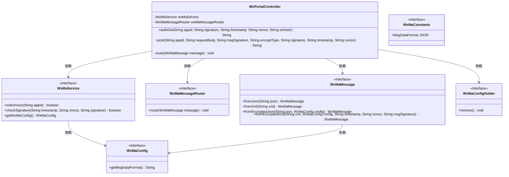
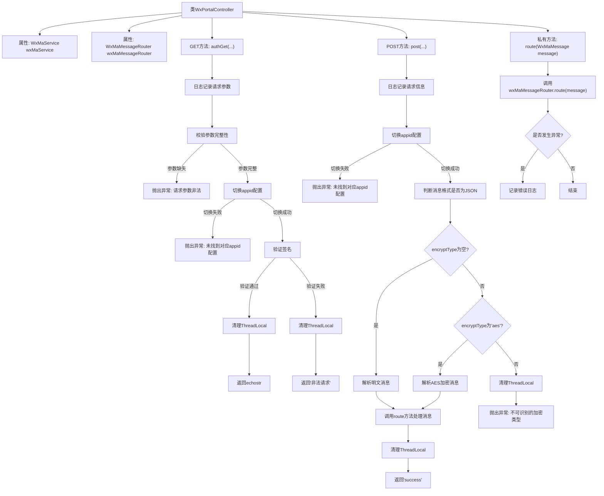

# 基础信息

|      |      |
|------|------|
| 名称 | WxPortalController |
| 编码语言 | .java |
| 代码路径 | weixin-java-miniapp-demo/src/main/java/com/github/binarywang/demo/wx/miniapp/controller/WxPortalController.java |
| 包名 | com.github.binarywang.demo.wx.miniapp.controller |
| 依赖项 | ['cn.binarywang.wx.miniapp.api.WxMaService', 'cn.binarywang.wx.miniapp.bean.WxMaMessage', 'cn.binarywang.wx.miniapp.constant.WxMaConstants', 'cn.binarywang.wx.miniapp.message.WxMaMessageRouter', 'cn.binarywang.wx.miniapp.util.WxMaConfigHolder', 'lombok.AllArgsConstructor', 'lombok.extern.slf4j.Slf4j', 'org.apache.commons.lang3.StringUtils', 'org.springframework.web.bind.annotation', 'java.util.Objects'] |
| 概述说明 | 该控制器用于处理微信小程序的GET和POST请求，支持消息签名验证、解密及路由处理。GET方法用于服务器认证，POST方法用于接收并解析用户消息，支持明文和AES加密两种传输方式，并根据配置自动切换处理JSON或XML格式数据。 |

# 说明

该控制器用于处理微信小程序接入认证及消息推送。通过GET请求完成服务器有效性验证，返回echostr确认请求合法；POST请求接收并解析用户发送的消息，支持明文与AES加密两种方式，根据配置自动切换JSON或XML格式解析数据，并将消息路由至指定处理器。所有操作均校验appid合法性，确保安全性。

# 类列表 Class Summary

| 名称   | 类型  | 说明 |
|-------|------|-------------|
| WxPortalController | class | 该控制器用于处理微信小程序的GET和POST请求，实现服务器验证与消息接收功能。GET方法用于校验签名并返回echostr，POST方法解析明文或AES加密的消息内容，并通过路由分发处理。支持JSON和XML格式数据，确保线程安全并清理上下文。 |

## 类 WxPortalController

|      |      |
|------|------|
| 访问范围 | @RestController;@AllArgsConstructor;@RequestMapping("/wx/portal/{appid}");@Slf4j;public |
| 类型 | class |
| 名称 | WxPortalController |
| 说明 | 该控制器用于处理微信小程序的GET和POST请求，实现服务器验证与消息接收功能。GET方法用于校验签名并返回echostr，POST方法解析明文或AES加密的消息内容，并通过路由分发处理。支持JSON和XML格式数据，确保线程安全并清理上下文。 |

### UML类图

该类图展示了微信小程序门户控制器 `WxPortalController` 的结构及其相关依赖。它通过接口调用处理 GET 和 POST 请求，完成签名校验、消息解析与路由转发等功能。同时依赖于多个微信小程序服务接口及配置类来实现完整的业务逻辑处理流程。

### 内部方法调用关系图

该流程图展示了微信公众号接入控制器 `WxPortalController` 的主要逻辑。包括 GET 请求用于服务器认证和 POST 请求用于接收并处理用户消息，涵盖了参数校验、配置切换、消息解密与路由等关键步骤，并在各关键节点进行 ThreadLocal 清理以防止内存泄漏。

### 字段列表 Field List

| 名称  | 类型  | 说明 |
|-------|-------|------|
| wxMaMessageRouter | WxMaMessageRouter | 这是一个微信小程序消息路由器的私有常量实例，用于处理和路由微信小程序的消息请求。 |
| wxMaService | WxMaService | 这是一个微信小程序服务接口的私有常量字段声明，用于在类中提供微信小程序相关功能调用。 |

### 方法列表

| 名称  | 类型  | 说明 |
|-------|-------|------|
| authGet | String | 该接口用于处理微信服务器的GET认证请求，验证签名合法性并返回echostr或错误信息。 |
| post | String | 该接口处理微信小程序消息推送，支持明文和AES加密两种传输方式，根据消息格式（JSON或XML）解析并路由处理，确保线程安全并返回成功响应。 |
| route | void | 该方法用于路由微信小程序消息，通过wxMaMessageRouter处理消息，若处理过程中发生异常则记录错误日志。 |

