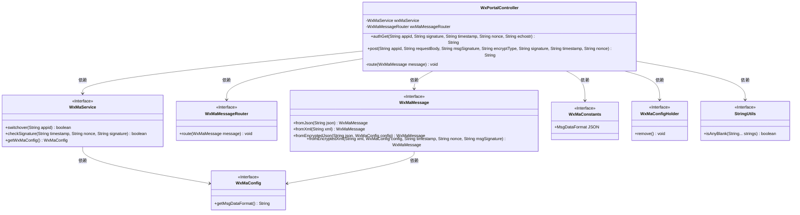
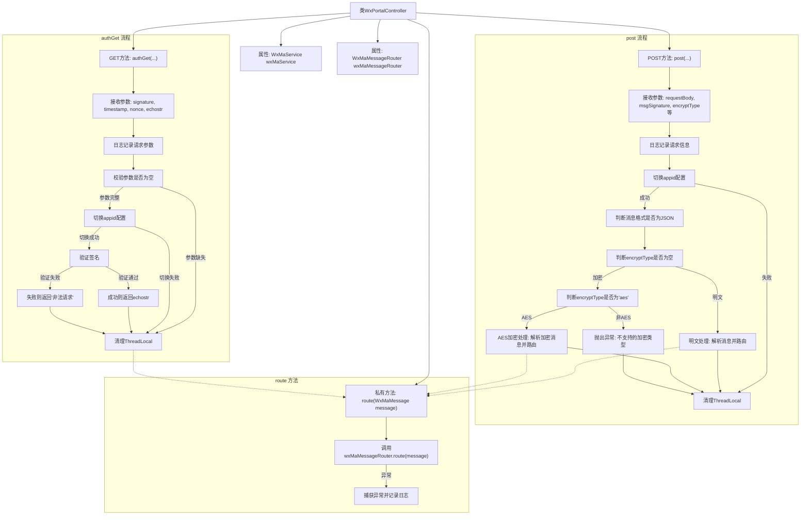

# 基础信息

|      |      |
|------|------|
| 名称 | WxPortalController |
| 编码语言 | .java |
| 代码路径 | weixin-java-miniapp-demo/src/main/java/com/github/binarywang/demo/wx/miniapp/controller/WxPortalController.java |
| 包名 | com.github.binarywang.demo.wx.miniapp.controller |
| 依赖项 | ['cn.binarywang.wx.miniapp.api.WxMaService', 'cn.binarywang.wx.miniapp.bean.WxMaMessage', 'cn.binarywang.wx.miniapp.constant.WxMaConstants', 'cn.binarywang.wx.miniapp.message.WxMaMessageRouter', 'cn.binarywang.wx.miniapp.util.WxMaConfigHolder', 'lombok.AllArgsConstructor', 'lombok.extern.slf4j.Slf4j', 'org.apache.commons.lang3.StringUtils', 'org.springframework.web.bind.annotation', 'java.util.Objects'] |
| 概述说明 | 该控制器用于处理微信小程序的GET和POST请求，支持消息签名校验、解密及路由处理。 |

# 说明

该控制器用于处理微信小程序接入请求，支持GET和POST方法。GET请求用于验证服务器有效性，接收signature、timestamp、nonce、echostr等参数，校验通过后返回echostr。POST请求用于接收微信消息，支持明文和AES加密两种方式，根据encrypt_type判断并解析消息内容，最终由消息路由器进行处理。所有操作完成后会清理线程上下文。

# 类列表 Class Summary

| 名称   | 类型  | 说明 |
|-------|------|-------------|
| WxPortalController | class | 该控制器用于处理微信小程序的GET和POST请求，实现服务器验证与消息接收功能。GET方法用于校验签名并返回echostr，POST方法解析明文或AES加密的消息体并路由处理。支持JSON和XML格式，通过appid切换配置，确保线程安全。 |

## 类 WxPortalController

|      |      |
|------|------|
| 访问范围 | @RestController;@AllArgsConstructor;@RequestMapping("/wx/portal/{appid}");@Slf4j;public |
| 类型 | class |
| 名称 | WxPortalController |
| 说明 | 该控制器用于处理微信小程序的GET和POST请求，实现服务器验证与消息接收功能。GET方法用于校验签名并返回echostr，POST方法解析明文或AES加密的消息体并路由处理。支持JSON和XML格式，通过appid切换配置，确保线程安全。 |

### UML类图

该类图展示了微信小程序门户控制器 `WxPortalController` 的结构及其与其他关键组件的交互关系。控制器通过接口依赖服务层（如 `WxMaService`）、消息路由（`WxMaMessageRouter`）以及消息解析工具类（如 `WxMaMessage`），实现微信服务器认证与消息处理逻辑。同时利用 `WxMaConfigHolder` 管理配置上下文，保证线程安全。整体设计遵循依赖倒置原则，便于扩展和测试。

### 内部方法调用关系图

该流程图展示了`WxPortalController`类中两个主要接口`authGet`与`post`的执行逻辑。其中包含了微信认证验证、消息解密解析以及最终通过`route`方法分发至消息路由器的核心流程，并涵盖了线程上下文清理的关键步骤。

### 字段列表 Field List

| 名称  | 类型  | 说明 |
|-------|-------|------|
| wxMaService | WxMaService | 这是一个微信小程序服务接口的私有常量字段声明，用于在类中提供微信小程序相关功能调用。 |
| wxMaMessageRouter | WxMaMessageRouter | 这是一个微信小程序消息路由器的私有不可变实例变量，用于处理微信小程序的消息路由转发功能。 |

### 方法列表

| 名称  | 类型  | 说明 |
|-------|-------|------|
| route | void | 该方法用于路由微信小程序消息，通过wxMaMessageRouter处理传入的消息，若处理过程中发生异常则记录错误日志。 |
| post | String | 该接口处理微信小程序消息推送，支持明文和AES加密两种传输方式，根据消息格式（JSON或XML）解析并路由处理，确保线程安全并返回成功响应。 |
| authGet | String | 该接口用于处理微信服务器的认证请求，验证签名合法性并返回echostr或错误信息。 |

