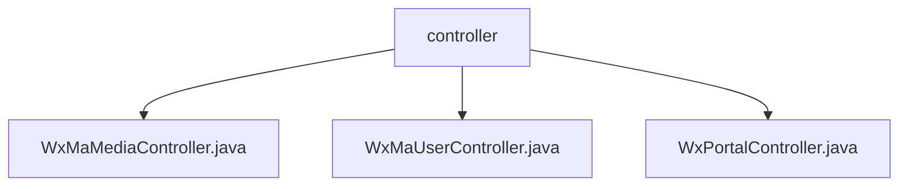

# 基础信息

|      |      |
|------|------|
| 名称 | controller |
| 编码语言 | .java |
| 代码路径 | weixin-java-miniapp-demo/src/main/java/com/github/binarywang/demo/wx/miniapp/controller |
| 包名 | docs.src.main.java.com.github.binarywang.demo.wx.miniapp.controller |
| 概述说明 | 该控制器实现微信小程序媒体文件上传下载功能，支持临时图片素材上传返回media_id列表，提供根据mediaId下载素材能力，使用multipart格式接收文件并通过CommonsMultipartResolver处理请求，每次操作后清理线程本地变量，未找到对应appid配置时抛出异常提示。 |

# 说明

## 概述

该模块为微信小程序提供核心后端服务，涵盖媒体文件上传下载、用户登录与信息管理、以及消息推送处理等功能。通过AppId路由机制实现多小程序实例的支持，采用线程本地变量隔离不同请求上下文，并在操作结束后进行资源清理。

接口遵循RESTful风格设计，支持Multipart文件上传、JSON/XML数据解析及AES加解密通信。主要依赖CommonsMultipartResolver处理文件流，结合WxJava SDK实现微信协议对接。例如：上传图片素材返回MediaId列表；根据Code换取用户Session；接收并路由用户消息至指定处理器。

关键数据结构包括WxMaConfig（配置对象）、WxMaUserInfo（用户信息）、WxMaJscode2SessionResult（登录结果）和WxMpXmlMessage（消息实体）。外部依赖项有commons-fileupload、wx-java-miniapp-spring-boot-starter及相关日志框架。

## 主要业务场景

模块整合了微信小程序三大核心交互流程：媒体资源管理、用户身份认证与消息订阅推送。其交互模式类似事件总线架构，由Portal Controller统一入口分发请求，UserController与MediaController分别负责用户态与资源态的操作处理。

功能覆盖从接入验证到业务响应的全流程闭环，例如通过GET请求完成服务器URL校验，POST方式接收并解析用户行为数据。API类型包含Controller层暴露的HTTP接口及内部调用的Service组件，适用于Spring Boot微服务部署环境下的快速集成案例。

### 包内部结构视图

该流程图展示了微信小程序Demo项目中控制器层的结构关系，`controller`作为父级目录包含了三个具体的控制器类文件，分别为媒体、用户和门户相关的控制逻辑实现。

# 文件列表

| 名称   | 类型  | 说明 |
|-------|------|-------------|
| [WxMaMediaController.java](WxMaMediaController.md) | file | 该控制器提供微信小程序临时素材的上传与下载功能，支持通过appid切换配置，上传接口返回media_id列表，下载接口根据media_id获取文件。 |
| [WxMaUserController.java](WxMaUserController.md) | file | 该类为微信小程序用户相关接口控制器，提供登录、获取用户信息及绑定手机号功能，通过appid切换配置并处理微信返回的数据。 |
| [WxPortalController.java](WxPortalController.md) | file | 该控制器用于处理微信小程序的GET和POST请求，支持消息签名验证、解密及路由处理。GET方法用于服务器认证，POST方法用于接收并解析用户消息，支持明文和AES加密两种传输方式，并根据配置自动切换处理JSON或XML格式数据。 |

