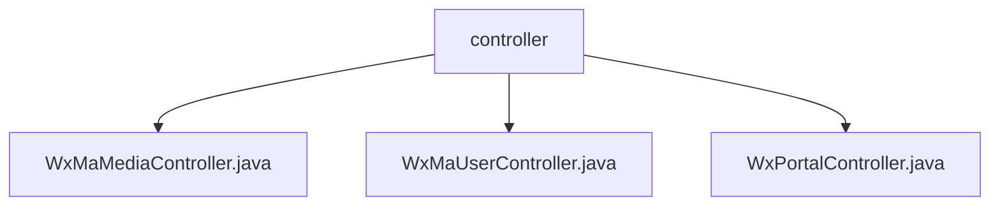

# 基础信息

|      |      |
|------|------|
| 名称 | controller |
| 编码语言 | .java |
| 代码路径 | weixin-java-miniapp-demo/src/main/java/com/github/binarywang/demo/wx/miniapp/controller |
| 包名 | docs.src.main.java.com.github.binarywang.demo.wx.miniapp.controller |
| 概述说明 | 微信小程序三个控制器类：媒体控制器处理文件上传下载；用户控制器提供登录、获取用户信息和手机号功能；门户控制器处理微信服务器认证和消息路由。均基于appid配置并清理ThreadLocal。 |

# 说明

## 概述  
该模块是微信小程序后端核心控制器集合，主要负责媒体文件管理、用户会话服务和微信消息路由三大功能。接口规范统一采用基于appid的配置切换机制，所有操作都包含ThreadLocal清理逻辑。关键数据结构包括media_id列表、用户会话信息JSON和微信消息对象。外部依赖微信SDK的加密解密服务、HTTP请求处理和JSON解析。例如上传接口返回media_id列表，登录接口返回包含sessionKey的JSON。

## 主要业务场景  
模块支持多业务流：媒体文件上传下载（类似CDN管理）、用户身份认证（类似OAuth2.0流程）和微信消息处理（类似事件总线模式）。典型交互模式为接收请求→验证appid→执行业务→清理资源→返回响应。完整功能覆盖小程序后台开发核心需求，包括用户信息获取、临时素材管理和消息路由。API类型包含RESTful接口和微信回调接口，例如通过code换取会话信息，或处理加密的微信消息。

### 包内部结构视图

该流程图展示了微信小程序demo项目中控制器的层级结构。根节点为controller文件夹，其下包含三个Java控制器文件：WxMaMediaController处理媒体相关功能，WxMaUserController管理用户操作，WxPortalController作为入口控制器。所有控制器均位于miniapp模块的同一目录层级，未显示其他无关路径节点。

# 文件列表

| 名称   | 类型  | 说明 |
|-------|------|-------------|
| [WxMaMediaController.java](WxMaMediaController.md) | file | 微信小程序媒体控制器，提供上传和下载临时素材功能。上传返回media_id列表，下载返回媒体文件。需校验appid有效性，操作后清理ThreadLocal。 |
| [WxMaUserController.java](WxMaUserController.md) | file | 微信小程序用户控制器，提供登录、获取用户信息及手机号接口，需校验appid和用户数据，返回JSON格式结果，处理异常并清理ThreadLocal。 |
| [WxPortalController.java](WxPortalController.md) | file | 微信小程序控制器，处理认证和消息请求，验证签名并路由消息，支持明文和AES加密格式。 |

