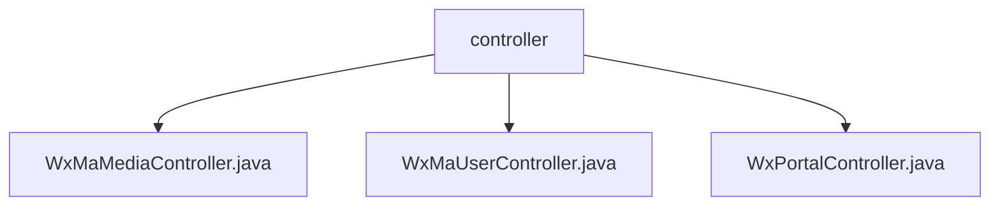

# 基础信息

|      |      |
|------|------|
| 名称 | controller |
| 编码语言 | .java |
| 代码路径 | weixin-java-miniapp-demo/src/main/java/com/github/binarywang/demo/wx/miniapp/controller |
| 包名 | docs.src.main.java.com.github.binarywang.demo.wx.miniapp.controller |
| 概述说明 | 该控制器实现微信小程序媒体文件上传下载功能，支持通过appid切换配置，上传临时图片素材返回唯一media_id，下载时根据media_id获取文件，接口处理完自动清理线程本地变量。 |

# 说明

## 概述

该模块为微信小程序提供核心后端接口支持，涵盖媒体文件上传下载、用户认证与信息获取、以及消息接收与路由三大功能。  
接口遵循RESTful风格并通过AppID实现多租户配置切换，采用JSON格式通信并确保线程安全。

所有控制器均在操作结束后清理ThreadLocal资源，保障运行环境干净，类似ServletContext生命周期管理机制。  
关键数据结构包括WxMaConfig（配置对象）、WxMaJscode2SessionResult（登录结果）和WxMaMessage（消息实体）。  

外部依赖主要包括weixin-java-miniapp SDK及Spring Boot框架组件，未引入其他第三方库。  
例如：通过/media/upload接口上传图片获得media_id；调用/wxa/business/getuserphonenumber解密手机号。

## 主要业务场景

模块主要支撑微信小程序的接入验证、用户身份管理与多媒体资源交互三大业务流程。  
接入层支持GET校验签名及POST接收明文/AES加密消息，并交由路由器分发处理，形如事件总线模式。  

用户相关接口完成登录态维护与敏感信息解密，例如通过code换取openid及session_key。  
媒体控制器则负责临时素材的上传与下载，适用于头像上传、语音下载等典型应用场景。  

API类型覆盖HTTP GET/POST请求，集成案例包含从微信回调到业务逻辑响应的全链路闭环处理。  
整体具备高内聚低耦合特性，适合嵌入微服务架构中作为独立服务能力单元使用。

### 包内部结构视图

该流程图展示了微信小程序 Demo 项目中 controller 层的结构关系，包含三个具体的控制器类文件，均位于 controller 目录下，用于处理不同的业务请求。

# 文件列表

| 名称   | 类型  | 说明 |
|-------|------|-------------|
| [WxMaMediaController.java](WxMaMediaController.md) | file | 该控制器提供微信小程序临时素材的上传与下载功能，支持通过appid切换配置，上传接口返回media_id列表，下载接口根据media_id获取文件。 |
| [WxMaUserController.java](WxMaUserController.md) | file | 该类为微信小程序用户相关接口控制器，提供登录、获取用户信息及绑定手机号功能，通过appid切换配置并处理微信返回的数据。 |
| [WxPortalController.java](WxPortalController.md) | file | 该控制器用于处理微信小程序的GET和POST请求，支持消息签名校验、解密及路由处理。 |

