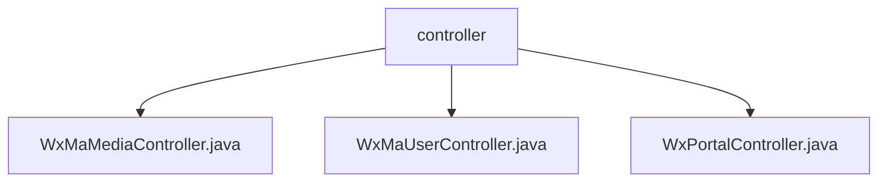

# 基础信息

|      |      |
|------|------|
| 名称 | controller |
| 编码语言 | .java |
| 代码路径 | weixin-java-miniapp-demo/src/main/java/com/github/binarywang/demo/wx/miniapp/controller |
| 包名 | docs.src.main.java.com.github.binarywang.demo.wx.miniapp.controller |
| 概述说明 | 该控制器实现微信小程序媒体文件上传下载功能，支持多文件处理和异常捕获。另一控制器提供用户登录、信息获取及手机号绑定接口，处理JSCode校验和敏感信息解密。第三控制器负责小程序接入认证和消息接收，支持明文与AES加密消息解析，自动切换JSON或XML格式并分发处理。所有接口均校验appid合法性并清理线程上下文。 |

# 说明

## 概述

该模块为微信小程序提供核心后端接口支持，涵盖媒体文件上传下载、用户登录与信息获取、以及接入认证与消息接收功能。通过Appid路由实现多小程序实例管理，采用线程局部变量清理机制保障服务稳定性。

接口遵循RESTful风格设计，支持GET/POST请求，集成WXJava SDK处理凭证校验、加解密及消息解析。关键数据结构包括MediaId、JSCode、Echostr等微信标准字段，以及自定义封装的响应对象。

外部依赖主要包括WXJava Miniapp SDK、Spring Boot框架及相关日志组件。例如：使用WxMaService处理登录凭证校验，调用WxMaConfig实现多租户配置切换。

## 主要业务场景

模块支持三类主要业务流程：一是媒体资源管理，如上传图片获得MediaId并可后续下载；二是用户身份交互，例如通过JSCode换取OpenId并解密手机号；三是接入层通信，类似事件总线模式分发不同类型微信消息至指定处理器。

系统通过Appid在多个小程序间路由请求，支持明文或AES加密传输，能自动识别JSON/XML格式。所有接口具备异常捕获能力，并在执行完毕后清理ThreadLocal上下文，防止内存泄漏。

典型应用场景包括第三方平台代运营多个小程序、企业内部门户对接微信生态、以及需要安全传递用户敏感信息的合规场景。API类型覆盖Controller层HTTP接口及底层SDK调用，支持与Nginx反向代理、HTTPS网关等基础设施集成。

### 包内部结构视图

该流程图展示了微信小程序Demo项目中控制器层的结构关系，`controller`作为父级目录包含了三个具体的控制器类文件，分别用于处理媒体、用户和门户相关的请求逻辑。

# 文件列表

| 名称   | 类型  | 说明 |
|-------|------|-------------|
| [WxMaMediaController.java](WxMaMediaController.md) | file | 该控制器提供微信小程序临时素材的上传与下载功能，支持通过appid切换配置，上传接口返回media_id列表，下载接口根据media_id获取文件。 |
| [WxMaUserController.java](WxMaUserController.md) | file | 该控制器提供微信小程序用户登录、信息获取及手机号解密功能，通过appid切换配置并处理会话验证与数据解密。 |
| [WxPortalController.java](WxPortalController.md) | file | 该控制器用于处理微信小程序的GET和POST请求，实现服务器验证与消息接收功能。GET方法用于验证签名并返回echostr，POST方法用于接收并解析用户消息，支持明文和AES加密两种模式，最终通过路由分发消息。 |

