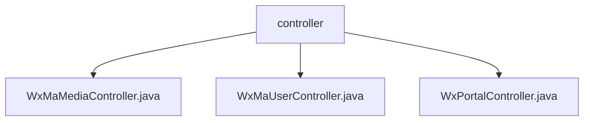

# 基础信息

|      |      |
|------|------|
| 名称 | controller |
| 编码语言 | .java |
| 代码路径 | weixin-java-miniapp-demo/src/main/java/com/github/binarywang/demo/wx/miniapp/controller |
| 包名 | docs.src.main.java.com.github.binarywang.demo.wx.miniapp.controller |
| 概述说明 | 该控制器实现微信小程序媒体文件上传下载功能，支持多文件处理和异常捕获。提供用户登录、信息获取及手机号绑定接口，处理JSCode校验与会话管理。同时负责小程序接入验证和消息接收处理，支持明文与AES加密传输，自动切换JSON或XML格式解析数据并路由至指定处理器，确保服务稳定运行。 |

# 说明

## 概述  
该模块为微信小程序提供核心后端接口支持，涵盖用户认证、媒体文件管理及消息处理等功能。通过AppID动态切换配置，实现多应用隔离与安全访问控制。

模块对外暴露RESTful API，统一采用JSON格式响应结果，并在每次请求结束后清理ThreadLocal变量以避免内存泄漏。例如：WxMaUserController负责登录与用户信息解密，WxMaMediaController处理素材上传下载，WxPortalController实现接入验证和消息路由。

关键数据结构包括WxMaJscode2SessionResult（用于存储登录凭证校验结果）、WxMaUserInfo（封装用户敏感信息）以及WxMpXmlMessage（表示接收到的微信推送消息）。外部依赖主要涉及weixin-java-miniapp SDK及其底层HTTP客户端库。

## 主要业务场景  
模块支持三大典型业务流程：小程序用户身份验证与会话管理、临时媒体资源的操作流转、以及来自微信平台的消息订阅与事件分发。例如：用户扫码登录时由UserController完成凭证校验，上传头像则交由MediaController处理。

交互模式上类似MVC架构，前端发起HTTP请求到指定Controller，经参数解析与逻辑处理后调用Service层完成具体任务。所有操作均遵循“接收-处理-清理”的生命周期模型，保障系统稳定性。

集成案例表明，开发者可通过统一入口按需加载不同配置实例，从而适配多个小程序项目。API类型覆盖GET/POST方法，兼容明文/AES加密传输机制，满足多样化接入需求。

### 包内部结构视图

该流程图展示了微信小程序Demo项目中控制器层的结构关系，`controller`作为父级目录包含了三个具体的控制器文件，分别用于处理媒体、用户和门户相关的请求。

# 文件列表

| 名称   | 类型  | 说明 |
|-------|------|-------------|
| [WxMaMediaController.java](WxMaMediaController.md) | file | 该控制器提供微信小程序临时素材的上传与下载功能，支持通过appid切换配置，上传接口返回media_id列表，下载接口根据media_id获取文件。 |
| [WxMaUserController.java](WxMaUserController.md) | file | 该控制器提供微信小程序用户登录、信息获取及手机号解密功能，通过appid切换配置并处理会话验证与数据解密。 |
| [WxPortalController.java](WxPortalController.md) | file | 该控制器用于处理微信小程序的GET和POST请求，实现服务器验证与消息解密路由功能。 |

