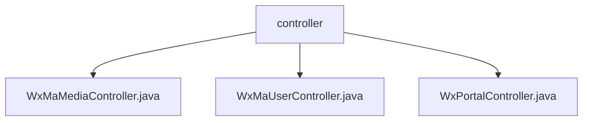

# 基础信息

|      |      |
|------|------|
| 名称 | controller |
| 编码语言 | .java |
| 代码路径 | weixin-java-miniapp-demo\src\main\java\com\github\binarywang\demo\wx\miniapp\controller |
| 包名 | docs.src.main.java.com.github.binarywang.demo.wx.miniapp.controller |
| 概述说明 | 微信小程序三个控制器类：媒体管理类处理文件上传下载；用户管理类处理登录、用户信息和手机号；门户类处理微信认证和消息路由。均验证appid并清理ThreadLocal。 |

# 说明

## 概述  
该模块是微信小程序后端核心控制器组，负责处理媒体文件管理、用户会话管理和微信门户交互三大功能。所有接口均遵循AppID有效性验证和ThreadLocal资源清理机制，类似网关模式确保线程安全。关键数据结构包括media_id列表、用户会话信息对象和微信消息封装体。依赖微信官方SDK进行加解密操作，例如AES解密用户信息和验证消息签名。  

## 主要业务场景  
媒体文件模块支持批量上传临时素材并返回media_id列表，下载时通过mediaId获取文件，例如图片/视频管理。用户模块实现微信标准登录流程，包含code校验、信息解密（例如获取手机号）和会话维护。门户模块同时处理微信服务器认证（GET校验）和消息路由（POST处理），支持明文/加密双模式解析。所有交互都基于AppID隔离配置，类似多租户架构。

### 包内部结构视图

该流程图展示了微信小程序demo项目中controller目录下的三个控制器文件结构。所有Java控制器文件(WxMaMediaController、WxMaUserController和WxPortalController)都直接隶属于controller节点，清晰地呈现了微信小程序后端接口控制层的文件组织方式，这种扁平化结构便于开发者快速定位媒体处理、用户管理和门户入口等核心功能模块。

# 文件列表

| 名称   | 类型  | 说明 |
|-------|------|-------------|
| [WxMaMediaController.java](WxMaMediaController.md) | file | 微信小程序媒体控制器，提供上传和下载临时素材功能。上传返回media_id列表，下载返回文件。检查appid有效性，清理ThreadLocal。 |
| [WxMaUserController.java](WxMaUserController.md) | file | 微信小程序用户控制器，提供登录、获取用户信息和手机号接口，需校验appid和用户数据，返回JSON格式结果，使用后清理ThreadLocal。 |
| [WxPortalController.java](WxPortalController.md) | file | 微信小程序控制器，处理认证和消息请求，验证签名并路由消息，支持明文和AES加密，清理ThreadLocal。 |

