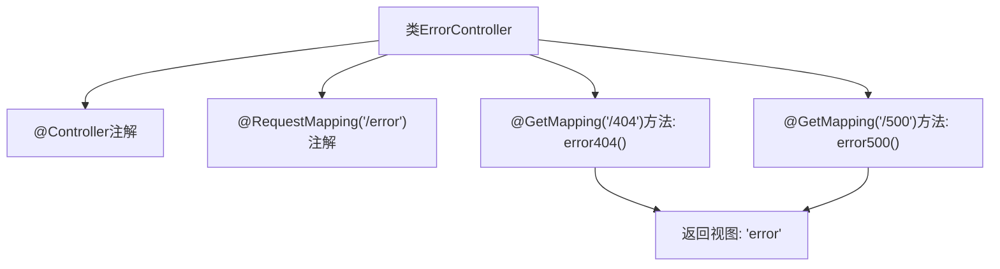

# 基础信息

|      |      |
|------|------|
| 名称 | ErrorController |
| 编码语言 | .java |
| 代码路径 | weixin-java-miniapp-demo/src/main/java/com/github/binarywang/demo/wx/miniapp/error/ErrorController.java |
| 包名 | com.github.binarywang.demo.wx.miniapp.error |
| 依赖项 | ['org.springframework.stereotype.Controller', 'org.springframework.web.bind.annotation.GetMapping', 'org.springframework.web.bind.annotation.RequestMapping'] |
| 概述说明 | 这是一个Spring Boot错误控制器，处理404和500错误页面请求，统一返回error视图。 |

# 说明

这是一个Spring Boot的错误处理控制器类，位于/error路径下。该控制器包含两个GET请求映射方法：error404用于处理404未找到错误，error500用于处理500服务器内部错误。两个方法都会返回名为error的视图页面，实现统一的错误页面展示功能。

# 类列表 Class Summary

| 名称   | 类型  | 说明 |
|-------|------|-------------|
| ErrorController | class | 这是一个Spring Boot错误处理控制器，映射/error路径下的404和500错误请求，统一返回error页面视图。 |


## 类 ErrorController

|      |      |
|------|------|
| 访问范围 | @Controller;@RequestMapping("/error");public |
| 类型 | class |
| 名称 | ErrorController |
| 说明 | 这是一个Spring Boot错误处理控制器，映射/error路径下的404和500错误请求，统一返回error页面视图。 |


### UML类图

```mermaid
classDiagram
    class ErrorController {
        +String error404()
        +String error500()
    }

    <<Interface>> org.springframework.stereotype.Controller
    <<Interface>> org.springframework.web.bind.annotation.RequestMapping

    ErrorController --|> org.springframework.stereotype.Controller : 实现
    ErrorController --|> org.springframework.web.bind.annotation.RequestMapping : 使用注解
```

该类图展示了 `ErrorController` 控制器类的结构，它包含两个处理不同错误码（404 和 500）的方法，并通过注解实现 Spring MVC 的路由映射功能。此类依赖于 Spring 框架提供的 Controller 和 RequestMapping 注解接口来完成其职责。


### 内部方法调用关系图



该流程图展示了`ErrorController`类的结构与请求映射逻辑。控制器通过`@RequestMapping`注解定义了基础路径`/error`，并包含两个GET请求处理方法分别对应404和500错误页面，均返回名为`error`的视图。

### 字段列表 Field List

| 名称  | 类型  | 说明 |
|-------|-------|------|

### 方法列表

| 名称  | 类型  | 说明 |
|-------|-------|------|
| error404 | String | 该代码定义了一个处理404错误的GET请求映射方法，返回错误页面视图名称"error"。 |
| error500 | String | 该代码定义了一个处理HTTP GET请求的方法，当访问路径为"/500"时，返回"error"字符串。这通常用于处理服务器内部错误的响应页面。 |


