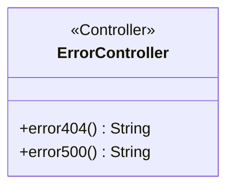
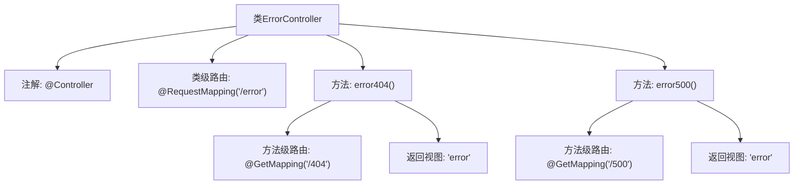

# 基础信息

|      |      |
|------|------|
| 名称 | ErrorController |
| 编码语言 | .java |
| 代码路径 | weixin-java-miniapp-demo/src/main/java/com/github/binarywang/demo/wx/miniapp/error/ErrorController.java |
| 包名 | com.github.binarywang.demo.wx.miniapp.error |
| 依赖项 | ['org.springframework.stereotype.Controller', 'org.springframework.web.bind.annotation.GetMapping', 'org.springframework.web.bind.annotation.RequestMapping'] |
| 概述说明 | 错误控制器类，处理404和500错误，返回错误页面。 |

# 说明

这是一个Spring MVC控制器类，专门用于处理错误页面请求。类上标注了@Controller注解，表明这是一个控制器组件。使用@RequestMapping注解将根路径映射到"/error"。类中包含两个方法：error404()方法处理HTTP 404错误的GET请求，映射路径为"/error/404"；error500()方法处理HTTP 500错误的GET请求，映射路径为"/error/500"。两个方法都返回名为"error"的视图字符串，表示将渲染error模板页面。

# 类列表 Class Summary

| 名称   | 类型  | 说明 |
|-------|------|-------------|
| ErrorController | class | ErrorController处理404和500错误，返回error页面。 |

## 类 ErrorController

|      |      |
|------|------|
| 访问范围 | @Controller;@RequestMapping("/error");public |
| 类型 | class |
| 名称 | ErrorController |
| 说明 | ErrorController处理404和500错误，返回error页面。 |

### UML类图

这段代码定义了一个Spring MVC控制器类`ErrorController`，用于处理错误页面请求。该类标注了`@Controller`注解表示它是一个控制器，并通过`@RequestMapping`映射到"/error"路径。类中包含两个公共方法：`error404()`和`error500()`，分别处理404和500错误，都返回"error"视图名称。该类没有定义私有成员变量，是一个典型的无状态控制器，仅负责路由请求到对应的错误页面。

### 内部方法调用关系图

这段代码定义了一个Spring MVC控制器类ErrorController，用于处理错误页面请求。类上标注了@Controller注解和根路径/error，包含两个处理方法：error404()处理404错误路径/error/404，error500()处理500错误路径/error/500，两者均返回名为"error"的视图模板。流程图清晰展示了类结构、注解层级和方法调用关系，体现了Spring MVC控制器的典型路由映射模式。

### 字段列表 Field List

| 名称  | 类型  | 说明 |
|-------|-------|------|

### 方法列表

| 名称  | 类型  | 说明 |
|-------|-------|------|
| error500 | String | Spring MVC控制器方法，处理GET请求路径"/500"，返回字符串"error"。 |
| error404 | String | 这是一个Spring MVC控制器方法，映射到"/404"路径的GET请求，返回字符串"error"作为响应。 |

