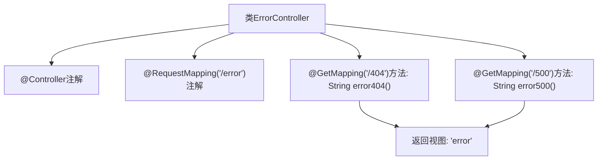

# 基础信息

|      |      |
|------|------|
| 名称 | ErrorController |
| 编码语言 | .java |
| 代码路径 | weixin-java-miniapp-demo/src/main/java/com/github/binarywang/demo/wx/miniapp/error/ErrorController.java |
| 包名 | com.github.binarywang.demo.wx.miniapp.error |
| 依赖项 | ['org.springframework.stereotype.Controller', 'org.springframework.web.bind.annotation.GetMapping', 'org.springframework.web.bind.annotation.RequestMapping'] |
| 概述说明 | 这是一个Spring Boot错误处理控制器，映射/error路径下的404和500错误页面请求，统一返回error视图。 |

# 说明

这是一个Spring Boot的错误处理控制器类，位于/error路径下。该控制器包含两个GET请求映射方法：error404处理404错误页面请求，error500处理500错误页面请求。两个方法都返回相同的视图名称error，用于统一显示错误页面内容。

# 类列表 Class Summary

| 名称   | 类型  | 说明 |
|-------|------|-------------|
| ErrorController | class | 这是一个Spring Boot错误处理控制器，映射/error路径下的404和500错误请求，统一返回error页面视图。 |


## 类 ErrorController

|      |      |
|------|------|
| 访问范围 | @Controller;@RequestMapping("/error");public |
| 类型 | class |
| 名称 | ErrorController |
| 说明 | 这是一个Spring Boot错误处理控制器，映射/error路径下的404和500错误请求，统一返回error页面视图。 |


### UML类图

```mermaid
classDiagram
    class ErrorController {
        +String error404()
        +String error500()
    }

    <<Annotation>> Controller
    <<Annotation>> RequestMapping
    <<Annotation>> GetMapping

    // ErrorController 是一个Spring控制器，处理HTTP错误页面请求
    // 提供了对404和500错误的映射处理，返回逻辑视图名"error"
```

该类图展示了`ErrorController`控制器类，它使用了Spring MVC注解来处理特定的HTTP错误状态码请求。其中`@Controller`表明这是一个控制器组件，`@RequestMapping("/error")`定义了基础路径，而两个方法分别通过`@GetMapping`映射到具体的错误处理逻辑，均返回名为“error”的视图。


### 内部方法调用关系图



该流程图展示了`ErrorController`类的结构与请求映射关系。控制器通过`@RequestMapping`注解绑定路径`/error`，并定义两个GET请求处理方法分别对应404和500错误页面，均返回名为`error`的视图模板。

### 字段列表 Field List

| 名称  | 类型  | 说明 |
|-------|-------|------|

### 方法列表

| 名称  | 类型  | 说明 |
|-------|-------|------|
| error500 | String | 该代码定义了一个处理HTTP GET请求的方法，当访问路径为"/500"时，返回名为"error"的视图页面，用于处理服务器内部错误情况。 |
| error404 | String | 该代码定义了一个处理404错误的GET请求方法，返回错误页面。 |


