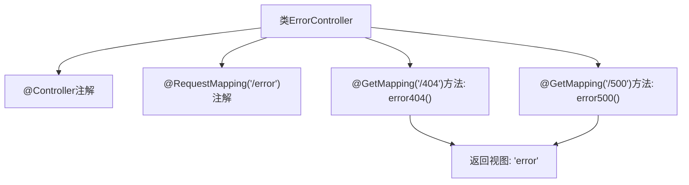

# 基础信息

|      |      |
|------|------|
| 名称 | ErrorController |
| 编码语言 | .java |
| 代码路径 | weixin-java-miniapp-demo/src/main/java/com/github/binarywang/demo/wx/miniapp/error/ErrorController.java |
| 包名 | com.github.binarywang.demo.wx.miniapp.error |
| 依赖项 | ['org.springframework.stereotype.Controller', 'org.springframework.web.bind.annotation.GetMapping', 'org.springframework.web.bind.annotation.RequestMapping'] |
| 概述说明 | 这是一个Spring Boot错误处理控制器，映射/error路径下的404和500错误页面请求，统一返回error视图。 |

# 说明

这是一个Spring Boot的错误处理控制器类，位于/error路径下。该控制器包含两个GET请求映射方法：error404处理404错误页面请求，error500处理500错误页面请求。两个方法都返回相同的视图名称error，用于统一展示错误页面内容。

# 类列表 Class Summary

| 名称   | 类型  | 说明 |
|-------|------|-------------|
| ErrorController | class | 这是一个Spring Boot错误处理控制器，映射/error路径下的404和500错误请求，统一返回error页面视图。 |


## 类 ErrorController

|      |      |
|------|------|
| 访问范围 | @Controller;@RequestMapping("/error");public |
| 类型 | class |
| 名称 | ErrorController |
| 说明 | 这是一个Spring Boot错误处理控制器，映射/error路径下的404和500错误请求，统一返回error页面视图。 |


### UML类图

```mermaid
classDiagram
    class ErrorController {
        +String error404()
        +String error500()
    }

    <<Interface>> Controller
    <<Interface>> RequestMapping
    
    note for ErrorController "// @Controller\n// @RequestMapping(\"/error\")"
    
    ErrorController -->|实现| Controller : 依赖
    ErrorController -->|映射路径 /error| RequestMapping : 依赖
```

该类图描述了一个Spring Boot中的控制器类`ErrorController`，它被注解为处理错误页面请求。通过`@Controller`和`@RequestMapping`注解表明其作为控制器的角色以及基础路由路径。其中包含两个GET请求方法分别对应404和500错误页面，均返回"error"视图名称。此类依赖于Spring MVC框架提供的注解支持来完成URL映射与响应处理。


### 内部方法调用关系图



该流程图展示了`ErrorController`类的结构与处理逻辑。控制器通过`@RequestMapping`注解绑定路径`/error`，并定义两个GET请求处理方法分别对应HTTP状态码404和500，两者均返回名为`error`的视图页面。

### 字段列表 Field List

| 名称  | 类型  | 说明 |
|-------|-------|------|

### 方法列表

| 名称  | 类型  | 说明 |
|-------|-------|------|
| error500 | String | 该代码定义了一个处理HTTP GET请求的控制器方法，当访问路径"/500"时返回"error"字符串，用于处理服务器内部错误页面跳转。 |
| error404 | String | 该代码定义了一个处理404错误的GET请求映射方法，返回错误页面视图名称"error"。 |


