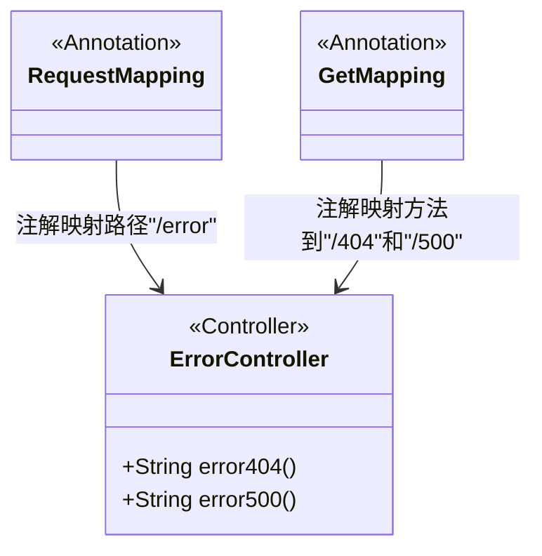
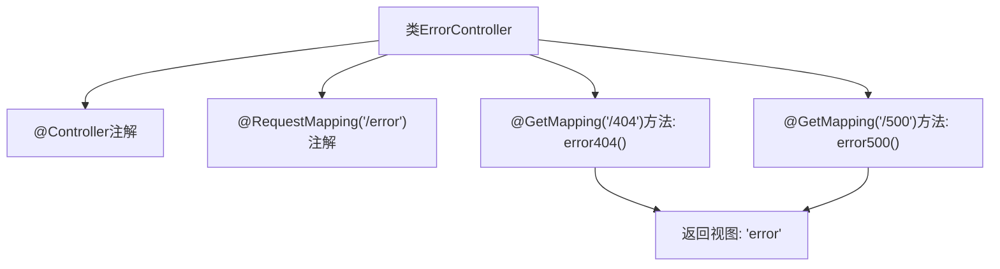

# 基础信息

|      |      |
|------|------|
| 名称 | ErrorController |
| 编码语言 | .java |
| 代码路径 | weixin-java-miniapp-demo/src/main/java/com/github/binarywang/demo/wx/miniapp/error/ErrorController.java |
| 包名 | com.github.binarywang.demo.wx.miniapp.error |
| 依赖项 | ['org.springframework.stereotype.Controller', 'org.springframework.web.bind.annotation.GetMapping', 'org.springframework.web.bind.annotation.RequestMapping'] |
| 概述说明 | 这是一个Spring Boot错误处理控制器，映射/error路径下的404和500错误请求，统一返回error视图页面。 |

# 说明

这是一个Spring Boot的错误处理控制器类，用于统一处理系统异常情况。该控制器通过@Controller注解标识为Spring MVC控制器组件，并使用@RequestMapping注解将所有请求映射到/error路径下。控制器内定义了两个GET请求处理方法，分别对应HTTP 404状态码和500状态码的错误页面跳转。当系统发生页面未找到错误时，error404方法会返回名为error的视图页面；当发生服务器内部错误时，error500方法同样返回error视图页面，实现统一的错误页面展示功能。

# 类列表 Class Summary

| 名称   | 类型  | 说明 |
|-------|------|-------------|
| ErrorController | class | 这是一个Spring Boot错误处理控制器，映射/error路径下的404和500错误请求，统一返回error页面视图。 |

## 类 ErrorController

|      |      |
|------|------|
| 访问范围 | @Controller;@RequestMapping("/error");public |
| 类型 | class |
| 名称 | ErrorController |
| 说明 | 这是一个Spring Boot错误处理控制器，映射/error路径下的404和500错误请求，统一返回error页面视图。 |

### UML类图

该类图展示了一个Spring Boot中的控制器类 `ErrorController`，它用于处理HTTP请求并返回错误页面视图。通过使用`@RequestMapping`和`@GetMapping`注解，将特定URL路径映射到对应的处理方法上，实现了对404和500错误状态码的统一响应。

### 内部方法调用关系图

该流程图展示了`ErrorController`类的结构与请求映射关系。控制器通过`@RequestMapping`注解绑定路径`/error`，并定义两个GET请求处理方法分别对应404和500错误页面，均返回名为`error`的视图模板。

### 字段列表 Field List

| 名称  | 类型  | 说明 |
|-------|-------|------|

### 方法列表

| 名称  | 类型  | 说明 |
|-------|-------|------|
| error404 | String | 该代码定义了一个处理404错误的GET请求方法，返回"error"字符串。当用户访问不存在的页面时，系统会调用此方法并显示错误页面。 |
| error500 | String | 该代码定义了一个处理HTTP GET请求的控制器方法，当访问路径为"/500"时，返回名为"error"的视图页面，用于处理服务器内部错误的展示。 |

