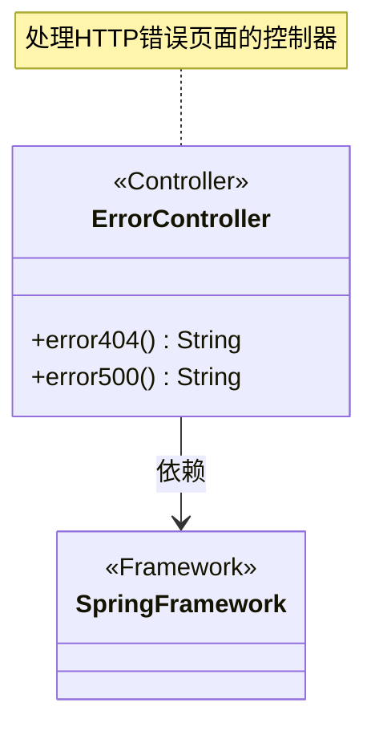
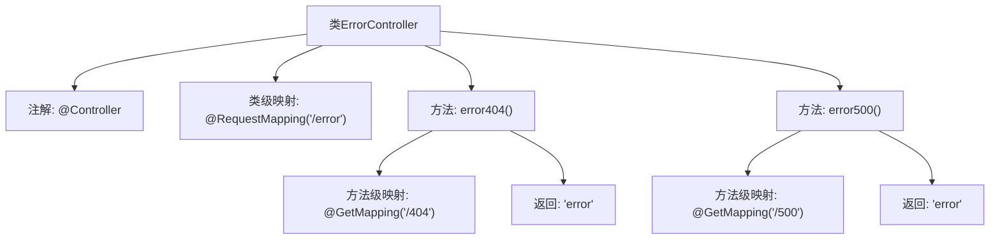

# 基础信息

|      |      |
|------|------|
| 名称 | ErrorController |
| 编码语言 | .java |
| 代码路径 | weixin-java-miniapp-demo\src\main\java\com\github\binarywang\demo\wx\miniapp\error\ErrorController.java |
| 包名 | com.github.binarywang.demo.wx.miniapp.error |
| 依赖项 | ['org.springframework.stereotype.Controller', 'org.springframework.web.bind.annotation.GetMapping', 'org.springframework.web.bind.annotation.RequestMapping'] |
| 概述说明 | ErrorController处理404和500错误，返回统一错误页面。 |

# 说明

这是一个Spring MVC控制器类，专门处理错误页面请求。类上标注了@Controller注解，表明这是一个控制器组件。使用@RequestMapping注解将根路径映射到"/error"。类中包含两个处理GET请求的方法：error404()方法处理404错误路径"/error/404"，error500()方法处理500错误路径"/error/500"。两个方法都返回名为"error"的视图字符串，表示它们使用相同的错误页面模板进行响应。

# 类列表 Class Summary

| 名称   | 类型  | 说明 |
|-------|------|-------------|
| ErrorController | class | ErrorController处理404和500错误，返回统一错误页面。 |

## 类 ErrorController

|      |      |
|------|------|
| 访问范围 | @Controller;@RequestMapping("/error");public |
| 类型 | class |
| 名称 | ErrorController |
| 说明 | ErrorController处理404和500错误，返回统一错误页面。 |

### UML类图

这段类图展示了一个Spring MVC的ErrorController控制器，它包含两个处理HTTP错误的方法：error404()和error500()。两个方法都返回相同的错误视图名称"error"。该类通过@Controller注解标记为Spring组件，并通过@RequestMapping定义了基础路径/error。该类依赖于Spring框架提供的功能，用于处理HTTP 404和500错误的请求映射。这是一个典型的Spring MVC控制器设计模式，用于集中处理特定类型的HTTP错误响应。

### 内部方法调用关系图

该流程图展示了Spring MVC中ErrorController类的结构，包含两个错误处理方法。类通过@Controller注解标记为控制器，并设置根路径为"/error"。error404()处理404错误路径，error500()处理500错误路径，两者均返回"error"视图。箭头清晰表示了类与注解、方法之间的从属关系，以及方法内部映射与返回值的逻辑流程。

### 字段列表 Field List

| 名称  | 类型  | 说明 |
|-------|-------|------|

### 方法列表

| 名称  | 类型  | 说明 |
|-------|-------|------|
| error500 | String | 这是一个Spring MVC控制器方法，处理GET请求路径"/500"，返回字符串"error"。 |
| error404 | String | 这是一个Spring MVC控制器方法，映射到"/404"路径的GET请求，返回字符串"error"。 |

