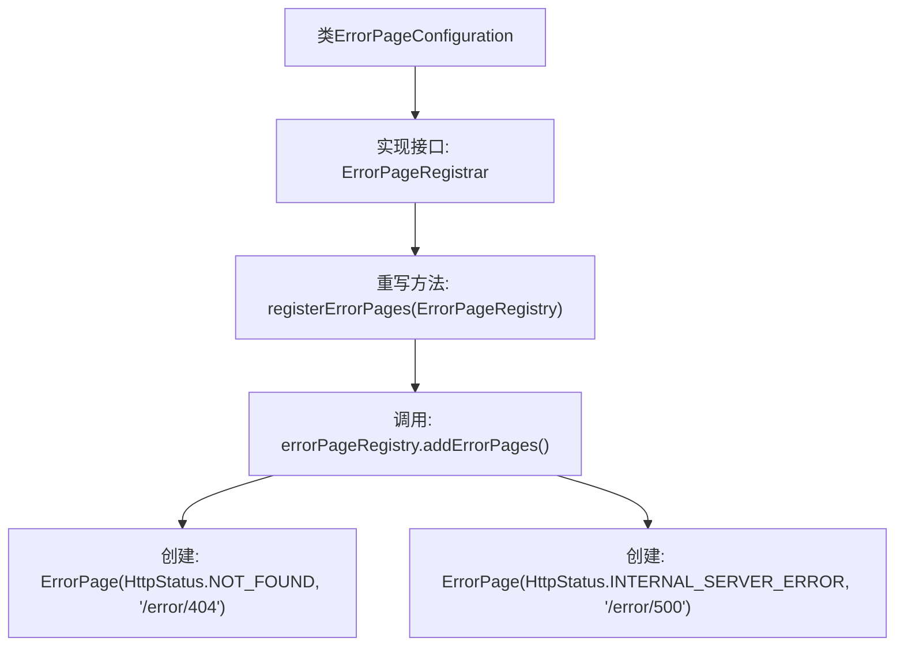

# 基础信息

|      |      |
|------|------|
| 名称 | ErrorPageConfiguration |
| 编码语言 | .java |
| 代码路径 | weixin-java-miniapp-demo\src\main\java\com\github\binarywang\demo\wx\miniapp\error\ErrorPageConfiguration.java |
| 包名 | com.github.binarywang.demo.wx.miniapp.error |
| 依赖项 | ['org.springframework.boot.web.server.ErrorPage', 'org.springframework.boot.web.server.ErrorPageRegistrar', 'org.springframework.boot.web.server.ErrorPageRegistry', 'org.springframework.http.HttpStatus', 'org.springframework.stereotype.Component'] |
| 概述说明 | ErrorPageConfiguration类注册404和500错误页，分别映射到/error/404和/error/500路径。 |

# 说明

这是一个Spring组件类，用于配置自定义错误页面。该类实现了ErrorPageRegistrar接口，通过重写registerErrorPages方法注册了两个错误页面：当出现404状态码时跳转到/error/404路径，出现500状态码时跳转到/error/500路径。该配置通过ErrorPageRegistry对象添加错误页面映射关系。

# 类列表 Class Summary

| 名称   | 类型  | 说明 |
|-------|------|-------------|
| ErrorPageConfiguration | class | 定义错误页面配置类，注册404和500错误对应的处理路径。 |


## 类 ErrorPageConfiguration

|      |      |
|------|------|
| 访问范围 | @Component;public |
| 类型 | class |
| 名称 | ErrorPageConfiguration |
| 说明 | 定义错误页面配置类，注册404和500错误对应的处理路径。 |


### UML类图

```mermaid
classDiagram
    class ErrorPageConfiguration {
        +registerErrorPages(ErrorPageRegistry errorPageRegistry) void
    }
    <<interface>> ErrorPageRegistrar {
        +registerErrorPages(ErrorPageRegistry errorPageRegistry) void
    }
    class ErrorPageRegistry {
        +addErrorPages(ErrorPage... errorPages) void
    }
    class ErrorPage {
        +ErrorPage(HttpStatus status, String path)
    }
    class HttpStatus {
        <<enumeration>>
        NOT_FOUND
        INTERNAL_SERVER_ERROR
        // ...其他状态码
    }

    ErrorPageConfiguration --> ErrorPageRegistrar : 实现
    ErrorPageConfiguration --> ErrorPageRegistry : 依赖
    ErrorPageConfiguration --> ErrorPage : 创建
    ErrorPage --> HttpStatus : 使用
```

这段代码定义了一个Spring组件`ErrorPageConfiguration`，实现了`ErrorPageRegistrar`接口，用于注册自定义错误页面。当应用出现404或500错误时，会重定向到对应的错误处理路径。类图展示了该组件与相关接口和类的依赖关系，包括错误页面注册表、错误页面实体以及HTTP状态枚举。


### 内部方法调用关系图



该流程图展示了Spring Boot错误页面配置类的核心逻辑。ErrorPageConfiguration类通过实现ErrorPageRegistrar接口，重写registerErrorPages方法，向容器注册两个标准错误页面：404未找到错误映射到"/error/404"路径，500服务器内部错误映射到"/error/500"路径。这种配置方式在Web应用发生对应HTTP状态码错误时，会自动重定向到预设的错误处理路径。

### 字段列表 Field List

| 名称  | 类型  | 说明 |
|-------|-------|------|

### 方法列表

| 名称  | 类型  | 说明 |
|-------|-------|------|
| registerErrorPages | void | 注册错误页面，404错误跳转至/error/404，500错误跳转至/error/500。 |


