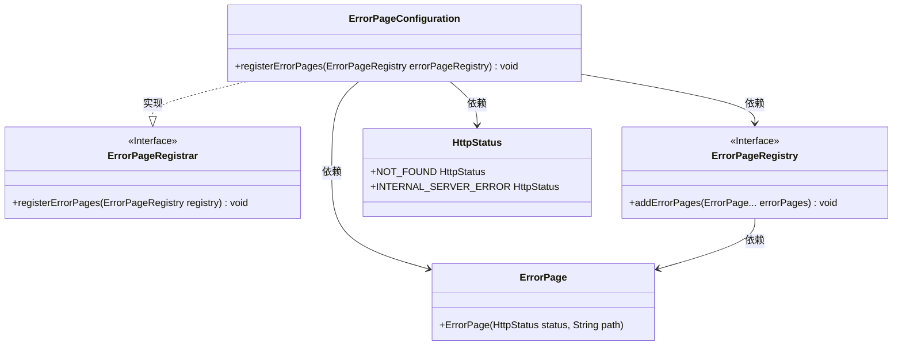
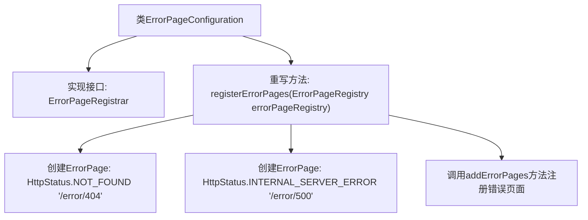

# 基础信息

|      |      |
|------|------|
| 名称 | ErrorPageConfiguration |
| 编码语言 | .java |
| 代码路径 | weixin-java-miniapp-demo/src/main/java/com/github/binarywang/demo/wx/miniapp/error/ErrorPageConfiguration.java |
| 包名 | com.github.binarywang.demo.wx.miniapp.error |
| 依赖项 | ['org.springframework.boot.web.server.ErrorPage', 'org.springframework.boot.web.server.ErrorPageRegistrar', 'org.springframework.boot.web.server.ErrorPageRegistry', 'org.springframework.http.HttpStatus', 'org.springframework.stereotype.Component'] |
| 概述说明 | 该配置类实现了错误页面注册功能，当出现404或500错误时，分别跳转到/error/404和/error/500页面进行处理。 |

# 说明

这是一个Spring Boot应用程序中的错误页面配置类，实现了ErrorPageRegistrar接口。该组件通过重写registerErrorPages方法来注册自定义错误页面处理逻辑，当应用程序遇到404未找到资源或500服务器内部错误时，会自动跳转到对应的/error/404和/error/500路径进行统一错误处理，从而提供更好的用户体验和错误提示机制。

# 类列表 Class Summary

| 名称   | 类型  | 说明 |
|-------|------|-------------|
| ErrorPageConfiguration | class | 该配置类用于注册自定义错误页面，将404和500错误分别重定向到/error/404和/error/500路径处理。 |

## 类 ErrorPageConfiguration

|      |      |
|------|------|
| 访问范围 | @Component;public |
| 类型 | class |
| 名称 | ErrorPageConfiguration |
| 说明 | 该配置类用于注册自定义错误页面，将404和500错误分别重定向到/error/404和/error/500路径处理。 |

### UML类图

该类图展示了`ErrorPageConfiguration`类实现`ErrorPageRegistrar`接口，并在其`registerErrorPages`方法中依赖`ErrorPageRegistry`、`ErrorPage`和`HttpStatus`来注册404和500错误页面的配置逻辑。

### 内部方法调用关系图

该流程图展示了`ErrorPageConfiguration`类如何实现Spring Boot中的错误页面配置。它通过实现`ErrorPageRegistrar`接口，在应用启动时向系统注册自定义的404和500错误页面路径，使用户访问异常页面时能跳转到指定友好提示页。

### 字段列表 Field List

| 名称  | 类型  | 说明 |
|-------|-------|------|

### 方法列表

| 名称  | 类型  | 说明 |
|-------|-------|------|
| registerErrorPages | void | 该代码片段展示了如何在Spring Boot应用中注册自定义错误页面。通过实现ErrorPageRegistrar接口，将HTTP 404和500错误分别映射到/error/404和/error/500路径，实现统一的错误处理机制。 |

