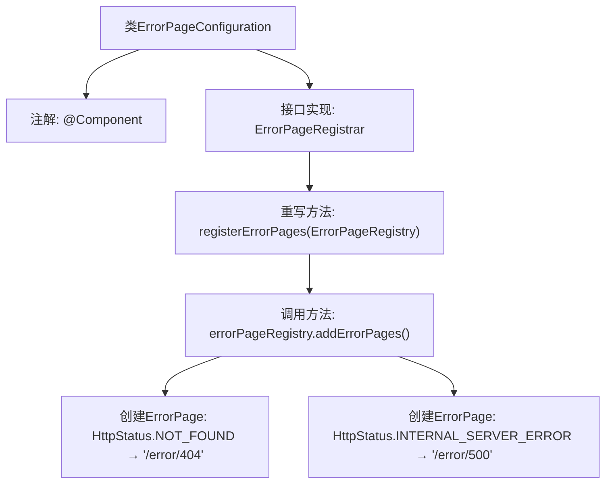

# 基础信息

|      |      |
|------|------|
| 名称 | ErrorPageConfiguration |
| 编码语言 | .java |
| 代码路径 | weixin-java-miniapp-demo/src/main/java/com/github/binarywang/demo/wx/miniapp/error/ErrorPageConfiguration.java |
| 包名 | com.github.binarywang.demo.wx.miniapp.error |
| 依赖项 | ['org.springframework.boot.web.server.ErrorPage', 'org.springframework.boot.web.server.ErrorPageRegistrar', 'org.springframework.boot.web.server.ErrorPageRegistry', 'org.springframework.http.HttpStatus', 'org.springframework.stereotype.Component'] |
| 概述说明 | 错误页配置类，注册404和500错误对应的处理路径。 |

# 说明

该内容定义了一个名为ErrorPageConfiguration的Spring组件类，实现了ErrorPageRegistrar接口。该类重写了registerErrorPages方法，通过ErrorPageRegistry注册了两个错误页面映射：将HTTP 404状态码映射到/error/404路径，将HTTP 500状态码映射到/error/500路径。这用于配置应用程序的错误页面处理机制。

# 类列表 Class Summary

| 名称   | 类型  | 说明 |
|-------|------|-------------|
| ErrorPageConfiguration | class | 定义错误页面配置类，注册404和500错误对应的处理路径。 |


## 类 ErrorPageConfiguration

|      |      |
|------|------|
| 访问范围 | @Component;public |
| 类型 | class |
| 名称 | ErrorPageConfiguration |
| 说明 | 定义错误页面配置类，注册404和500错误对应的处理路径。 |


### UML类图

```mermaid
classDiagram
    class ErrorPageConfiguration {
        +registerErrorPages(ErrorPageRegistry errorPageRegistry) void
    }
    <<interface>> ErrorPageRegistrar {
        <<Interface>>
        +registerErrorPages(ErrorPageRegistry errorPageRegistry) void
    }
    class ErrorPageRegistry {
        +addErrorPages(ErrorPage... errorPages) void
    }
    class ErrorPage {
        +ErrorPage(HttpStatus status, String path)
    }
    class HttpStatus {
        <<enumeration>>
        NOT_FOUND
        INTERNAL_SERVER_ERROR
        //其他状态码...
    }

    ErrorPageConfiguration --|> ErrorPageRegistrar : 实现
    ErrorPageConfiguration --> ErrorPageRegistry : 依赖
    ErrorPageConfiguration --> ErrorPage : 创建
    ErrorPage --> HttpStatus : 使用
```

这段代码定义了一个Spring组件`ErrorPageConfiguration`，用于注册自定义错误页面。它实现了`ErrorPageRegistrar`接口，通过`registerErrorPages`方法向`ErrorPageRegistry`注册了两个错误页面：404状态码对应"/error/404"路径，500状态码对应"/error/500"路径。类图展示了组件与接口的继承关系，以及与其他类（如`ErrorPage`和`HttpStatus`枚举）的依赖关系，体现了Spring Boot错误处理机制的典型实现方式。


### 内部方法调用关系图



这段代码流程图展示了Spring Boot错误页面配置的实现过程。ErrorPageConfiguration类通过@Component注解成为Spring组件，并实现了ErrorPageRegistrar接口。核心逻辑在registerErrorPages方法中，该方法通过ErrorPageRegistry注册了两个错误页面：404状态码映射到"/error/404"路径，500状态码映射到"/error/500"路径。整个流程体现了Spring Boot的异常处理机制，通过集中配置将特定HTTP状态码重定向到自定义错误页面。

### 字段列表 Field List

| 名称  | 类型  | 说明 |
|-------|-------|------|

### 方法列表

| 名称  | 类型  | 说明 |
|-------|-------|------|
| registerErrorPages | void | 注册错误页面：404跳转/error/404，500跳转/error/500。 |


